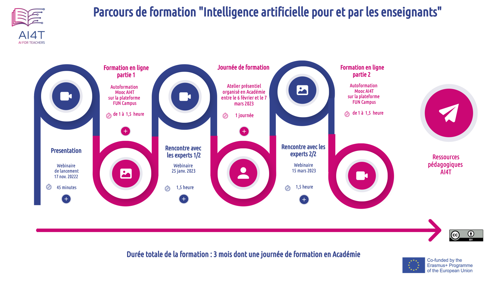

??? info "Metadáta
    - Id: EU.AI4T.O1.M0.1.3t
    - Názov: 0.1.3 Komplexná cesta odbornej prípravy v oblasti umelej inteligencie a vzdelávania
    - Typ: text
    - Opis: Opis všeobecnej cesty odbornej prípravy spoločnej pre všetkých partnerov.
    - Predmet: Umelá inteligencia pre učiteľov a pre učiteľov
    - Autori: Mgr:
        - AI4T 
    - Licencia: CC BY 4.0
    - Dátum: 2022-11-15

# Kurz Mooc v centre kompletného vzdelávacieho programu o umelej inteligencii a vzdelávaní

Kompletný vzdelávací program založený na Mooc bol navrhnutý a vyvinutý tak, aby učitelia a celá vzdelávacia komunita mohli skúmať, experimentovať a klásť si otázky o využívaní umelej inteligencie vo vzdelávaní.

Testoval sa v prvej polovici roka 2023 v 5 partnerských krajinách projektu.

Tu je grafické znázornenie typickej cesty navrhnutej účastníkom na základe Mooc.

<figure>
  
</figure>

Vitajte na Mooc!
