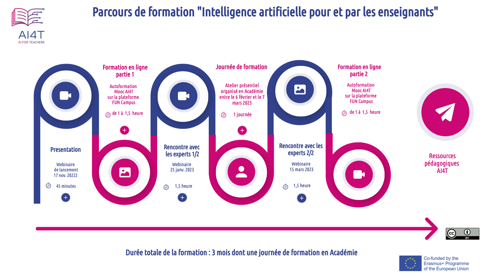

??? info "Metadáta
    - Id: EU.AI4T.O1.M0.1.3t
    - Názov: 0.1.3 Kompletná vzdelávacia cesta v oblasti AI a vzdelávania
    - Typ: text
    - Opis: Opis všeobecnej vzdelávacej cesty pre všetkých partnerov.
    - Predmet: AI pre učiteľov a od učiteľov
    - Autori:
        - AI4T 
    - Licencia: CC BY 4.0
    - Dátum: 2022-11-15

# MOOC kurz v centre komplexného vzdelávacieho programu o AI a vzdelávaní

Kompletný vzdelávací program založený na MOOC kurze bol navrhnutý a vyvinutý tak, aby učitelia a celá vzdelávacia komunita mohli skúmať, experimentovať a klásť si otázky o využívaní AI vo vzdelávaní.

Testovanie kurzu prebiehalo v prvej polovici roka 2023 v piatich partnerských krajinách projektu.

Tu je grafické znázornenie typickej vzdelávacej dráhy s využitím MOOC kurzu, ktorú účastníci absolvujú.

<figure>
  
</figure>

Vitajte v MOOC kurze!
