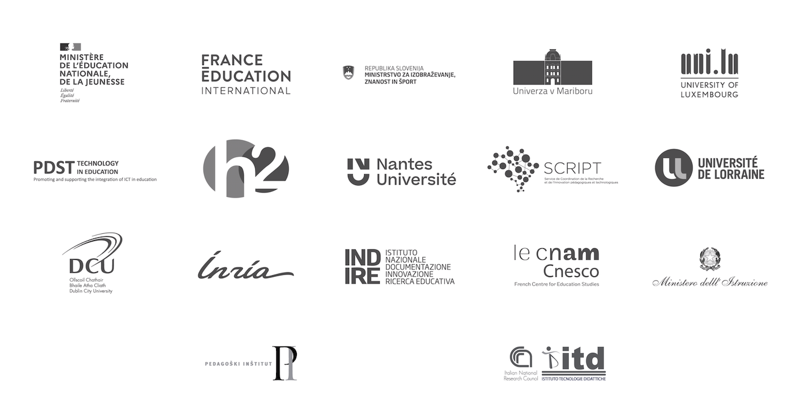

??? info "Metadáta
    - Id: EU.AI4T.O1.M0.4.1t
    - Názov: 0.4.1 Partneri
    - Typ: text
    - Opis: Partneri, financovanie a upozornenia
    - Vec: Umelá inteligencia pre učiteľov a od učiteľov
    - Autori:
        - AI4T 
    - Licencia: CC BY 4.0
    - Dátum: 2022-11-15

# Financovanie
MOOC kurz AI4T je financovaný z grantu č. 626154-EPP-1-2020-2-EN-EPPKA3-PI-POLICY agentúry EK EACEA v rámci projektu Erasmus+ KA3: Umelá inteligencia pre učiteľov a od učiteľov.

<figure>
  
</figure>

*Podpora Európskej komisie pri vytváraní tohto MOOC kurzu nie je schvaľovaním jeho obsahu, za ktorý sú zodpovední výlučne autori. Komisia nenesie zodpovednosť za akékoľvek použitie informácií, ktoré sú v kurze obsiahnuté.

# Konzorcium AI4T združuje 17 partnerov.

<a href="https://www.ai4t.eu/partners/" target="_blank">
<figure>
  
</figure></a>  
