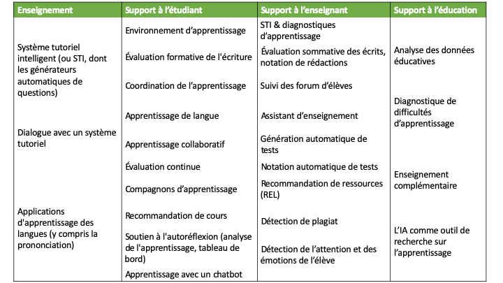

??? info "Metadáta
    - Id: EU.AI4T.O1.M1.3.1t
    - Názov: 1.3.1 Budúcnosť expertného učenia vo vzdelávaní
    - Typ: text
    - Opis: Identifikujte výzvy súvisiace s AI vo vzdelávaní a základné zručnosti potrebné v ére AI.
    - Predmet: Umelá inteligencia pre učiteľov a pre učiteľov
    - Autori: Mgr:
        - AI4T 
    - Licencia: CC BY 4.0
    - Dátum: 2022-11-15

# Budúcnosť vzdelávania podľa odborníkov na vzdelávanie
## Umelá inteligencia je už v triedach.

Technológie umelej inteligencie majú potenciál podporiť nové pedagogické a odborné postupy v prospech učiteľov a žiakov. Tu je niekoľko príkladov činností v oblasti vzdelávania, ktoré sa už testujú v triedach a podporujú sa technológiami umelej inteligencie:

- Individualizované učenie krok za krokom

- Dynamické zoskupovanie žiakov pre efektívnejšiu prácu v triede

- Analýza písania žiakov a automatické hodnotenie

- Chatboti na pomoc študentom

- Automatické generovanie testov 

- Monitorovanie študijných výsledkov študentov

- Správa administratívnych úloh, ako je organizácia výučby alebo odpovede na často kladené otázky.

K týmto niekoľkým príkladom by sme mohli pridať dlhý zoznam nástrojov, ktoré sú dnes súčasťou každodenného života učiteľov a žiakov pri používaní digitálnych služieb, ako napríklad automatická oprava pravopisu, odporúčania a návrhy na čítanie, spamové filtre pre e-maily, automatické rozpoznávanie hlasu alebo tváre atď.

Ak vezmeme do úvahy len úlohy špecifické pre vzdelávanie, Fengchun &amp; al [^1] definovali súbor štyroch kategórií vznikajúcich a potenciálnych aplikácií založených na potrebách:

- Riadenie vzdelávania ;

- Učenie a hodnotenie ;

- Posilnenie postavenia učiteľov a zlepšenie vyučovania;

- a celoživotné vzdelávanie.

Holmes &amp; al [^2] rozdelili rôzne typy súčasných systémov založených na umelej inteligencii pre vzdelávanie do nasledujúcich kategórií.

<figure>
	 
	 <figcaption> Rôzne typy súčasných systémov na báze umelej inteligencie pre vzdelávanie (podľa Holmes &amp; al. 2019) </figcaption>
</figure>

## AI a výzvy v oblasti vzdelávania

O týchto vznikajúcich technológiách umelej inteligencie je potrebné pochybovať aj v súvislosti s ich využívaním vo vzdelávaní. Na využitie príležitostí a zmiernenie potenciálnych rizík AI vo vzdelávaní boli v správe Fengchun &amp; al. UNESCO, 2021, identifikované nasledujúce výzvy:

1.  **Ako možno využiť AI na zlepšenie vzdelávania?

    "*V priebehu posledného desaťročia exponenciálne narástlo využívanie nástrojov AI na podporu alebo zlepšenie vzdelávania[^3]. Tento trend sa po zatvorení škôl v rámci programu COVID-19 len zvýšil. Dôkazov o tom, ako môže umelá inteligencia zlepšiť výsledky vzdelávania a či môže pomôcť vedcom a odborníkom z praxe lepšie pochopiť, ako prebieha efektívne vzdelávanie, je však stále málo[^4]. Okrem toho stále potrebujeme preskúmať potenciál UI pri monitorovaní výsledkov vzdelávania v rôznych kontextoch, ako aj pri hodnotení zručností, najmä tých, ktoré sa získali v neformálnom a informálnom kontexte*."

    "*Takisto existuje potenciál, aby AI uľahčila nové prístupy k hodnoteniu, ako napríklad adaptívne a priebežné hodnotenie založené na AI[^5]. Hneď na začiatku je však dôležité uznať, že využívanie UI na učenie a hodnotenie vyvoláva aj rôzne obavy, ktoré zatiaľ neboli dostatočne riešené. Patria k nim obavy týkajúce sa ich prístupu k pedagogike, nedostatok spoľahlivých dôkazov o ich účinnosti a ich potenciálny vplyv na úlohu učiteľov, ako aj širšie etické otázky[^6][^7]*."

    "*Mnohé aplikácie umelej inteligencie pre učiteľov majú za cieľ pomôcť učiteľom znížiť ich pracovné zaťaženie automatizáciou úloh, ako je hodnotenie, odhaľovanie plagiátorstva, administrácia a spätná väzba. Často sa uvádza, že by sa tým mal učiteľom uvoľniť čas, ktorý by mohli investovať do iných úloh, napríklad do poskytovania účinnejšej podpory jednotlivým študentom."

2.  **Ako môžeme zabezpečiť etické, inkluzívne a spravodlivé využívanie umelej inteligencie vo vzdelávaní?

    "Etické, inkluzívne a spravodlivé využívanie UI vo vzdelávaní má vplyv na každý z cieľov udržateľného rozvoja. Existujú otázky, ktoré sa sústreďujú na údaje a algoritmy, pedagogické rozhodnutia, inklúziu a "digitálnu priepasť", právo detí na súkromie, slobodu a neobmedzený rozvoj a spravodlivosť z hľadiska pohlavia, zdravotného postihnutia, sociálneho a ekonomického postavenia, etnického a kultúrneho pôvodu a geografickej polohy.*"

3.  **Ako môže vzdelávanie pripraviť ľudí na život a prácu s umelou inteligenciou?

    "*Ak má svet zabezpečiť, aby UI nezhoršovala existujúce nerovnosti, bude čoraz dôležitejšie, aby mal každý občan možnosť získať dôkladné znalosti o UI - čo je to UI, ako funguje a ako by mohla ovplyvniť jeho život. Niekedy sa to označuje ako "gramotnosť v oblasti UI". Kľúčovú úlohu v tomto smere budú zohrávať učitelia.*"

    "*Pomôcť žiakom naučiť sa efektívne žiť vo svete, ktorý je čoraz viac ovplyvňovaný UI, si vyžaduje pedagogiku, ktorá kladie väčší dôraz na ľudské zručnosti (napr. kritické myslenie, komunikáciu, spoluprácu a tvorivosť) a schopnosť spolupracovať so všadeprítomnými nástrojmi UI v živote, pri učení a v práci.*"

## Základné kompetencie potrebné v ére umelej inteligencie

Zavádzanie technológií založených na UI v školách vyvoláva otázky o vplyve používania týchto systémov na vyučovacie zručnosti, na čo upozornilo Spoločné výskumné centrum (JRC), oddelenie Európskej komisie pre vedu a znalosti[^8]:

- Do akej miery by mal učiteľ alebo používateľ poznať základnú technológiu?

- Do akej miery musia pedagógovia poznať umelú inteligenciu, aby mohli konať znalostne a efektívne ako pedagógovia?

- Budú mať dnešné nové technológie vplyv na profesijné zručnosti učiteľov v budúcnosti?

Autori správy Spoločného výskumného centra poukazujú na to, že okrem všeobecných pedagogických vedomostí, vedomostí o jednotlivých predmetoch a zručností v oblasti riadenia triedy budú pedagógovia potrebovať

- všeobecné digitálne zručnosti na používanie a uplatňovanie digitálnych technológií ako u každého občana[^9] týkajúce sa informačnej a digitálnej gramotnosti, komunikácie a spolupráce, tvorby digitálneho obsahu, bezpečnosti a riešenia problémov.

- a zručnosti na zmysluplné využívanie týchto digitálnych technológií vo vzdelávaní.

Konkrétnu výzvu zavádzania umelej inteligencie do vzdelávania a prípravy študentov na kontext využívajúci umelú inteligenciu predstavilo UNESCO v roku 2019[^10]:
"*Príprava učiteľov na vzdelávanie využívajúce UI a zároveň príprava UI na pochopenie vzdelávania, ktorá však musí byť obojsmerná: učitelia sa musia naučiť nové digitálne zručnosti, aby mohli UI pedagogicky a zmysluplne využívať, a vývojári UI sa musia naučiť, ako učitelia pracujú a vytvárajú udržateľné riešenia v reálnom prostredí.*"

V nasledujúcich moduloch tohto kurzu sa snažíme pomôcť pochopiť, čo je AI a jej základné technológie, uvedomiť si výhody a obmedzenia, aby sme ako učitelia mohli konať informovane a efektívne, a spochybniť vplyv systémov AI na učenie, vyučovanie a vzdelávanie.

[^1]: Miao Fengchun, Holmes Wayne, Ronghuai Huang, Hui Zhang - ISBN: 978-92-3-100447-6 - UNESCO, 2021

[^2]: Artificial Intelligence In Education: Promises and Implications for Teaching and Learning - Wayne Holmes, Maya Bialik, Charles Fadel - Boston, MA, Center for Curriculum Redesign, 2019

[^3]: Wayne Holmes, Maya Bialik, Charles Fadel - Boston, MA, Center for Curriculum Redesign, 2019

[^4]: Zawacki-Richter, O., Marín, V. I., Bond, M. a Gouverneur, F. 2019. Systematický prehľad výskumu aplikácií umelej inteligencie vo vysokoškolskom vzdelávaní -- kde sú pedagógovia? International Journal of Educational Technology in Higher Education, Vol. 16, No. 1, pp. 1--27.

[^5]: Luckin, R. 2017. K systémom hodnotenia založeným na umelej inteligencii. Nat Hum Behav 1, 0028

[^6]: Holmes, W., Bektik, D., Whitelock, D. a Woolf, B. P. 2018b. Etika v AIED: Koho to zaujíma? C. Penstein Rosé, R. Martínez- Maldonado, H. U. Hoppe, R. Luckin, M. Mavrikis, K. Porayska-Pomsta, B. McLaren a B. du Boulay (eds.), Lecture Notes in Computer Science. London, Springer International Publishing, zv. 10948, s. 551-553.

[^7]: Artificial Intelligence In Education: Promises and Implications for Teaching and Learning - Wayne Holmes, Maya Bialik, Charles Fadel - Boston, MA, Center for Curriculum Redesign, 2019

[^8]: Emerging technologies and the teaching profession: Ethical and pedagogical considerations based on near-future scenarios- Vuorikari Riina, Punie Yves,Marcelino Cabrera - správa Spoločného výskumného centra - 2020

[^9]:  DigComp 2.2: Rámec digitálnych kompetencií pre občanov - s novými príkladmi vedomostí, zručností a postojov, Vuorikari, R., Kluzer, S. a Punie, Y., EUR 31006 SK, Úrad pre publikácie Európskej únie, Luxemburg, 2022, ISBN 978-92-76-48883-5, doi:10.2760/490274, JRC128415.

[^10]: Umelá inteligencia vo vzdelávaní: výzvy a príležitosti pre udržateľný rozvoj- Pedró Francesc, Subosa Miguel, Rivas Axel, Valverde Paula, ED-2019/WS/8, UNESCO, 2019.
