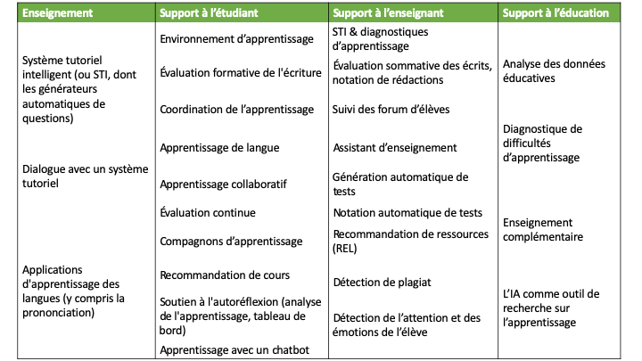

??? info "Metadáta
    - Id: EU.AI4T.O1.M1.3.1t
    - Názov: 1.3.1 Budúcnosť vzdelávania podľa odborníkov
    - Typ: text
    - Opis: Identifikujte výzvy spojené s AI vo vzdelávaní a základné zručnosti potrebné v ére umelej inteligencie.
    - Predmet: Umelá inteligencia pre učiteľov a pre učiteľov
    - Autori: AI4T 
    - Licencia: CC BY 4.0
    - Dátum: 2022-11-15

# Budúcnosť vzdelávania podľa odborníkov
## Umelá inteligencia sa už dostala do tried

Technológie umelej inteligencie majú potenciál podporiť nové pedagogické a odborné postupy v prospech učiteľov a žiakov. Tu je niekoľko príkladov vzdelávacích aktivít, ktoré využívajú technológie umelej inteligencie a už sa experimentálne overujú v triedach:

- Individualizované učenie krok za krokom

- Dynamické zoskupovanie žiakov pre efektívnejšiu prácu v triede

- Analýza a automatické hodnotenie žiackych písomných prác

- Četboti na podporu žiakov

- Automatické generovanie testov 

- Monitorovanie študijných výsledkov žiakov

- Administratívne úlohy, ako je tvorba rozvrhov hodín či odpovedanie na často kladené otázky.

K týmto niekoľkým príkladom by sme mohli pridať dlhý zoznam nástrojov, ktoré sú dnes súčasťou každodenného života učiteľov a žiakov pri používaní digitálnych služieb, ako je automatická oprava pravopisu, odporúčania či návrhy na čítanie, spamové filtre na e-maily, automatické rozpoznávanie hlasu alebo tváre atď.

Ak vezmeme do úvahy len úlohy orientované na vzdelávanie, Fengchun a kol. [^1] definovali súbor štyroch kategórií novovznikajúcich a potenciálnych aplikácií založených na potrebách:

- riadenie a poskytovanie vzdelávania;

- učenie sa a hodnotenie;

- posilnenie postavenia učiteľov a zlepšenie výučby;

- celoživotné vzdelávanie.

Holmes a kol. [^2] rozdelili rôzne typy súčasných AI systémov v oblasti vzdelávania do nasledujúcich kategórií.

<figure>
	 
	 <figcaption> Rôzne typy súčasných AI systémov v oblasti vzdelávania (podľa Holmes a kol. 2019) </figcaption>
</figure>

## Výzvy spojené s AI v oblasti vzdelávania

Tieto novovznikajúce AI technológie treba podrobiť skúmaniu aj v súvislosti s ich využívaním vo vzdelávaní. Na využitie príležitostí a zmiernenie potenciálnych rizík AI vo vzdelávaní boli v správe UNESCO (Fengchun a kol., 2021) identifikované nasledujúce výzvy:

1.  **Ako sa dá AI využiť na zlepšenie vzdelávania?

    *„V poslednom desaťročí rástlo využívanie AI nástrojov na podporu alebo zlepšenie učenia exponenciálne.[^3]. Tento trend sa ešte zintenzívnil po zatvorení škôl počas pandémie COVID-19. Dôkazov o tom, ako môže umelá inteligencia zlepšiť výsledky vzdelávania a či môže pomôcť vedcom a odborníkom z praxe lepšie pochopiť, ako prebieha efektívne vzdelávanie, je však stále málo[^4]. Okrem toho stále potrebujeme preskúmať potenciál AI pri sledovaní výsledkov vzdelávania v rôznych kontextoch, ako aj pri posudzovaní kompetencií, najmä tých získaných v neformálnych kontextoch.“*

    *„Existuje tiež potenciál, aby umelá inteligencia umožnila nové prístupy k hodnoteniu, ako je napríklad adaptívne a priebežné hodnotenie založené na umelej inteligencii[^5]. Hneď na začiatku je však dôležité poznamenať, že využívanie umelej inteligencie na učenie a hodnotenie vyvoláva aj rôzne obavy, ktoré zatiaľ neboli dostatočne prebraté. Patria sem obavy týkajúce sa prístupu AI nástrojov k pedagogike, nedostatku spoľahlivých dôkazov o ich účinnosti a ich potenciálneho vplyvu na rolu učiteľov, ako aj širšie etické otázky[^6][^7].“*

    *„Mnohé využitia umelej inteligencie zamerané na učiteľov majú za cieľ pomôcť znížiť pracovné zaťaženie učiteľov automatizáciou úloh, ako je hodnotenie, odhaľovanie plagiátorstva, administratíva či poskytovanie spätnej väzby. Často sa uvádza, že by to malo učiteľom uvoľniť čas, ktorý by následne mohli investovať do iných úloh, napríklad do poskytovania účinnejšej podpory jednotlivým študentom.“*

2.  **Ako môžeme zabezpečiť etické, inkluzívne a spravodlivé využívanie umelej inteligencie vo vzdelávaní?

    *„Etické, inkluzívne a spravodlivé využívanie AI vo vzdelávaní má vplyv na každý z cieľov udržateľného rozvoja. Príslušné otázky sa zameriavajú na dáta a algoritmy, pedagogické rozhodnutia, inklúziu a ,digitálnu priepasť‘, právo detí na súkromie, slobodu a nerušený vývoj a rovnosť z hľadiska rodu, zdravotného stavu, sociálneho a ekonomického postavenia, etnického a kultúrneho pôvodu či geografickej polohy.“*

3.  **Ako môže vzdelávanie pripraviť ľudí na život a prácu s umelou inteligenciou?

    *„Ak má svet zabezpečiť, aby umelá inteligencia nezhoršovala existujúce nerovnosti, bude čoraz dôležitejšie, aby mal každý občan možnosť dôkladne ju pochopiť – čo je to AI, ako funguje a ako môže ovplyvniť jeho život. Niekedy tento súbor poznatkov označujeme aj výrazom ,AI gramotnosť‘. Kľúčovú úlohu v tomto smere budú zohrávať učitelia.“*

    *„Ak chceme pomôcť žiakom naučiť sa efektívne fungovať vo svete, ktorý je čoraz viac ovplyvňovaný umelou inteligenciou, vyžaduje si to pedagogiku, ktorá kladie väčší dôraz na ľudské zručnosti (napr. kritické myslenie, komunikáciu, spoluprácu a tvorivosť) a schopnosť spolupracovať so všadeprítomnými AI nástrojmi v živote, učení a práci.“*

## Základné kompetencie potrebné v ére umelej inteligencie

Zavádzanie technológií založených na umelej inteligencii v školách vyvoláva otázky o vplyve používania týchto systémov na vyučovacie zručnosti, na čo upozornilo Spoločné výskumné centrum (JRC) – zložka Európskej komisie, ktorá poskytuje vedeckú a znalostnú podporu[^8]:

- Do akej miery by mal učiteľ alebo používateľ poznať technológiu, na ktorej sú AI nástroje postavené?

- Do akej miery by mali pedagógovia poznať umelú inteligenciu, aby mohli vo svojej práci konať informovane a efektívne?

- Budú mať dnešné novovznikajúce technológie vplyv na profesijné zručnosti učiteľov v budúcnosti?

Autori správy Spoločného výskumného centra poukazujú na to, že okrem všeobecných pedagogických poznatkov, vedomostí o jednotlivých predmetoch a zručností v oblasti riadenia triedy budú pedagógovia potrebovať:

- všeobecné digitálne kompetencie na používanie a aplikáciu digitálnych technológií ako u každého občana[^9] v oblastiach informačnej a digitálnej gramotnosti, komunikácie a spolupráce, tvorby digitálneho obsahu, bezpečnosti a riešenia problémov;

- kompetencie na zmysluplné využívanie týchto digitálnych technológií vo vzdelávaní.

V roku 2019 UNESCO predstavilo konkrétnu výzvu, ktorú predstavuje zavádzanie umelej inteligencie do vzdelávania a príprava študentov na svet ovplyvňovaný umelou inteligenciou[^10]:
*„Príprava učiteľov na vzdelávanie s využitím umelej inteligencie a zároveň príprava umelej inteligencie na pochopenie vzdelávania, ktorá však musí byť obojsmerná: učitelia sa musia naučiť nové digitálne zručnosti, aby mohli AI zmysluplne využívať vo svojej pedagogickej praxi, a vývojári AI musia pochopiť prácu učiteľov a vytvárať riešenia, ktoré budú v reálnom prostredí udržateľné.“*

V nasledujúcich moduloch tohto online kurzu vám chceme pomôcť pochopiť umelú inteligenciu a jej základné technológie; uvedomiť si jej prínosy a riziká, aby sme ako učitelia mohli konať informovane a efektívne; a zamyslieť sa nad vplyvom AI systémov na učenie sa, vyučovanie a vzdelávanie.

[^1]: AI and education: Guidance for policy-makers - Miao Fengchun, Holmes Wayne, Ronghuai Huang, Hui Zhang - ISBN: 978-92-3-100447-6 - UNESCO, 2021

[^2]: Artificial Intelligence In Education: Promises and Implications for Teaching and Learning - Wayne Holmes, Maya Bialik, Charles Fadel - Boston, MA, Center for Curriculum Redesign, 2019

[^3]: Wayne Holmes, Maya Bialik, Charles Fadel - Boston, MA, Center for Curriculum Redesign, 2019

[^4]: Zawacki-Richter, O., Marín, V. I., Bond, M. a Gouverneur, F. 2019. Systematic review of research on artificial intelligence applications in higher education -- where are the educators? International Journal of Educational Technology in Higher Education, roč. 16, č. 1, s. 1 – 27.

[^5]: Luckin, R. 2017. Towards artificial intelligence-based assessment systems. Nat Hum Behav 1, 0028.

[^6]: Holmes, W., Bektik, D., Whitelock, D. and Woolf, B. P. 2018b. Ethics in AIED: Who cares? C. Penstein Rosé, R. Martínez- Maldonado, H. U. Hoppe, R. Luckin, M. Mavrikis, K. Porayska-Pomsta, B. McLaren a B. du Boulay (ed.), Lecture Notes in Computer Science. London, Springer International Publishing, zv. 10948, s. 551 – 553.

[^7]: Artificial Intelligence In Education: Promises and Implications for Teaching and Learning - Wayne Holmes, Maya Bialik, Charles Fadel - Boston, MA, Center for Curriculum Redesign, 2019

[^8]: Emerging technologies and the teaching profession: Ethical and pedagogical considerations based on near-future scenarios- Vuorikari Riina, Punie Yves,Marcelino Cabrera - Joint Research Center report - 2020

[^9]:  DigComp 2.2: The Digital Competence Framework for Citizens - With new examples of knowledge, skills and attitudes, Vuorikari, R., Kluzer, S. a Punie, Y., EUR 31006 EN, Publications Office of the European Union, Luxembourg, 2022, ISBN 978-92-76-48883-5, doi:10.2760/490274, JRC128415.

[^10]: Artificial intelligence in education: challenges and opportunities for sustainable development- Pedró Francesc, Subosa Miguel, Rivas Axel, Valverde Paula, ED-2019/WS/8, UNESCO, 2019.
