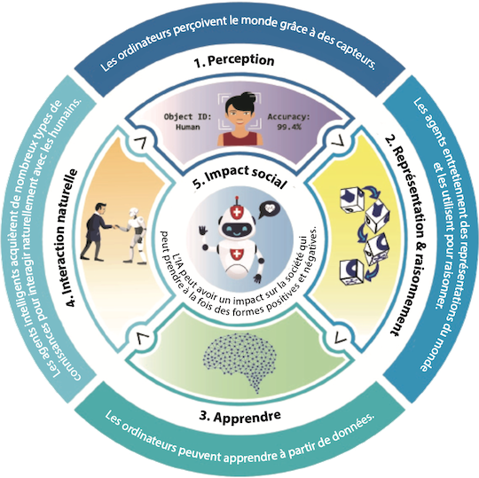
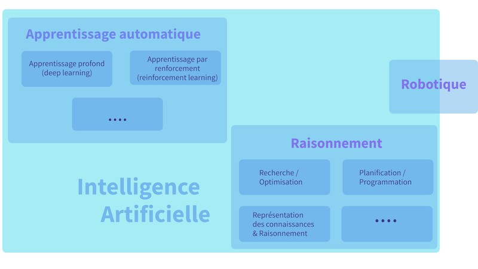

??? info "Metadáta
    - Id: EU.AI4T.O1.M2.1.2t
    - Názov: 2.1.2 Čo je definícia umelej inteligencie?
    - Typ: text
    - Opis: Uveďte rôzne definície umelej inteligencie a jej oblastí.
    - Predmet: Umelá inteligencia pre učiteľov a pre učiteľov
    - Autori: Mgr:
        - AI4T
    - Licencia: CC BY 4.0
    - Dátum: 2022-11-15

# Aká je definícia umelej inteligencie?

## Vývoj definície

Podať definíciu umelej inteligencie je zložitá úloha, pretože pre túto stále veľmi novú vedu (70 rokov) neexistuje žiadna všeobecne prijatá definícia alebo taxonómia umelej inteligencie[^1].

Pojem "umelá inteligencia" prvýkrát použili v roku 1955 McCarthy &amp; al[^2] na označenie "*vedy a techniky vytvárania inteligentných strojov, najmä inteligentných počítačových programov*".

V roku 1968 ďalší otec umelej inteligencie Marvin Minsky navrhol stručnú definíciu umelej inteligencie, keď uviedol, že ide o "*vedu o tom, ako prinútiť stroje robiť veci, ktoré by si vyžadovali inteligenciu, keby ich robili ľudia*"[^3].

Odvtedy sa pojem "umelá inteligencia" často používa na označenie algoritmov, ktoré simulujú alebo zdieľajú niektoré schopnosti inteligencie živých bytostí.

Na európskej úrovni skupina expertov na vysokej úrovni pre umelú inteligenciu navrhuje túto podrobnú definíciu, na ktorú sa bežne odkazuje v práci Európskej komisie[^4] :

*"Systémy umelej inteligencie (UI) sú systémy* ***softvéru*** *(prípadne aj hardvéru) navrhnuté ľuďmi, ktoré vzhľadom na komplexný cieľ konajú vo fyzickom alebo digitálnom rozmere tak, že vnímajú svoje prostredie prostredníctvom získavania údajov, interpretujú získané štruktúrované alebo neštruktúrované údaje, uvažujú o poznatkoch alebo spracúvajú informácie získané z týchto údajov a rozhodujú o najlepšej činnosti (činnostiach) na dosiahnutie daného cieľa. Systémy umelej inteligencie môžu používať symbolické pravidlá alebo sa učiť numerický model a môžu tiež prispôsobovať svoje správanie analýzou toho, ako je prostredie ovplyvnené ich predchádzajúcimi činnosťami. "* [preklad Deepl]

Tento opis umelej inteligencie je znázornený na nasledujúcom obrázku [^3].

<figure>
	 
	 <figcaption> Päť veľkých myšlienok v umelej inteligencii. Kredit: Iniciatíva AIK12. CC BY-NC-SA 4.0 International </figcaption>
</figure>

## Vedecká reprezentácia

Umelá inteligencia ako vedná disciplína zahŕňa niekoľko čiastkových odborných oblastí a s nimi súvisiacich techník [^4]. Niektoré z nich sú často citované, iné sú menej známe.

- Strojové učenie (ktorého konkrétnymi príkladmi sú hlboké učenie a posilňovacie učenie),
- strojové uvažovanie (ktoré zahŕňa plánovanie, rozvrhovanie, reprezentáciu znalostí a uvažovanie, vyhľadávanie a optimalizáciu),
- A robotika (ktorá zahŕňa riadenie, vnímanie, senzory a aktuátory, ako aj integráciu všetkých ostatných techník v kyberneticko-fyzických systémoch).

<figure>
  
  <figcaption> Zjednodušený prehľad subdisciplín umelej inteligencie a ich vzťahov. Strojové učenie a uvažovanie zahŕňajú mnoho ďalších techník a robotika zahŕňa techniky, ktoré nie sú súčasťou AI. Umelá inteligencia ako celok patrí do disciplíny informatiky. Zdroj: Skupina expertov na vysokej úrovni pre umelú inteligenciu.</figcaption>
</figure>

[^1]: Technická správa Spoločného výskumného centra: AI Watch: Definícia umelej inteligencie - smerom k operačnej definícii a taxonómii umelej inteligencie (2020) - [https://publications.jrc.ec.europa.eu/repository/handle/JRC118163](https://publications.jrc.ec.europa.eu/repository/handle/JRC118163) (konzultované 19. 8. 2022).

[^2]: McCarthy, J., Minsky, M. L., Rochester, N., &amp; Shannon, C. E. (2006). A Proposal for the Dartmouth Summer Research Project on Artificial Intelligence (Návrh letného výskumného projektu Dartmouthskej univerzity o umelej inteligencii), 31. augusta 1955. AI Magazine, 27(4), 12. https://doi.org/10.1609/aimag.v27i4.1904

[^3]: Minsky, M. L. Sémantické spracovanie informácií. Cambridge, MA: MIT Press citované v: M. Minsky, M.: MIT Press. AI watch: Defining artificial intelligence 2.0 - strana 113 (op.cit.).

[^4]: High Level Panel on Artificial Intelligence: A definition of Artificial Intelligence: main capabilities and scientific disciplines (2019) [https://digital-strategy.ec.europa.eu/en/library/definition-artificial-intelligence-main-capabilities-and-scientific-disciplines](https://digital-strategy.ec.europa.eu/en/library/definition-artificial-intelligence-main-capabilities-and-scientific-disciplines) (prístup 19.8.2022).
