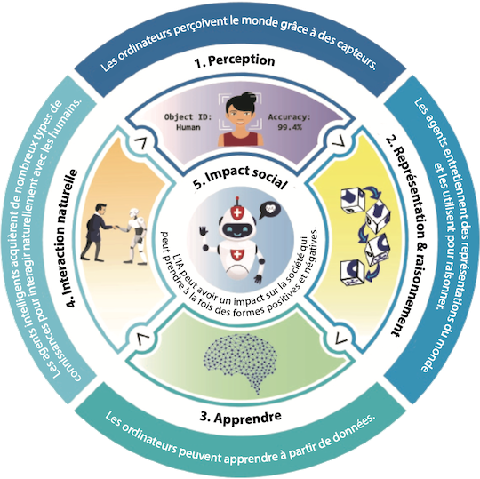
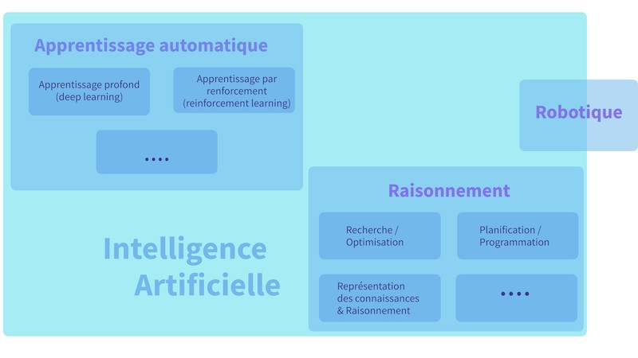

??? info "Metadáta
    - Id: EU.AI4T.O1.M2.1.2t
    - Názov: 2.1.2 Aká je definícia umelej inteligencie?
    - Typ: text
    - Opis: Uveďte rôzne definície umelej inteligencie a jej oblastí.
    - Predmet: Umelá inteligencia pre učiteľov a pre učiteľov
    - Autori:
        - AI4T
    - Licencia: CC BY 4.0
    - Dátum: 2022-11-15

# Aká je definícia umelej inteligencie?

## Vývoj definície

Definovať umelú inteligenciu je zložitá úloha, pretože táto stále veľmi mladá veda ani po 70 rokoch nemá žiadnu všeobecne prijatú definíciu či taxonómiu.[^1]

Pojem „umelá inteligencia“ prvýkrát použili v roku 1955 McCarthy a kol.[^2] na označenie „*vedy a techniky vytvárania inteligentných prístrojov, najmä inteligentných počítačových programov.“*

V roku 1968 navrhol stručnú definíciu umelej inteligencie ďalší zo zakladateľov tejto disciplíny, Marvin Minsky. Uviedol, že ide o „*vedu o tom, ako prinútiť prístroje robiť veci, ktoré by si vyžadovali inteligenciu, keby ich robili ľudia.“[^3]*

Odvtedy sa pojem „umelá inteligencia“ často používa na označenie algoritmov, ktoré simulujú alebo zdieľajú niektoré schopnosti inteligentných živých bytostí.

Pod záštitou Európskej komisie funguje Vysoká expertná skupina pre umelú inteligenciu a tá navrhuje nasledujúcu podrobnú definíciu, na ktorú sa bežne odkazuje v dokumentoch Európskej komisie:[^4]

*AI systémy sú **softvérové** (prípadne aj hardvérové) systémy navrhnuté ľuďmi, ktoré po zadaní komplexného cieľa konajú vo fyzickom alebo digitálnom rozmere tak, že vnímajú svoje prostredie získavaním údajov, interpretujú získané štruktúrované alebo neštruktúrované údaje, uvažujú o poznatkoch alebo spracúvajú informácie získané z týchto údajov a vyberajú najlepšie možné kroky na dosiahnutie daného cieľa. AI systémy môžu využívať symbolické pravidlá alebo si osvojiť numerický model, pričom svoje správanie môžu prispôsobovať na základe analýzy toho, aký vplyv malo ich predchádzajúce konanie na okolité prostredie.*

Tento opis umelej inteligencie je znázornený na nasledujúcom obrázku:[^3]

<figure>
	 
	 <figcaption> Päť veľkých myšlienok o umelej inteligencii. Autor: Iniciatíva AIK12. Podlieha licencii CC BY-NC-SA 4.0 – Medzinárodná </figcaption>
</figure>

## Vedecká reprezentácia

Umelá inteligencia je vednou disciplínou, ktorá zahŕňa niekoľko podoblastí odborných znalostí a s nimi súvisiacich techník.[^4] Niektoré z nich sa spomínajú často, iné sú menej známe:

- strojové učenie (ktorého konkrétnymi príkladmi sú hlboké učenie a posilňované učenie);
- strojové uvažovanie (z angl. _machine reasoning_, ktoré zahŕňa plánovanie, rozvrhovanie, reprezentáciu znalostí a uvažovanie, vyhľadávanie a optimalizáciu);
- robotika (ktorá zahŕňa riadenie, vnímanie, senzory a aktuátory, ako aj integráciu všetkých ostatných techník do kyberneticko-fyzikálnych systémov).

<figure>
  
  <figcaption> Zjednodušený prehľad pododborov umelej inteligencie a ich vzťahov. Strojové učenie aj uvažovanie zahŕňajú množstvo ďalších techník a robotika zahŕňa techniky, ktoré nie sú súčasťou AI. Umelá inteligencia ako celok patrí pod odbor informatiky. Zdroj: Vysoká expertná skupina Európskej komisie pre umelú inteligenciu</figcaption>
</figure>

[^1]: Joint Research Centre technical report: AI Watch: defining artificial intelligence - toward an operational definition and taxonomy of artificial intelligence (2020) - [https://publications.jrc.ec.europa.eu/repository/handle/JRC118163](https://publications.jrc.ec.europa.eu/repository/handle/JRC118163) (citované 19. 8. 2022)

[^2]: McCarthy, J., Minsky, M. L., Rochester, N., & Shannon, C. E. (2006). A Proposal for the Dartmouth Summer Research Project on Artificial Intelligence, August 31, 1955. AI Magazine, roč. 27 č. 4, s. 12. https://doi.org/10.1609/aimag.v27i4.1904

[^3]: Minsky, M. L. Semantic information processing. Cambridge, MA: MIT Press quoted in. AI watch: defining artificial intelligence 2.0 - s. 113 (op.cit)

[^4]: High-Level Expert Group on Artificial Intelligence: A definition of AI: main capabilities and disciplines (2019) [https://digital-strategy.ec.europa.eu/en/library/definition-artificial-intelligence-main-capabilities-and-scientific-disciplines](https://digital-strategy.ec.europa.eu/en/library/definition-artificial-intelligence-main-capabilities-and-scientific-disciplines) (citované 19. 8. 2022)
