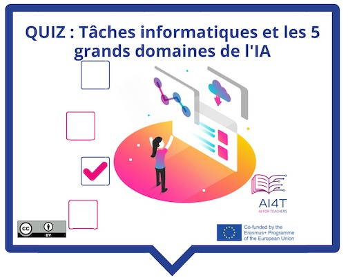

??? info "Metadáta
    - Id: EU.AI4T.O1.M2.1.3a
    - Názov: 2.1.3 Aktivita: Aká je definícia umelej inteligencie?
    - Typ: činnosť
    - Opis: Kvíz o rôznych definíciách umelej inteligencie a jej doménach.
    - Predmet: Umelá inteligencia pre učiteľov a od učiteľov
    - Autori: Mgr:
        - AI4T 
    - Licencia: CC BY 4.0
    - Dátum: 2022-11-15

# Aktivita: Aká je definícia umelej inteligencie?

Teraz, keď ste objavili počiatočnú definíciu umelej inteligencie, priraďme niektoré výpočtové úlohy k jednej z 5 hlavných oblastí umelej inteligencie.

**Prístup k aktivite  
Kliknite na obrázok nižšie
<figure>
    
</figure>

<iframe width="818" height="404" src="2-1-3-Quiz-definition-of-ai/2-1-3-Quiz-5-big-ideas-in-AI.html" frameborder="0" allowfullscreen></iframe>

