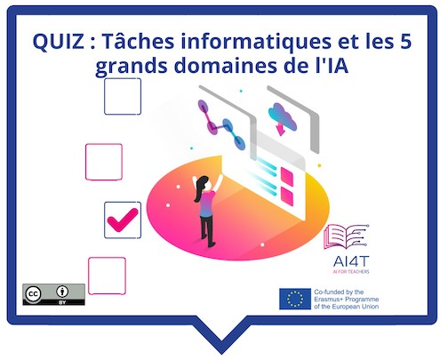

??? info "Metadáta
    - Id: EU.AI4T.O1.M2.1.3a
    - Názov: 2.1.3 Aktivita: Aká je definícia umelej inteligencie?
    - Typ: aktivita
    - Opis: Kvíz zameraný na rôzne definície umelej inteligencie a jej oblasti.
    - Predmet: Umelá inteligencia pre učiteľov a od učiteľov
    - Autori:
        - AI4T 
    - Licencia: CC BY 4.0
    - Dátum: 2022-11-15

# Aktivita: Aká je definícia umelej inteligencie?

Teraz, keď ste sa už oboznámili s prvou definíciou umelej inteligencie, poďme priradiť niektoré výpočtové úlohy k jednej z 5 hlavných oblastí AI.

**Prístup k aktivite**
Kliknite na nasledujúci obrázok
<figure>
    
</figure>

<iframe width="818" height="404" src="2-1-3-Quiz-definition-of-ai/2-1-3-Quiz-5-big-ideas-in-AI.html" frameborder="0" allowfullscreen></iframe>

