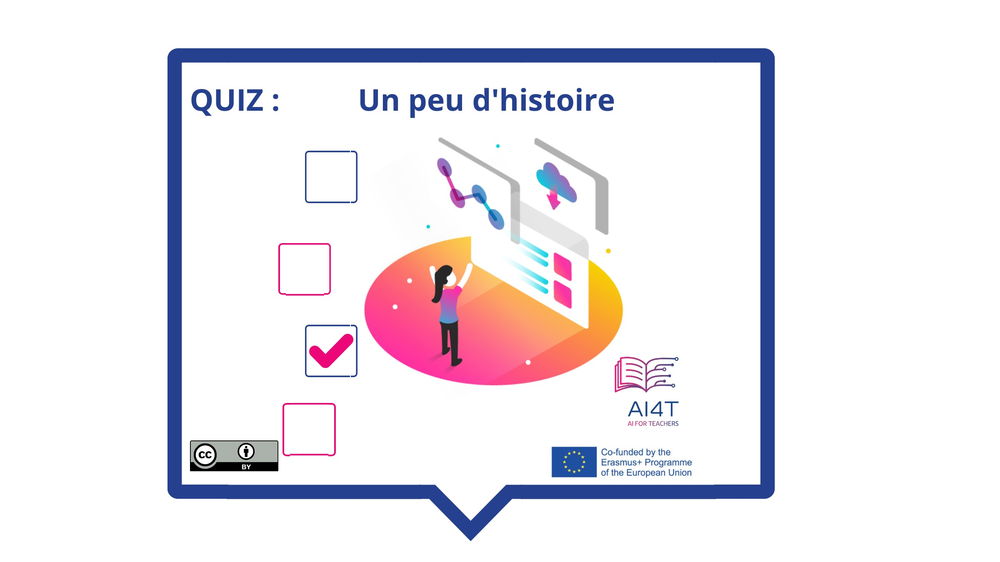

??? info "Metadáta
    - Id: EU.AI4T.O1.M2.2.3a
    - Názov: 2.2.3 Aktivita: Trocha histórie
    - Typ: činnosť
    - Opis: Kvíz o dejinách umelej inteligencie
    - Predmet: Umelá inteligencia pre učiteľov a od učiteľov
    - Autori:
        - AI4T 
    - Licencia: CC BY 4.0
    - Dátum: 2022-11-15

# Aktivita: Trocha histórie
 Na záver tejto lekcie si pár otázkami otestujete svoje znalosti o dejinách umelej inteligencie.

**Prístup k aktivite**  
Kliknite na nasledujúci obrázok

<figure> 
    
</figure>

<iframe width="818" height="404" src="2-2-3-Activity-A-bit-of-history/2-2-3-activity-quiz-AI-history.html" frameborder="0" allowfullscreen></iframe>

