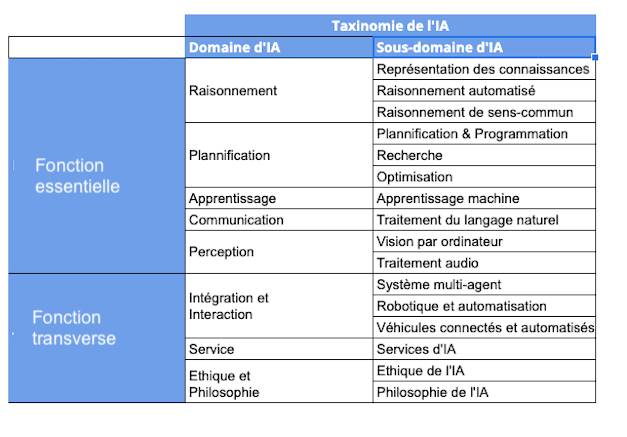

??? info "Metadáta
    - Id: EU.AI4T.O1.M2.2.5t
    - Názov: AIT4.0.1.1. Názov: AIT4.0.1.2:
    - Typ: text
    - Opis: Predmet: Umelá inteligencia pre učiteľov a pre učiteľov
    - Predmet: Umelá inteligencia pre učiteľov a pre učiteľov
    - Autori: Mgr:
        - AI4T
    - Licencia: CC BY 4.0
    - Dátum: 2022-11-15

# Aké sú možnosti využitia umelej inteligencie vo vzdelávaní?

Spomedzi možných klasifikácií vedných oblastí UI sa v nasledujúcej tabuľke uvádza taxonómia UI[^1] vo vzťahu k rodinným funkciám, ktoré môže UI vykonávať.
<figure>
    
</figure>
Obrázok: Taxonómia UI - vedecké oblasti a podoblasti UI (podľa Samoili &amp; al., správa JRC z roku 2021[^1]).

Pozrime sa, ktoré techniky AI sa používajú v aplikáciách zameraných na vzdelávanie na báze AI, ktoré navrhli Holmes &amp; al. v roku 2019[^2].
<figure>
  
</figure>
Obrázok: Rôzne typy súčasných systémov založených na AI pre vzdelávanie (podľa Holmes &amp; al. 2019[^2])._

Každý nástroj alebo prostriedok na vzdelávanie založený na AI má svoje vlastné špecifické techniky. Niekedy je však možné odhadnúť, ktoré z nich sa pravdepodobne použijú pre daný zdroj.

Uveďme si niekoľko príkladov:

- **Dialogový výučbový systém**, ako služba na výučbu žiakov.
Takéto systémy budú pravdepodobne používať: **komunikačné** techniky, ako je spracovanie prirodzeného jazyka na porozumenie a generovanie reči a jazyka a **techniky uvažovania** na účely výučby.

- Odporúčanie kurzov** ako podporná služba pre učiacich sa.
Podobne ako v prípade personalizovaných komerčných ponúk a odporúčacích funkcií, ktoré možno nájsť na internete, budú systémy odporúčania kurzov pravdepodobne založené na technikách strojového učenia prostredníctvom analýzy relevantných aktuálnych údajov súvisiacich s učebnou dráhou študenta a identifikácie podobností s predchádzajúcimi zovšeobecnenými učebnými dráhami.

- Zisťovanie pozornosti a emócií študentov**, ako podporná služba pre učiteľov.
Takýto systém bude pravdepodobne využívať techniky **vnímania** (napríklad počítačové videnie na rozpoznávanie tváre) a techniky **strojového učenia** na analýzu výrazov tváre alebo správania študenta, ak sa tieto informácie zhromažďujú a analyzujú.

[^1]: AI Watch - Definovanie umelej inteligencie - 2.0. Towards an operational definition and taxonomy for the AI landscape - Samoili, S., López Cobo, M., Delipetrev, B., Martínez-Plumed, F., Gómez, E., and De Prato, G. - EUR 30873 SK, Úrad pre vydávanie publikácií Európskej únie, Luxemburg, 2021, ISBN 978-92-76-42648-6, doi:10.2760/019901, JRC126426.

[^2]: Artificial Intelligence In Education: Promises and Implications for Teaching and Learning - Wayne Holmes, Maya Bialik, Charles Fadel - Boston, MA, Center for Curriculum Redesign, 2019.
