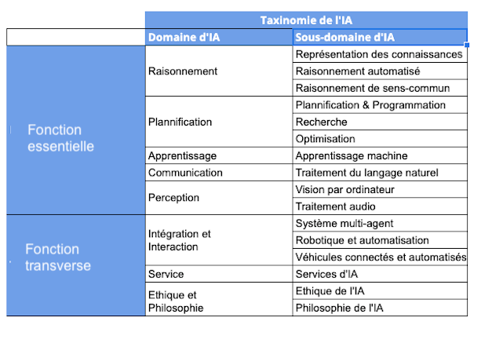

??? info "Metadáta
    - Id: EU.AI4T.O1.M2.2.5t
    - Názov: AIT4.0.1.1. Názov: AIT4.0.1.2:
    - Typ: text
    - Predmet: Umelá inteligencia pre učiteľov a od učiteľov
    - Autori:
        - AI4T
    - Licencia: CC BY 4.0
    - Dátum: 2022-11-15

# Aké sú možnosti využitia AI vo vzdelávaní?

Spomedzi všetkých možných spôsobov zatriedenia podoblastí umelej inteligencie v nasledujúcej tabuľke uvádzame taxonómiu umelej inteligencie[^1] podľa skupín funkcií, ktoré môže vykonávať.
<figure>
    
</figure>
Obrázok: Taxonómia umelej inteligencie - vedecké oblasti a podoblasti AI (podľa Samoili a kol., správa JRC z roku 2021[^1])

Pozrime sa, ktoré techniky umelej inteligencie sa využívajú v aplikáciách zameraných na vzdelávanie pomocou AI, ktoré definovali Holmes a kol. v roku 2019[^2].
<figure>
  
</figure>
Obrázok: Rôzne typy súčasných systémov založených na AI pre vzdelávanie (podľa Holmes a kol. 2019[^2]).

Každý vzdelávací nástroj alebo zdroj založený na AI má svoje vlastné špecifické techniky. Niekedy však vieme odhadnúť, ktoré z nich sa pravdepodobne pri danom zdroji použijú.

Uveďme si niekoľko príkladov:

- **Výučbový systém založený na dialógu**, ktorý slúži na výučbu žiakov.
Takéto systémy pravdepodobne využívajú: **komunikačné** techniky, ako je spracovanie prirodzeného jazyka na porozumenie a generovanie reči a jazyka, ako aj techniky **uvažovania** na účely výučby.

- **Odporúčanie kurzov** ako podporná služba pre študentov.
Podobne ako pri personalizovaných marketingových ponukách a odporúčacích funkciách, ktoré sa dajú nájsť na internete, systémy na odporúčanie kurzov pravdepodobne využívajú techniky **strojového učenia**, vďaka ktorým analyzujú relevantné aktuálne údaje súvisiace s učebnou dráhou študenta a identifikujú podobnosti s predchádzajúcimi zovšeobecnenými učebnými dráhami.

- **Overovanie pozornosti a emócií študentov** ako podporná služba pre učiteľov.
Takýto systém pravdepodobne využíva techniky **vnímania** (napríklad počítačové videnie na rozpoznávanie tvárí) a techniky **strojového učenia** na analýzu výrazov tváre alebo správania študentov, pokiaľ sa tieto informácie zhromažďujú a analyzujú.

[^1]: AI Watch - Defining Artificial Intelligence - 2.0. Towards an operational definition and taxonomy for the AI landscape - Samoili, S., López Cobo, M., Delipetrev, B., Martínez-Plumed, F., Gómez, E. a De Prato, G. - EUR 30873 EN, Publications Office of the European Union, Luxembourg, 2021, ISBN 978-92-76-42648-6, doi:10.2760/019901, JRC126426.

[^2]: Artificial Intelligence In Education: Promises and Implications for Teaching and Learning - Wayne Holmes, Maya Bialik, Charles Fadel - Boston, MA, Center for Curriculum Redesign, 2019.
