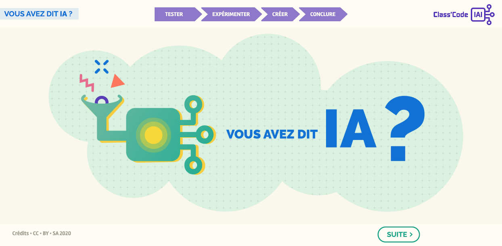

??? info "Metadáta
    - Id: EU.AI4T.O1.M2.3.1a
    - Názov: 2.3.1 Aktivita: Výučbový program Testovanie nášho prvého programu
    - Typ: aktivita
    - Popis: Výukový program na objavovanie programov na rozpoznávanie obrazu, ako ich trénovať, ako ich oklamať.
    - Predmet: Umelá inteligencia pre učiteľov a pre učiteľov
    - Autori: Mgr:
        - AI4T
        - Magickí tvorcovia
        - Inria
        - S24B
        - Kód triedy
    - Licencia: CC BY 4.0
    - Dátum: 2022-11-15

# Aktivita: Výučba Otestujme náš prvý program

Rozpoznávanie obrazu je oblasť umelej inteligencie, ktorá zaznamenala značný rozvoj. V tomto tutoriáli navrhujeme otestovať rozpoznávanie obrazu a natrénovať program na rozpoznávanie psov a mačiek. Potom nám pripomína, že tento program môže robiť len to, na čo bol vycvičený, a že ho možno oklamať!

Učebnicu, ktorá pozostáva zo 7 veľmi krátkych inštruktážnych videí, možno použiť v triede.

**_Poznámka1_** : Tento výukový program neukladá žiadne osobné údaje. Obrázky sa spracúvajú lokálne na počítači používateľa. Možno ho používať s nasledujúcimi prehliadačmi: Edge, Chrome, Mozilla, Safari, Opera.

**_Poznámka2_** : Tento výukový program navrhuje stiahnuť si vlastné obrázky na experimentovanie so strojovým učením a významom súborov údajov na trénovanie algoritmu. Môžete si tiež stiahnuť 2 pripravené súbory údajov:

- Stiahnite si [súbor obrázkov Charlesa Dickensa](Images/Images-set-of-Charles-Dickens.zip)  
- Stiahnite si [súbor obrázkov Williama Shakespeara](Images/Images-set-of-William-Shakespear.zip).

Pokračujte a trénujte umelú inteligenciu!

**Ako funguje program umelej inteligencie?
Kliknite na obrázok nižšie a nechajte sa viesť!

<a href="https://pixees.fr/classcodeiai/app/tuto1/" target="_blank"><figure>
  
</figure></a>
