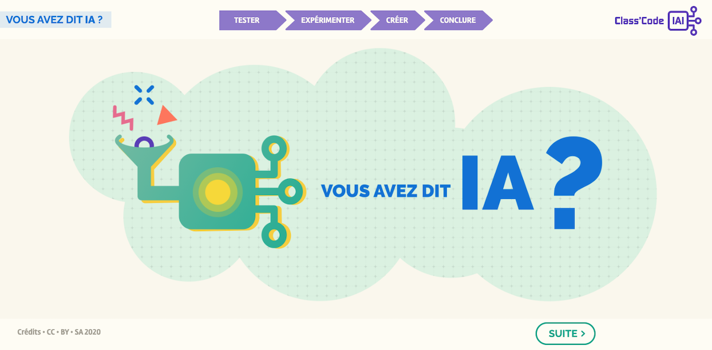

??? info "Metadáta
    - Id: EU.AI4T.O1.M2.3.1a
    - Názov: 2.3.1 Aktivita: Tutoriál – Poďme otestovať náš prvý program
    - Typ: aktivita
    - Popis: Tutoriál na objavovanie programov na rozpoznávanie obrazu: ako ich trénovať a ako ich oklamať
    - Predmet: Umelá inteligencia pre učiteľov a od učiteľov
    - Autori:
        - AI4T
        - Magickí tvorcovia
        - Inria
        - S24B
        - Kód triedy
    - Licencia: CC BY 4.0
    - Dátum: 2022-11-15

# Aktivita: Tutoriál – Poďme otestovať náš prvý program

Rozpoznávanie obrazu je oblasť umelej inteligencie, ktorá zaznamenala značný rozmach. V tomto tutoriáli otestujeme rozpoznávanie obrazu a natrénujeme program na rozpoznávanie psov a mačiek. Následne nám tutoriál pripomenie, že tento program dokáže robiť len to, na čo bol vycvičený, a teda sa dá aj oklamať.

Tutoriál obsahuje 7 veľmi krátkych výukových videí a môže sa používať pri práci so žiakmi SŠ alebo 2. stupňa ZŠ.

**_Poznámka 1:_** Tento výukový program neukladá žiadne osobné údaje. Obrázky sa spracúvajú lokálne na počítači používateľa. Je kompatibilný s nasledujúcimi prehliadačmi: Edge, Chrome, Mozilla, Safari a Opera.

**_Poznámka 2:_** Tento výukový program navrhuje stiahnuť si vlastné obrázky na experimentovanie so strojovým učením a dátovými súbormi na trénovanie algoritmu. Ak ale chcete, môžete si stiahnuť aj tieto dva predpripravené dátové súbory:

- Stiahnite si [súbor obrázkov Charlesa Dickensa](Images/Images-set-of-Charles-Dickens.zip)  
- Stiahnite si [súbor obrázkov Williama Shakespeara](Images/Images-set-of-William-Shakespear.zip).

Tak sa pustite do trénovania umelej inteligencie!

**Ako funguje program založený na umelej inteligencii?
Kliknite na nasledujúci obrázok a nechajte sa všetkým previesť!

<a href="https://pixees.fr/classcodeiai/app/tuto1/" target="_blank"><figure>
  
</figure></a>
