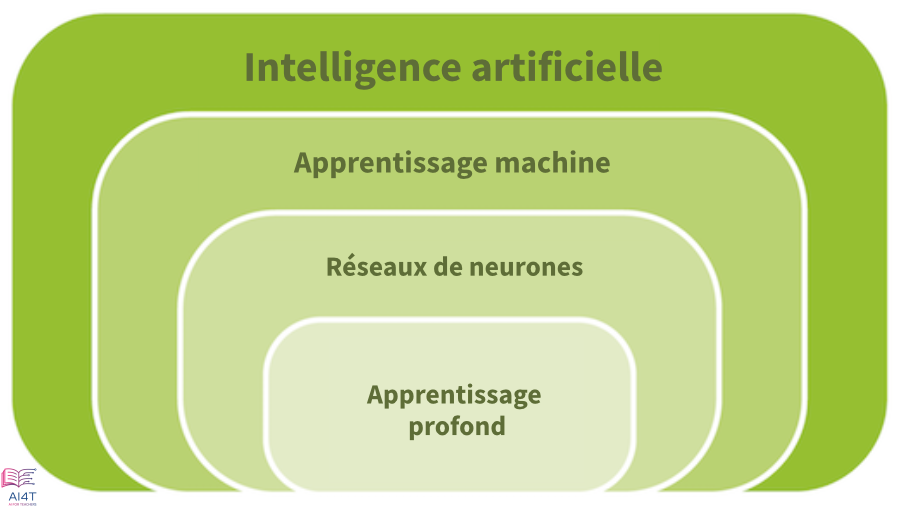

??? info "Metadáta
    - Id: EU.AI4T.O1.M3.1.2t
    - Názov: "M3.1.2: 
    - Typ: text
    - Opis: Predmet: Umelá inteligencia pre učiteľov a pre učiteľov 
    - Predmet: Umelá inteligencia pre učiteľov a pre učiteľov
    - Autori: Mgr:
        - AI4T 
    - Licencia: CC BY 4.0
    - Dátum: 2022-11-15

# Aký typ umelej inteligencie?  
Vo vedeckej literatúre existuje mnoho typov umelej inteligencie. Pozrime sa, na čo sa vzťahujú.

## Slabá alebo silná umelá inteligencia?
- Slabá umelá inteligencia  
  Ide o umelú inteligenciu, ktorú poznáme dnes: je to algoritmus, ktorý sa "učí" tak, že prispôsobuje svoje parametre učebným údajom, a ktorý nemá mentálne a kognitívne schopnosti, ale je schopný vykonávať určitú úlohu niekedy oveľa efektívnejšie (rýchlosť, presnosť) ako človek.
- Silná umelá inteligencia  
  Umelá inteligencia, ktorá je schopná kopírovať ľudské schopnosti (učenie, chápanie, porozumenie, uvažovanie, rozhodovanie, svedomie, emócie atď.) Vývoj "silnej" umelej inteligencie, ktorá je schopná byť autonómna a univerzálna v neočakávaných situáciách, je vedeckým cieľom. Súčasné výsledky však ukazujú, že tento ideál silnej umelej inteligencie je technicky nemožný. Doteraz silná umelá inteligencia neexistuje.

## Symbolický prístup alebo strojové učenie?

Na čo sa v rámci slabej umelej inteligencie vzťahujú symbolické prístupy alebo strojové učenie?

- Symbolický prístup k umelej inteligencii  
  Tento prístup, známy aj ako "založený na pravidlách" alebo "klasická" umelá inteligencia, je založený na logike a apriórnych znalostiach, ktoré poskytujú ľudskí odborníci v skúmanej oblasti.
  Z historického hľadiska je symbolický prístup starší, zodpovedá expertným systémom a v poslednom čase aj tzv. sémantickému webu.
- Strojové učenie (alebo digitálny prístup)  
  Tento prístup, známy aj ako "digitálny", je založený na údajoch a učení.
  Digitálny prístup alebo prístup strojového učenia (ML) zahŕňa umelé neurónové siete a hlboké učenie, keď existuje niekoľko vrstiev týchto výpočtových jednotiek[^1]. V poslednom čase sa stal efektívnym v dôsledku technologického pokroku v oblasti rýchlosti a architektúry procesorov vrátane grafických procesorov a cloud computingu. Tento prístup umožňuje napríklad automaticky prepisovať texty, ktoré diktujeme, alebo rozpoznávať a spracovávať hlasy a objekty na obrázkoch. Vyžaduje si veľa údajov a je založený na štatistických prístupoch.

<figure>
  
  <figcaption>Vzťah medzi umelou inteligenciou, neurónovými sieťami a hlbokým učením (preložené s DeepL) - Zdroj: AI and education: Guidance for policy-makers, UNESCO, 2021.</figcaption>
</figure>

## Prístup k učeniu s dohľadom alebo bez dohľadu?

V rámci prístupov strojového učenia sú systémy umelej inteligencie dvoch typov v závislosti od spôsobu použitia údajov na ich trénovanie[^2] :

- Učenie pod dohľadom  
  "*Supervised learning" sa vzťahuje na používanie označených údajov - napríklad fotografií, na ktorých je uvedené, či obsahujú alebo neobsahujú mačky - na trénovanie algoritmov. Tieto prístupy navrhujú vlastné metódy na predpovedanie toho, ako by mali byť obrázky označené.*"
- Nekontrolované učenie  
  "Učenie bez dozoru sa môže použiť, keď nie sú k dispozícii kvalitné označené údaje. Vyniká pri objavovaní nových skupín a asociácií v rámci údajov, ktoré by inak neboli identifikované alebo označené človekom. Keďže označenia sú často neúplné alebo nepresné, mnohé aplikácie, ako napríklad systémy odporúčania obsahu, kombinujú prístupy učenia pod dohľadom a učenia bez dohľadu*.

Mnohé mechanizmy umelej inteligencie dnes pracujú s využitím učenia pod dohľadom.

Na ilustráciu si predstavme, že chceme naučiť systém umelej inteligencie rozpoznať mačku na obrázku.

Na tento účel poskytneme umelej inteligencii veľké množstvo údajov - v tomto príklade veľa obrázkov, na ktorých možno vidieť mačku, a veľa obrázkov bez mačky -, aby výpočet upravil svoje parametre tak, aby poskytol výstupnú hodnotu zodpovedajúcu prítomnosti alebo neprítomnosti mačky.
Všetky tieto obrázky predstavujú vstupné údaje a očakávaný výsledok, či sa na obrázku nachádza alebo nenachádza mačka, výstupné údaje. Tieto "vstupné" a "výstupné" údaje sú jedinými informáciami poskytnutými na účely trénovania.

Výpočtový mechanizmus preto musí upraviť vnútorné parametre (podobne ako nastavovacie tlačidlá na fotoaparáte), aby určil, či sa na obrázku nachádza mačka alebo nie. Prvýkrát sa poskytne náhodný, a teda s najväčšou pravdepodobnosťou nesprávny výsledok, potom postupne v závislosti od pozitívnej alebo negatívnej spätnej väzby mechanizmus pozoruje chyby a postupnými pokusmi upravuje parametre tak, aby sa chyby znížili, a tým sa zvýšila úspešnosť. Tento proces je známy ako automatické učenie.

V skutočnosti mnohé aplikácie umelej inteligencie využívajú strojové učenie a takmer vždy symbolickú umelú inteligenciu v pozadí.
Napríklad mnohé aplikácie chatbotov sú vopred naprogramované s pravidlami definovanými človekom o tom, ako odpovedať na predpokladané otázky. Štúdium toho, ako kombinovať prístupy symbolického a strojového učenia, je aktuálnou témou výskumu.

[^1]: [AI and education: a guide for policy makers](https://unesdoc.unesco.org/ark:/48223/pf0000380006) - Miao Fengchun, Holmes Wayne, Ronghuai Huang, Hui Zhang - ISBN: 978-92-3-200244-0 - UNESCO, 2021

[^2]: Štúdia v angličtine: [Artificial intelligence: How does it work, why does it matter, and what can we do about it?](https://www.europarl.europa.eu/thinktank/en/document/EPRS_STU(2020)641547) - Philip Boucher, Scientific Foresight Unit (STOA) - ISBN: 978-92-846-6770-3 - Európska únia, 2020
