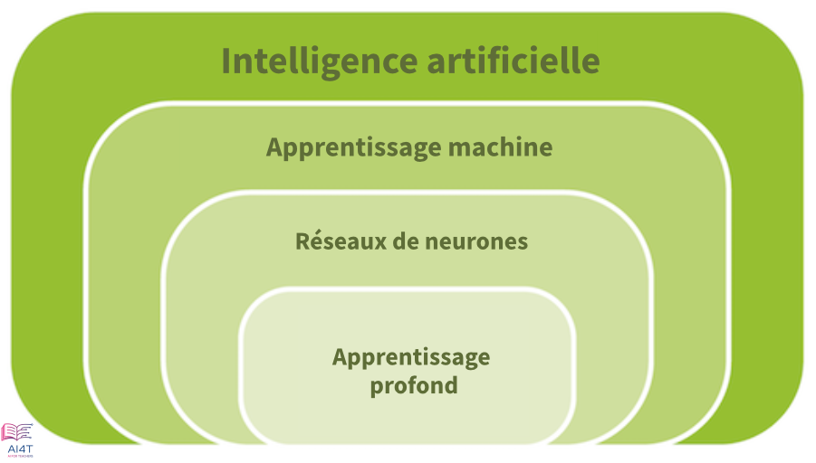

??? info "Metadáta
    - Id: EU.AI4T.O1.M3.1.2t
    - Názov: "M3.1.2: 
    - Typ: text
    - Predmet: Umelá inteligencia pre učiteľov a od učiteľov
    - Autori:
        - AI4T 
    - Licencia: CC BY 4.0
    - Dátum: 2022-11-15

# Aký typ umelej inteligencie?  
Vo vedeckej literatúre možno nájsť mnoho typov umelej inteligencie. Pozrime sa, na čo jednotlivé typy odkazujú.

## Slabá alebo silná umelá inteligencia?
- **Slabá umelá inteligencia**

  Ide o umelú inteligenciu, ktorú poznáme dnes: je to algoritmus, ktorý sa „učí“ tým, že prispôsobuje svoje parametre učebným dátam. Nie je obdarený mentálnymi ani kognitívnymi schopnosťami, ale je schopný vykonávať konkrétnu úlohu, niekedy dokonca oveľa efektívnejšie než človek.
- **Silná umelá inteligencia**
  
  Umelá inteligencia, ktorá je schopná kopírovať ľudské schopnosti (napr. učenie sa, chápanie, porozumenie, uvažovanie, rozhodovanie, vedomie či emócie). Cieľom vedcov je vyvinúť „silnú“ umelú inteligenciu, ktorá by vedela byť autonómna a všestranne využiteľná aj v nečakaných situáciách. Súčasné výsledky však ukazujú, že tento ideál silnej umelej inteligencie je technicky nemožný. Silná umelá inteligencia tak dodnes nevznikla, je iba teoretickým konceptom.

## Symbolický prístup alebo strojové učenie?

Čo pri slabej umelej inteligencii myslíme pod symbolickým prístupom či strojovým učením?

- **Symbolická umelá inteligencia**
  
  Tento prístup k umelej inteligencii, na ktorý odkazujú aj výrazy „umelá inteligencia založená na pravidlách“ či „klasická umelá inteligencia“, je založený na logike a existujúcich znalostiach, ktoré poskytujú ľudskí odborníci. Z historického hľadiska je symbolický prístup starší – používa sa v expertných systémoch a novšie aj pri vývoji tzv. sémantického webu.
- **Strojové učenie (digitálny prístup)**
  
  Tento prístup, tiež známy ako „digitálny prístup“, je založený na dátach a učení. Prístup strojového učenia zahŕňa umelé neurónové siete a hlboké učenie, keď je k dispozícii viacero vrstiev takýchto výpočtových jednotiek.[^1] V poslednom čase sa výrazne zefektívnil, a to vďaka zvýšenej výpočtovej rýchlosti a lepšej architektúre procesorov vrátane grafických procesorov a cloud computingu. Tento prístup nám umožňuje napríklad automaticky prepisovať diktované texty alebo rozpoznávať objekty na obrázkoch. Vyžaduje si veľa dát a je založený na štatistických prístupoch.

<figure>
  
  <figcaption>Vzťah medzi umelou inteligenciou, neurónovými sieťami a hlbokým učením - Zdroj: AI and education: Guidance for policy-makers, UNESCO, 2021.</figcaption>
</figure>

## Učenie s dohľadom alebo bez?

V rámci prístupov strojového učenia existujú dva typy systémov umelej inteligencie v závislosti od toho, ako využívajú trénovacie dáta:[^2]

- **Učenie s dohľadom**  
  *Pod týmto pojmom sa myslí používanie označených dát (napríklad fotografií, na ktorých je uvedené, či sú na nich vyobrazené mačky alebo nie) na trénovanie algoritmov. Tieto prístupy si vytvárajú vlastné metódy na predpovedanie toho, ako by mali byť obrázky označené.*
- **Učenie bez dohľadu**  
  *Učenie bez dohľadu sa môže použiť, keď nemáme k dispozícii kvalitne označené dáta. Dokáže v dátach dobre objavovať nové zhluky a asociácie, ktoré by človek nemusel úspešne identifikovať alebo označiť. Keďže takto vytvorené označenia sú často neúplné alebo nepresné, mnohé aplikácie (napríklad odporúčacie systémy) prístupy učenia sa s dohľadom a bez dohľadu kombinujú.*

Mnohé mechanizmy umelej inteligencie dnes využívajú učenie s dohľadom. Na ilustráciu ich fungovania si predstavme, že chceme systém umelej inteligencie naučiť rozpoznať mačku na obrázku.

Na tento účel poskytneme umelej inteligencii veľké množstvo dát. V tomto príklade jej poskytujeme veľa obrázkov, na ktorých vidieť mačku, a veľa obrázkov bez mačky. Program tak upraví svoje parametre tak, aby jeho výstupom bola informácia o tom, či je na obrázku prítomná mačka alebo nie. Všetky tieto obrázky sú vstupnými údajmi a očakávaný výsledok, či sa na obrázku nachádza mačka alebo nie, nazývame výstupnými údajmi. Tieto vstupné a výstupné údaje sú jedinými informáciami, ktoré poskytujeme na účely trénovania.

Výpočtový mechanizmus preto musí upraviť vnútorné parametre (podobne ako keď nastavujeme ovládacie gombíky na fotoaparáte), aby určil, či sa na obrázku nachádza mačka alebo nie. Prvýkrát nám poskytne náhodný, a teda s najväčšou pravdepodobnosťou nesprávny výsledok. Potom mechanizmus postupne dostáva pozitívnu alebo negatívnu spätnú väzbu, vďaka ktorej pozoruje svoje chyby a postupnými pokusmi upravuje parametre tak, aby sa chybovosť znížila a úspešnosť zvýšila. Tento proces je známy ako strojové učenie.

Mnohé AI aplikácie využívajú strojové učenie a takmer vždy beží v pozadí aj nejaký typ symbolickej umelej inteligencie.
Napríklad mnohé četboty sú vopred naprogramované pomocou pravidiel, ktoré presne zadefinovali ľudia, aby vedeli odpovedať na najpravdepodobnejšie otázky. Skúmanie toho, ako kombinovať prístupy symbolického a strojového učenia, je aktuálne predmetom výskumu.

[^1]:[AI and education: Guidance for policy-makers](https://unesdoc.unesco.org/ark:/48223/pf0000376709) - Miao Fengchun, Holmes Wayne, Ronghuai Huang, Hui Zhang - ISBN: 978-92-3-100447-6 - UNESCO, 2021

[^2]:[Artificial intelligence: How does it work, why does it matter, and what can we do about it?](https://www.europarl.europa.eu/thinktank/en/document/EPRS_STU(2020)641547) - Philip Boucher, Scientific Foresight Unit (STOA) - ISBN: 978-92-846-6770-3 - European Union, 2020
