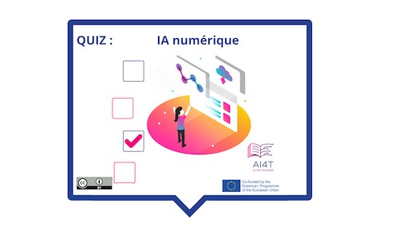

??? info "Metadáta
    - Id: EU.AI4T.O1.M3.1.4a
    - Názov: 3.1.4 Aktivita: Identifikácia digitálnej umelej inteligencie 
    - Typ: činnosť
    - Opis: Čo je a čo nie je digitálna umelá inteligencia?
    - Predmet: Umelá inteligencia pre učiteľov a od učiteľov
    - Autori:
        - AI4T 
    - Licencia: CC BY 4.0
    - Dátum: 2022-11-15

# Aktivita: Digitálna umelá inteligencia

Krátka aktivita na zhodnotenie digitálnej umelej inteligencie (známej aj ako _strojové učenie_) a toho, čo dokáže a čo nie.

**Prístup k aktivite**  
Kliknite na nasledujúci obrázok.

<figure>
    
</figure>

<iframe width="818" height="404" src="3-1-4a-activity-what-type-of-ai/3-1-4a-Digital-AI.html" frameborder="0" allowfullscreen></iframe>

