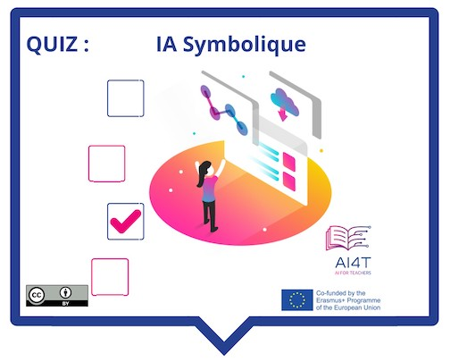

??? info "Metadáta
    - Id: EU.AI4T.O1.M3.1.5a
    - Názov: 3.1.5 Aktivita: Identifikácia symbolickej umelej inteligencie
    - Typ: činnosť
    - Opis: Čo je a čo nie je symbolická umelá inteligencia?
    - Predmet: Umelá inteligencia pre učiteľov a od učiteľov
    - Autori:
        - AI4T 
    - Licencia: CC BY 4.0
    - Dátum: 2022-11-15

# Aktivita: Symbolická umelá inteligencia

Krátka aktivita na zhodnotenie symbolickej umelej inteligencie a toho, čo dokáže a čo nie.

**Prístup k aktivite**  
Kliknite na nasledujúci obrázok.

<figure>
    
</figure>

<iframe width="818" height="404" src="3-1-5a-activity-what-type-of-ai/3-1-5a-Symbolic-AI.html" frameborder="0" allowfullscreen></iframe>

