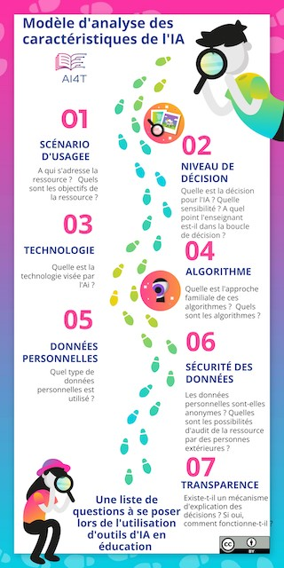

??? info "Metadáta
    - Id: EU.AI4T.O1.M3.1.6t
    - Názov: 3.1.6 Model charakterizácie AI
    - Typ: text
    - Opis: Získať počiatočné pochopenie charakteristík UI
    - Predmet: Umelá inteligencia pre učiteľov a pre učiteľov
    - Autori: Mgr:
        - AI4T
        - Jiajun Pan
        - Azim Roussanaly
        - Anne Boyer
    - Licencia: CC BY 4.0
    - Dátum: 2022-11-15

# Model na charakterizovanie umelej inteligencie

Hoci sa vzdelávacie zdroje umelej inteligencie -AIER- stávajú čoraz bežnejšími, v súčasnosti neexistuje nástroj, ktorý by komplexne mapoval charakteristiky AIER a pomáhal používateľom tieto zdroje informovane využívať.

Výskumné laboratórium LORIA[^1] špeciálne navrhlo model charakterizácie UI[^2] na vedeckej, technickej, regulačnej a etickej úrovni s cieľom pomôcť učiteľom lepšie pochopiť zdroje založené na UI, ktoré môžu učitelia a študenti používať.

Je usporiadaný do rôznych vrstiev, ktoré pokrývajú všetky charakteristiky UI, od scenárov používania až po mechanizmus transparentnosti na vysvetlenie rozhodnutia navrhovaného UI.

**Chcete vedieť, aké otázky si klásť pri používaní nástrojov AI vo vzdelávaní?

Kliknite na obrázok nižšie a objavte formát pripravený na použitie modelu analýzy vzdelávacích zdrojov AI.

<a href="Documents/AI4T-Template-Ready-to-use-FR.pdf" target="_blank"><figure>
  
</figure></a>`

Model vo formáte pripravenom na použitie[^3] si môžete stiahnuť a doplniť aj pre svoje vlastné vzdelávacie nástroje a zdroje umelej inteligencie.

[^1]: Loria [Laboratoire Lorrain de Recherche en Informatique et ses Applications](https://www.loria.fr) je súčasťou výskumnej jednotky (UMR 7503), ktorú spoločne využívajú [CNRS](http://www.cnrs.fr), [Université de Lorraine](https://welcome.univ-lorraine.fr/fr/) a [Inria](http://www.inria.fr/). Je členom konzorcia AI4T a prispieva svojimi odbornými znalosťami v oblasti umelej inteligencie a vzdelávania, ako aj analýzy učenia.

[^2]: Document en anglais : [Report on template for analysing AI-related features in learning resources](Documents/REPORT-ON-THE-TEMPLATE-2.0.pdf) - Jiajun PAN, Azim ROUSSANALY, Anne BOYER - AI4T Erasmus+ project, 2022.

[^3]: Document en anglais : [Ready to Use template for AI resources Characterisation](Documents/AI4T-Template-Ready-to-use-EN.pdf) - Inria Learning Lab, Jiajun PAN, Azim ROUSSANALY, Anne BOYER - AI4T Erasmus+ project - 2022.
