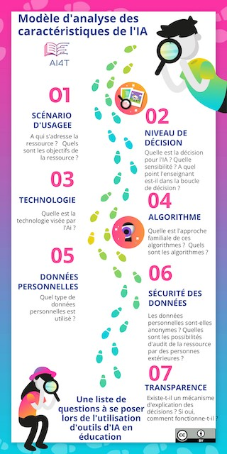

??? info "Metadáta
    - Id: EU.AI4T.O1.M3.1.6t
    - Názov: 3.1.6 Šablóna na charakterizovanie umelej inteligencie
    - Typ: text
    - Opis: Získajte základnu predstavu o charakteristikách AI
    - Predmet: Umelá inteligencia pre učiteľov a od učiteľov
    - Autori:
        - AI4T
        - Jiajun Pan
        - Azim Roussanaly
        - Anne Boyer
    - Licencia: CC BY 4.0
    - Dátum: 2022-11-15

# Šablóna na charakterizovanie umelej inteligencie

Hoci AI vzdelávacie zdroje sú čoraz bežnejšie, v súčasnosti neexistuje nástroj, ktorý by komplexne mapoval ich charakteristiky a pomáhal používateľom informovane tieto zdroje využívať.

Výskumné laboratórium LORIA[^1] špeciálne navrhlo šablónu na charakterizovanie AI[^2] na vedeckej, technickej, regulačnej a etickej úrovni s cieľom pomôcť učiteľom lepšie pochopiť zdroje, ktoré oni alebo ich študenti používajú.

Je usporiadaná do rôznych vrstiev, ktoré pokrývajú všetky charakteristiky AI vzdelávacích nástrojov, od scenárov používania až po mechanizmus transparentnosti na vysvetlenie rozhodnutia navrhnutého umelou inteligenciou.

**Chcete vedieť, aké otázky si klásť pri používaní AI vzdelávacích nástrojov?**

Kliknite na nasledujúci obrázok a pozrite si šablónu na analýzu AI vzdelávacích zdrojov.

<a href="Documents/AI4T-Template-Ready-to-use-FR.pdf" target="_blank"><figure>
  
</figure></a>`

Šablónu vo formáte pripravenom na použitie[^3] si môžete stiahnuť a využiť aj na vlastné AI vzdelávacie nástroje a zdroje.

[^1]: Loria [Laboratoire Lorrain de Recherche en Informatique et ses Applications](https://www.loria.fr) je súčasťou výskumnej jednotky (UMR 7503), ktorú spoločne využívajú [CNRS](http://www.cnrs.fr), [Université de Lorraine](https://welcome.univ-lorraine.fr/fr/) a [Inria](http://www.inria.fr/). Je členom konzorcia AI4T a prispieva svojimi odbornými znalosťami v oblasti umelej inteligencie a vzdelávania, ako aj analýzy učenia.

[^2]: [Report on template for analyzing AI-related features in learning resources](Documents/REPORT-ON-THE-TEMPLATE-2.0.pdf) - Jiajun PAN, Azim ROUSSANALY, Anne BOYER - AI4T Erasmus+ project, 2022.

[^3]: [Ready to Use template for AI resources Characterisation](Documents/AI4T-Template-Ready-to-use-EN.pdf) - Inria Learning Lab, Jiajun PAN, Azim ROUSSANALY, Anne BOYER - AI4T Erasmus+ Project - 2022
