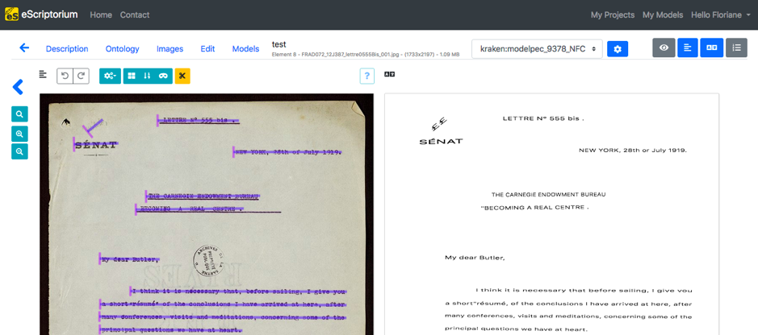

??? info "Metadáta
    - Id: EU.AI4T.O1.M3.2.2t
    - Názov: 3.2.2 Čo sú to údaje?
    - Typ: text
    - Opis: Prvotné pochopenie toho, čo sú údaje a ako sa používajú v umelej inteligencii.
    - Predmet: Umelá inteligencia pre učiteľov a pre učiteľov
    - Autori: Mgr:
        - AI4T
        - Laurent Romary - Inria
    - Licencia: CC BY 4.0
    - Dátum: 2022-11-15

# Čo sú to dáta?

## Úloha údajov v systéme umelej inteligencie

Vo všeobecnom digitálnom zmysle sú údaje informácie, ktoré používa, spracováva a vytvára softvér počítačového systému.

Bez údajov neexistuje umelá inteligencia. Údaje zohrávajú ústrednú úlohu vo všetkých procesoch strojového učenia, pretože sa používajú na učenie aj na testovanie. Majú tiež podobu parametrov používaných na riadenie procesov učenia. Nakoniec systém umelej inteligencie je kombináciou určitej softvérovej architektúry so všetkými parametrami učenia, tzv. modelom, ktorý je tiež údajom.

Pochopenie úlohy údajov v systémoch umelej inteligencie a spôsobu ich výberu, dokumentácie a šírenia je nevyhnutné na hodnotenie správania systému umelej inteligencie. Je to dôležité z hľadiska reprodukovateľnosti alebo na porovnanie dvoch rôznych systémov UI.

Napríklad vo svete spracovania prirodzeného jazyka je dostupnosť veľkého množstva hovorených a písaných údajov kľúčová pre výkonnosť kontrolórov pravopisu, predikcie vyhľadávačov a, samozrejme, strojového prekladu. Tieto údaje sa používajú na vytvorenie tzv. jazykových modelov, ktoré poskytujú iným procesom štatistické reprezentácie kombinácií slov alebo viet.

Udržateľnosť systémov umelej inteligencie preto do veľkej miery závisí od metód správy údajov použitých pri ich návrhu.

## Údaje pre systémy umelej inteligencie pod dohľadom a bez dohľadu

Ako sme už videli, systémy umelej inteligencie sú dvoch typov v závislosti od toho, ako sa údaje používajú na učenie. Systémy s dohľadom sú založené na poskytovaní vstupov a príslušných výstupov. Učenie teda zahŕňa učenie systému, aby z neznámych vstupov generoval najpravdepodobnejší výstup. Existuje niekoľko spôsobov získavania takýchto údajov. Napríklad databáza obrázkov, kde je každý obrázok spojený s kľúčovými slovami, alebo zbierka digitalizovaných dokumentov, ktoré boli prepísané anotátormi (pozri obrázok nižšie).

<figure>
	 
	 <figcaption>Obrázok: Automatický prepis listu od Paula D'Estournellesa (s láskavým dovolením F. Chiffoleaua, Coll. Archives de la Sarthe).</figcaption>
</figure>

Systémy umelej inteligencie založené na nekontrolovanom učení nebudú určené na konkrétne správanie, ale budú navrhnuté tak, aby podporovali štatistické vlastnosti trénovaných údajov. To je napríklad prípad jazykových modelov, ako je BERT, ktoré majú tendenciu spájať podobné pozície v matematickom priestore so slovami s rovnakým syntaktickým alebo sémantickým správaním, pozorovaným na základe dodania veľkého počtu vzorových viet pre každé slovo. Takéto modely sú veľmi účinné napríklad pri predpovedaní synoným alebo ďalších slov v danej sekvencii.

## Zdroje - výber, dokumentácia, príprava, anotácia

Návrh systému umelej inteligencie v podstate závisí od vhodného návrhu súboru údajov, ktorý sa použije na jeho trénovanie. Medzi rôzne faktory, ktoré vstupujú do hry, patrí relevantnosť údajov pre danú úlohu, veľkosť údajov, ktorá musí zodpovedať zložitosti architektúry softvéru umelej inteligencie --- čím viac matematických parametrov sa má trénovať, tým viac údajov je potrebných --- a rôznorodosť vzoriek, ktorá musí odrážať zložitosť úlohy.

V závislosti od zdrojov údajov sa údaje musia vybrať a často vyčistiť pred ich zavedením do procesu učenia. Ak si zoberieme príklad učenia jazykového modelu na základe webového obsahu, rôzne vzorky sa musia roztriediť podľa skutočného jazyka, očistiť od sprievodného webového kódu (HTML, Javascript atď.) a prípadne zmiešať, aby sa predišlo porušeniu autorských práv. Dobrým príkladom takejto prípravy údajov je návrh korpusu OSCAR [^1].

Návrh anotovaných údajov pre systémy umelej inteligencie s dohľadom je zložitejší, pretože zahŕňa návrh anotačnej schémy, organizáciu anotačných kampaní a kontrolu kvality anotovaných údajov, napríklad posúdením zhody medzi anotátormi na tých istých údajoch.

Celkovo je nevyhnutné, aby bol proces návrhu dobre zdokumentovaný, aby bolo možné vysledovať akékoľvek chybné správanie vo výslednom vyškolenom systéme až k jeho zdroju.

## Neobjektívne systémy umelej inteligencie

Ako sme práve spomenuli, správanie systému umelej inteligencie úzko závisí od povahy údajov použitých na jeho trénovanie. To môže generovať možné skreslenia, ktoré vyplývajú z výberu súborov údajov. Napríklad jazykový model vycvičený výlučne na novinových článkoch bude pokrývať úplne iné typy výrazov a tém ako model, ktorý by si vybral literatúru alebo obsah sociálnych sietí. Podobne aj systémy na generovanie obrázkov budú odrážať veľkosť a rozmanitosť zdrojových databáz obrázkov (napr. umeleckých diel), ktoré sa brali do úvahy.

V prípade systémov pod dohľadom môže špecifické skreslenie vyplynúť zo spôsobu, akým sú navrhnuté anotačné štítky, ako aj zo spôsobu, akým budú anotátori s vlastným kultúrnym pozadím interpretovať údaje. Ak chcete napríklad identifikovať nenávistné prejavy na sociálnych sieťach, spôsob, akým anotátori interpretujú pocity, sa môže líšiť v závislosti od veku, kultúry a osobných pocitov anotátorov voči materiálu, ktorý sa má anotovať.

Celkovo treba mať vždy na pamäti, že systémy umelej inteligencie sú zo svojej podstaty veľmi konzervatívne, pokiaľ ide o ich tréningové údaje, a teda existujúce pozorovateľné údaje. Od systému umelej inteligencie nemôžeme očakávať žiadnu skutočnú kreativitu.

## Hosťovanie, zhromažďovanie a distribúcia údajov

Vzhľadom na potenciálnu veľkosť a zložitosť tréningových údajov systémov AI a výsledných modelov boli zavedené rôzne iniciatívy, ktoré umožňujú ich hosťovanie a distribúciu.

Otvorené súbory údajov a modely môžu byť umiestnené v špecializovaných úložiskách (napr. Image Data Resource[^2]) alebo vo všeobecných národných či medzinárodných úložiskách (napr. Zenodo[^3]). Tieto repozitáre spravidla poskytujú infraštruktúru na správu autorstva, licencií, verzií a archiváciu svojho obsahu.

V prípade komplexných úloh, keď na anotácii rôznych vzoriek údajov pracuje paralelne niekoľko tímov, niektoré iniciatívy fungujú ako katalógy pre príslušné zdroje údajov. To je napríklad prípad iniciatívy HTR United[^4], ktorá združuje metadáta anotovaných dokumentov na rozpoznávanie (ručne písaného) textu.

[^1]: Stránka v anglickom korpuse OSCAR : [https://oscar-corpus.com/](https://oscar-corpus.com/)

[^2]: Webová stránka so zdrojmi obrazových údajov : [https://idr.openmicroscopy.org/](https://idr.openmicroscopy.org/)

[^3]: Webová stránka Zenodo : [https://zenodo.org/](https://zenodo.org/)

[^4]: Webová stránka HTR United : [https://htr-united.github.io](https://htr-united.github.io)
