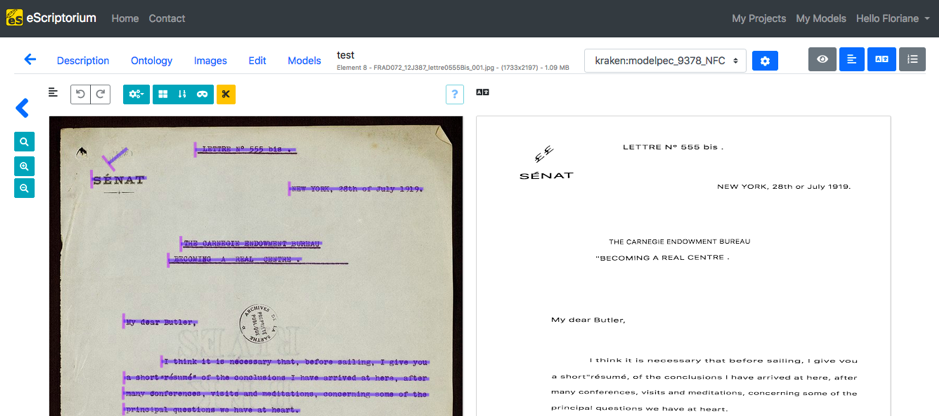

??? info "Metadáta
    - Id: EU.AI4T.O1.M3.2.2t
    - Názov: 3.2.2 Čo sú to údaje?
    - Typ: text
    - Opis: Základné informácie o tom, čo sú to dáta a ako sa využívajú pri umelej inteligencii.
    - Predmet: Umelá inteligencia pre učiteľov a od učiteľov
    - Autori:
        - AI4T
        - Laurent Romary - Inria
    - Licencia: CC BY 4.0
    - Dátum: 2022-11-15

# Čo sú to dáta?

## Úloha dát v AI systémoch

Vo všeobecnom digitálnom zmysle sa dátami myslia údaje (informácie), ktoré používa, spracúva a vytvára softvér počítačového systému.

Bez dát by nemohla existovať žiadna umelá inteligencia. Dáta totiž zohrávajú ústrednú úlohu vo všetkých procesoch strojového učenia, pretože sa používajú na trénovanie aj testovanie. Dáta tiež vystupujú v podobe parametrov, ktoré sa používajú na riadenie trénovacích procesov. AI systém je tak v konečnom dôsledku kombináciou určitej softvérovej architektúry a všetkých učebných parametrov – tzv. modelom, ktorý je vlastne tiež tvorený dátami.

Pochopenie toho, akú úlohu v AI systémoch zohrávajú dáta a spôsobu ich výberu, dokumentácie a šírenia, je nevyhnutné na to, aby sme dokázali posúdiť správania AI systému. Je to dôležité z hľadiska reprodukovateľnosti alebo pri porovnávaní dvoch rôznych AI systémov.

Napríklad pri spracúvaní prirodzeného jazyka je nevyhnutné, aby bolo dostupné veľké množstvo hovorených a písaných dát, pretože práve tieto dáta zabezpečujú kvalitné výstupy pri kontrole pravopisu, predikcii vyhľadávačov či strojovom preklade. Tieto dáta sa používajú na vytvorenie tzv. jazykových modelov, ktoré potom iným procesom poskytujú štatistické reprezentácie kombinácií rôznych slov alebo viet.

Udržateľnosť AI systémov preto do veľkej miery závisí od toho, aké metódy na správu dát sa využívajú pri ich navrhovaní.

## Dáta pre AI systémy s dohľadom a bez

Ako sme už videli, rozlišujeme dva typy AI systémov v závislosti od toho, akým spôsobom sa dáta využívajú na ich trénovanie. Systémy **s dohľadom** sa spoliehajú na poskytovanie vstupov a zamýšľaných výstupov. Pri tréningu teda systém učíme, aby z neznámych vstupov generoval najpravdepodobnejší výstup. Existuje niekoľko spôsobov, ako takéto dáta získavať. Príkladom môže byť databáza obrázkov, kde sú ku každému obrázku priradené kľúčové slová, alebo zbierka digitalizovaných dokumentov, ktoré prepísali anotátori (pozri obrázok nižšie).

<figure>
	 
	 <figcaption>Obrázok: Automatický prepis listu, ktorý napísal Paula d'Estournelles (zdroj: F. Chiffoleau, Coll. Archives de la Sarthe).</figcaption>
</figure>

AI systémy založené na učení **bez dohľadu** nie sú určené na konkrétne správanie, ale sú navrhnuté tak, aby zachytávali štatistické vlastnosti tréningových dát. To je napríklad prípad jazykových modelov ako BERT, ktoré zvyknú priraďovať podobné pozície v matematickom priestore so slovami s rovnakými syntaktickými alebo sémantickými vlastnosťami, čo vypozorovali na veľkom počte vzorových viet pre každé slovo. Takéto modely sú veľmi účinné napríklad pri predpovedaní synoným alebo nasledujúcich slov v určenej sekvencii.

## Zdroje - výber, dokumentácia, príprava, anotácia

Návrh AI systému v podstate závisí od vhodného návrhu dátového súboru, ktorý sa použije na jeho trénovanie. Do hry vstupujú rôzne faktory ako relevantnosť dát pre danú úlohu, veľkosť dát (ktorá by mala zodpovedať zložitosti architektúry AI softvéru – čím viac matematických parametrov sa má trénovať, tým viac dát treba) či rozmanitosť vzoriek, ktorá by mala odrážať komplexnosť úlohy.

V závislosti od použitých zdrojov býva ešte pred použitím dát v procese učenia potrebné vybrať a očistiť ich. Ak si ako príklad vezmeme učenie jazykového modelu na webovom obsahu, rôzne vzorky sa musia roztriediť podľa reálne použitého jazyka, očistiť od sprievodného kódu (HTML, Javascript a pod.) a prípadne premiešať, aby sa predišlo porušeniu autorských práv. Dobrým príkladom takejto prípravy dát je návrh jazykového korpusu OSCAR.[^1]

Návrh anotovaných dát pre AI systémy s dohľadom je zložitejší, pretože pri ňom treba navrhnúť schému anotácií, zorganizovať anotačné kampane a skontrolovať kvalitu anotovaných dát (napríklad posudzovaním zhody medzi rôznymi anotátormi na tých istých dátach).

Celkovo je nevyhnutné, aby bol proces návrhu dobre zdokumentovaný, aby bolo vo výslednom vytrénovanom systéme možné spätne vystopovať zdroj prípadného chybného správania až k jeho zdroju.

## Neobjektívne AI systémy

Ako sme už naznačili, správanie systému umelej inteligencie úzko závisí od povahy údajov použitých na jeho trénovanie. To môže generovať možné skreslenia, ktoré vyplývajú z výberu súborov údajov. Napríklad jazykový model vycvičený výlučne na novinových článkoch bude pokrývať úplne iné typy výrazov a tém ako model, ktorý by si vybral literatúru alebo obsah sociálnych sietí. Podobne aj systémy na generovanie obrázkov budú odrážať veľkosť a rozmanitosť zdrojových databáz obrázkov (napr. umeleckých diel), ktoré sa brali do úvahy.

V prípade systémov pod dohľadom môže špecifické skreslenie vyplynúť zo spôsobu, akým sú navrhnuté anotačné štítky, ako aj zo spôsobu, akým budú anotátori s vlastným kultúrnym pozadím interpretovať údaje. Ak chcete napríklad identifikovať nenávistné prejavy na sociálnych sieťach, spôsob, akým anotátori interpretujú pocity, sa môže líšiť v závislosti od veku, kultúry a osobných pocitov anotátorov voči materiálu, ktorý sa má anotovať.

Celkovo treba mať vždy na pamäti, že systémy umelej inteligencie sú zo svojej podstaty veľmi konzervatívne, pokiaľ ide o ich tréningové údaje, a teda existujúce pozorovateľné údaje. Od systému umelej inteligencie nemôžeme očakávať žiadnu skutočnú kreativitu.

## Hosťovanie, zhromažďovanie a distribúcia údajov

Vzhľadom na potenciálnu veľkosť a zložitosť tréningových údajov systémov AI a výsledných modelov boli zavedené rôzne iniciatívy, ktoré umožňujú ich hosťovanie a distribúciu.

Otvorené súbory údajov a modely môžu byť umiestnené v špecializovaných úložiskách (napr. Image Data Resource[^2]) alebo vo všeobecných národných či medzinárodných úložiskách (napr. Zenodo[^3]). Tieto repozitáre spravidla poskytujú infraštruktúru na správu autorstva, licencií, verzií a archiváciu svojho obsahu.

V prípade komplexných úloh, keď na anotácii rôznych vzoriek údajov pracuje paralelne niekoľko tímov, niektoré iniciatívy fungujú ako katalógy pre príslušné zdroje údajov. To je napríklad prípad iniciatívy HTR United[^4], ktorá združuje metadáta anotovaných dokumentov na rozpoznávanie (ručne písaného) textu.

[^1]: Stránka v anglickom korpuse OSCAR : [https://oscar-corpus.com/](https://oscar-corpus.com/)

[^2]: Webová stránka so zdrojmi obrazových údajov : [https://idr.openmicroscopy.org/](https://idr.openmicroscopy.org/)

[^3]: Webová stránka Zenodo : [https://zenodo.org/](https://zenodo.org/)

[^4]: Webová stránka HTR United : [https://htr-united.github.io](https://htr-united.github.io)
