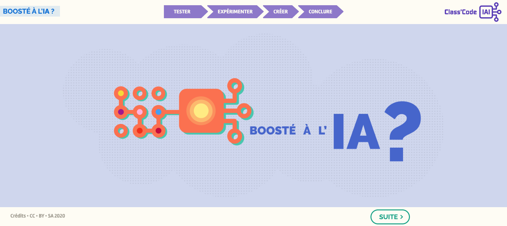

??? info "Metadáta
    - Id: EU.AI4T.O1.M3.2.4a
    - Názov: 3.2.4 Činnosť : Posilnená AI ?
    - Typ: činnosť
    - Opis: Experimentujte s tým, ako funguje strojové učenie a trénovanie programov, a otestujte význam správne pripravených súborov údajov.
    - Predmet: Umelá inteligencia pre učiteľov a pre učiteľov
    - Autori: Mgr:
        - AI4T 
        - Magickí tvorcovia
        - Inria
        - S24B
        - Kód triedy
    - Licencia: CC BY 4.0
    - Dátum: 2022-11-15

# Aktivita: Posilnená umelou inteligenciou?
Neexistuje lepší spôsob, ako pochopiť, ako funguje strojové učenie a trénovanie programov, ako študovať, ako správne pripraviť súbor údajov.

Tento výukový program obsahuje sedem krátkych inštruktážnych videí, takže je v prípade potreby vhodný na použitie so študentmi stredných škôl (alebo univerzít).

**_Poznámka1_** : Tento výukový program neukladá žiadne osobné údaje. Obrázky sa spracúvajú lokálne na počítači používateľa. Možno ho používať s nasledujúcimi prehliadačmi: Edge, Chrome, Mozilla, Safari, Opera.

**_Poznámka2_** : Tento výukový program navrhuje stiahnuť si vlastné obrázky na experimentovanie so strojovým učením a významom súborov údajov na trénovanie algoritmu. Môžete si tiež stiahnuť 2 pripravené súbory údajov:

- Stiahnite si [súbor obrázkov Charlesa Dickensa](Images/Images-set-of-Charles-Dickens.zip)  
- Stiahnite si [súbor obrázkov Williama Shakespeara](Images/Images-set-of-William-Shakespear.zip).

**Nynie je rad na vás!
Kliknite na obrázok nižšie a nechajte sa viesť!

<a href="https://pixees.fr/classcodeiai/app/tuto2/" target="_blank"><figure>
  
  <figcaption> Tutorial2: Boosted with AI </figcaption>
</figure></a>
