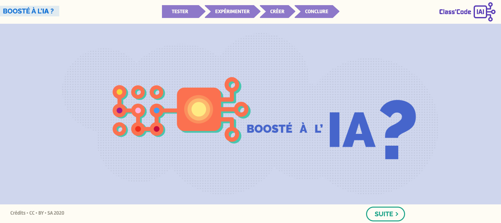

??? info "Metadáta
    - Id: EU.AI4T.O1.M3.2.4a
    - Názov: 3.2.4 Lepšie s umelou inteligenciou?
    - Typ: aktivita
    - Opis: Experimentujte so strojovým učením a trénovaním programov a spoznajte význam dobre pripravených dátových súborov.
    - Predmet: Umelá inteligencia pre učiteľov a pre učiteľov
    - Autori: Mgr:
        - AI4T 
        - Magic Makers
        - Inria
        - S24B
        - Class Code
    - Licencia: CC BY 4.0
    - Dátum: 2022-11-15

# Aktivita: Lepšie s umelou inteligenciou?
Fungovanie strojového učenia a trénovania programov najlepšie pochopíme, keď sa pozrieme na to, ako správne pripraviť dátový súbor.

Tento tutoriál pozostáva zo siedmich veľmi krátkych inštruktážnych videí, takže je vhodný aj na použitie so študentmi stredných škôl.

**_Poznámka č. 1_**: Tento tutoriál neukladá žiadne osobné údaje. Obrázky sa spracúvajú lokálne na počítači používateľa. Je kompatibilný s prehliadačmi Edge, Chrome, Mozilla, Safari a Opera.

**_Poznámka č. 2_**: Tento tutoriál účastníkov motivuje k tomu, aby na experimentovanie so strojovým učením a spoznávanie významu dátových súborov pri trénovaní algoritmov použili vlastné obrázky. Môžete si tiež stiahnuť dvojicu predpripravených dátových súborov:

- Stiahnite si [súbor obrázkov Charlesa Dickensa](Images/Images-set-of-Charles-Dickens.zip)  
- Stiahnite si [súbor obrázkov Williama Shakespeara](Images/Images-set-of-William-Shakespear.zip).

**Teraz je rad na vás!
Kliknite na nasledujúci obrázok a nechajte sa viesť!

<a href="https://pixees.fr/classcodeiai/app/tuto2/" target="_blank"><figure>
  
  <figcaption> Tutoriál č. 2: Lepšie s AI? </figcaption>
</figure></a>
