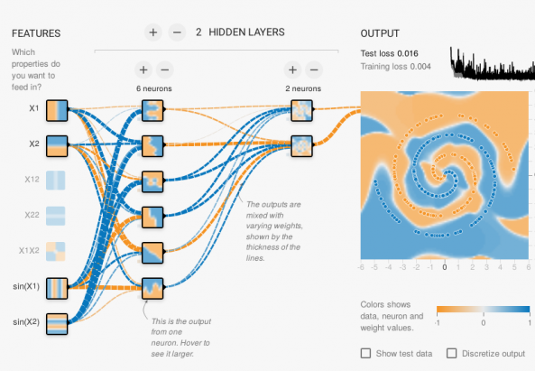
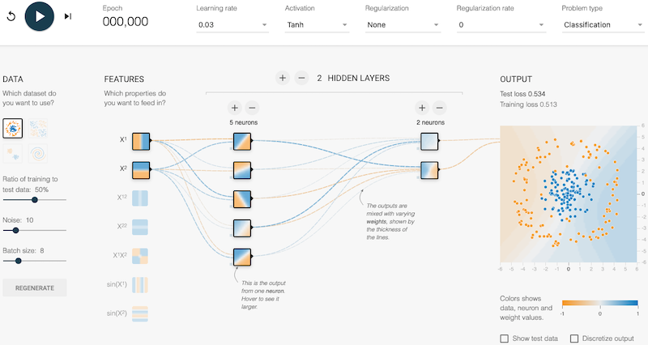

??? info "Metadáta
    - Id: EU.AI4T.O1.M3.2.5a
    - Názov: 3.2.5 Činnosť: Hrajte sa s neurónmi stroja
    - Typ: aktivita
    - Opis: Pochopiť, ako funguje umelá neurónová sieť
    - Predmet: Umelá inteligencia pre učiteľov a pre učiteľov
    - Autori: Mgr:
        - AI4T 
        - Webová stránka Pixees
    - Licencia: CC BY 4.0
    - Dátum: 2022-11-15

# Aktivita: Hrajte sa s neurónmi stroja
Online softvér **[TensorFlow](https://www.tensorflow.org/overview/)** umožňuje vytvárať umelé neurónové siete a testovať ich reakcie na rôzne typy problémov a na rôznych typoch údajov. V type problému "Klasifikácia" je cieľom oddeliť modro a oranžovo sfarbené body. Aplikáciou tohto typu problému je napríklad algoritmus klasifikácie fotografií. V nasledujúcom príklade je jeden vstup (charakteristika), ktorý oddeľuje body horizontálne, a druhý, ktorý ich oddeľuje vertikálne. Kombináciou týchto dvoch vstupov získame šikmú separáciu. Výsledok (výstup) je dobre prispôsobený zvolenému typu údajov.

<figure>
  
  <figcaption> Pohľad na rozhranie TensorFlow </figcaption>
</figure>

## TensorFlow: Niekoľko vysvetlení pred vyskúšaním simulácie neurónovej siete

*Zdroj: [webová stránka Pixees](https://pixees.fr/jouez-avec-les-neurones-de-la-machine/)*

**Čo je to neurónová sieť a ako funguje?
Neurónová sieť je všeobecný mechanizmus zložený z malých jednotiek (pseudoneurónov) navzájom prepojených. Každá jednotka vykonáva veľmi jednoduchú operáciu: prijíma vstupné hodnoty, veľmi jednoducho ich kombinuje (jednoduchý priemer s koeficientmi) a na výsledok aplikuje transformáciu (napríklad ponecháva len kladné hodnoty).

Koeficienty použité na váženie priemeru sú parametrami tohto algoritmu. Práve kombinácia veľmi, veľmi veľkého počtu týchto jednotiek umožňuje vykonávať veľmi zložité operácie. Sieť takýchto "neurónov" sa získa nahromadením niekoľkých vrstiev týchto jednotiek. Vstupom sú údaje, ktoré sa majú spracovať. Tie sa transformujú cez všetky vrstvy a posledná vrstva poskytuje výstupnú predpoveď týchto údajov, napríklad na zistenie, či je na obrázku tvár. Neurónová sieť je teda parametrizovaná funkcia s množstvom koeficientov (nazývaných "váhy") a práve výber týchto váh definuje vykonávané spracovanie.

**Kde sa nachádzajú neuróny v TensorFlow?
Vo webovom rozhraní TensorFlow môžete jednoducho vytvoriť sieť pozostávajúcu z približne desiatich neurónov, z ktorých každý má 3 až 10 parametrov. Vypočítaný výstup teda okrem dvoch súradníc (x, y) vstupného bodu závisí od stoviek parametrov. Na rozhraní každý štvorec predstavuje neurón a farba pixelu so súradnicami (x,y) vo štvorci predstavuje výstup neurónu, keď je (x,y) nastavený ako vstup do siete. Ak je na výstupe len jeden neurón, je reprezentovaný väčším štvorcom v pravej časti siete. Parametre siete sú inicializované náhodnými hodnotami.

**Ale ako sa tieto váhy naučíte?
Učenie s dohľadom spočíva v poskytovaní príkladov údajov s riešením, ktoré sa má nájsť, aby sa sieť naučila upravovať tieto váhy podľa potreby. V príklade na obrázku vyššie máme sériu bodov vo štvorci, každý s očakávanou farbou (modrou alebo oranžovou), s cieľom predpovedať farbu bodu na danom mieste.  Na nájdenie príslušných parametrov sa používa klasický algoritmus postupného nastavovania váh.  
Tlačidlo "play" v ľavom hornom rohu rozhrania sa používa na spustenie tohto algoritmu a potom vidíme, ako sa výstup neurónovej siete vyvíja počas procesu "učenia": farba pozadia výstupného neurónu má tendenciu preberať farbu tréningových bodov, ktoré sú na ňom nakreslené. Ďalšia časť súboru údajov sa potom použije na testovanie kvality výslednej funkcie siete. Krivka v pravom hornom rohu zobrazuje chybovosť údajov použitých na trénovanie (na kontrolu, či boli váhy správne nastavené) a chybovosť ďalších testovacích údajov (na kontrolu, či sa naučené dobre zovšeobecňuje na nové údaje). Tlačidlá na ľavej strane možno použiť na úpravu rozloženia údajov medzi trénovaciu a testovaciu množinu a tiež na pridanie chýb do údajov (zašumené údaje), aby sa zistilo, či je mechanizmus voči týmto chybám odolný.

V praxi sa nám darí nájsť vyhovujúce parametre, ale neexistuje žiadny skutočný teoretický rámec, ktorý by to všetko formalizoval. Všetko je to otázka experimentovania: výber správneho počtu neurónov, správneho počtu vrstiev neurónov, ktoré predbežné výpočty pridať ako vstupy (napríklad násobenie vstupov na zvýšenie stupňov voľnosti výpočtu).  
Tento typ techniky môže v praxi priniesť pôsobivé výsledky, ako napríklad pri rozpoznávaní hlasu alebo objektov v obraze.

Pochopenie toho, prečo (a ako) sa dosahujú také dobré výsledky, však zostáva pomerne otvorenou vedeckou otázkou.

## Vyskúšajte TensorFlow

Kliknutím na obrázok nižšie otvoríte aplikáciu TensorFlow v novom okne_.

<a href="https://playground.tensorflow.org/#activation=tanh&amp;batchSize=8&amp;dataset=circle&amp;regDataset=reg-plane&amp;learningRate=0.03&amp;regularizationRate=0&amp;noise=10&amp;networkShape=5,2&amp;seed=0.02708&amp;showTestData=false&amp;discretize=false&amp;percTrainData=50&amp;x=true&amp;y=true&amp;xTimesY=false&amp;xSquared=false&amp;ySquared=false&amp;cosX=false&amp;sinX=false&amp;cosY=false&amp;sinY=false&amp;collectStats=false&amp;problem=classification&amp;initZero=false&amp;hideText=false;" target="_blank"><figure>
  
  <figcaption> TensorFlow playground view </figcaption>
</figure></a>
