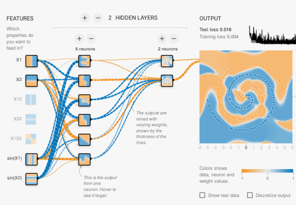
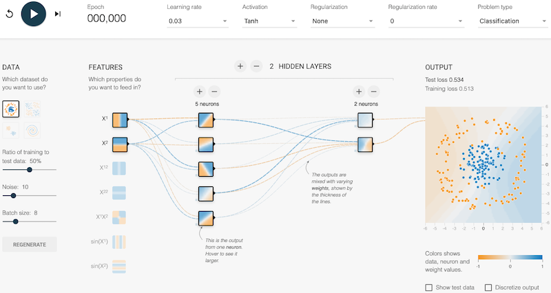

??? info "Metadáta
    - Id: EU.AI4T.O1.M3.2.5a
    - Názov: 3.2.5 Činnosť: Pohrajte sa s neurónmi stroja
    - Typ: aktivita
    - Opis: Zistite, ako funguje umelá neurónová sieť
    - Predmet: Umelá inteligencia pre učiteľov a od učiteľov
    - Autori:
        - AI4T 
        - Pixees.fr
    - Licencia: CC BY 4.0
    - Dátum: 2022-11-15

# Aktivita: Pohrajte sa s neurónmi stroja
Online softvér **[TensorFlow](https://www.tensorflow.org/overview/)** umožňuje vytvárať umelé neurónové siete a testovať ich reakcie na rôzne typy úloh a dát. Pri úlohe typu „klasifikácia“ je cieľom oddeliť modré a oranžové body. Príkladom takéhoto využitia v praxi je napríklad algoritmus na klasifikáciu fotografií. V nasledujúcom príklade jeden vstup (príznak) oddeľuje body horizontálne a druhý zase vertikálne. Skombinovaním týchto dvoch vstupov získame šikmé rozdelenie. Výsledok (výstup) je dobre prispôsobený zvolenému typu údajov.

<figure>
  
  <figcaption>Pohľad na rozhranie TensorFlow Playground</figcaption>
</figure>

## TensorFlow: niekoľko vysvetlení, kým sa pustíme do simulácie neurónovej siete

*Zdroj: [web Pixees.fr](https://pixees.fr/jouez-avec-les-neurones-de-la-machine/)*

**Čo je to neurónová sieť a ako funguje?**  
Neurónová sieť je všeobecný mechanizmus zložený z malých jednotiek (pseudoneurónov), ktoré sú navzájom prepojené. Každá jednotka vykonáva veľmi jednoduchú operáciu: prijíma vstupné hodnoty, veľmi jednoducho ich kombinuje (jednoduché spriemerovanie s koeficientmi) a výsledok transformuje (napríklad ponecháva len kladné hodnoty).

Koeficienty použité na vytvorenie váženého priemeru sú parametrami tohto algoritmu. Práve kombinácia obrovského množstva takýchto jednotiek umožňuje vykonávať veľmi zložité operácie. Sieť takýchto „neurónov“ získame spojením niekoľkých vrstiev týchto jednotiek. Vstupom sú údaje, ktoré sa majú spracovať. Tie sa transformujú cez všetky vrstvy a posledná vrstva poskytuje výstupnú predpoveď o týchto údajoch – napríklad zisťuje, či je na obrázku tvár. Neurónová sieť je teda parametrizovaná funkcia s množstvom koeficientov (nazývaných „váhy“) a práve výber týchto váh určuje, aké spracúvanie sa bude vykonávať.

**Kde sa nachádzajú neuróny v nástroji TensorFlow?**  
Vo webovom rozhraní TensorFlow môžete jednoducho vytvoriť sieť pozostávajúcu z približne desiatich neurónov, z ktorých každý má 3 až 10 parametrov. Vypočítaný výstup teda okrem dvoch súradníc vstupného bodu (x, y) závisí od stoviek ďalších parametrov. V rozhraní každý štvorec predstavuje jeden neurón a farba pixelu so súradnicami (x, y) v štvorci predstavuje výstup neurónu, keď na vstup siete zadáme súradnice (x, y). Ak je na výstupe len jeden neurón, je znázornený väčším štvorcom v pravej časti siete. Parametre siete majú na začiatku nastavené náhodné hodnoty.

**Ale ako pristupovať k učeniu týchto váh?**  
Pri učení s dohľadom poskytujem príklady dát s riešením, ktoré sa má nájsť. Neurónová sieť sa tak učí upravovať tieto váhy podľa potreby. V príklade na obrázku vyššie ide o sériu bodov v štvorci, pričom každý má priradenú očakávanú farbu (modrú alebo oranžovú). Cieľom je predpovedať farbu bodu na danom mieste. Na nájdenie príslušných parametrov sa používa klasický algoritmus postupného upravovania váh.  
Tlačidlo Play v ľavom hornom rohu rozhrania sa používa na spustenie tohto algoritmu. Počas procesu „učenia“ uvidíte, ako sa výstup neurónovej siete vyvíja: farba pozadia výstupného neurónu má tendenciu preberať farbu tréningových bodov, ktoré sú na ňom vykreslené. Iná časť dátového súboru sa potom použije na otestovanie kvality výslednej funkcie siete. Krivka v pravom hornom rohu zobrazuje chybovosť dát použitých na učenie (na kontrolu, či boli váhy správne nastavené) a chybovosť ďalších testovacích dát (na kontrolu, či sa naučené vedomosti dajú dobre zovšeobecniť na nové dáta). Tlačidlá na ľavej strane umožňujú upraviť rozloženie dát medzi trénovaciu a testovaciu množinu, ako aj pridať do dát chyby (zašumené dáta), aby sa dalo zistiť, či je mechanizmus voči takýmto chybám odolný.

V praxi sa nám darí nájsť vyhovujúce parametre, ale neexistuje žiadny teoretický rámec, ktorý by celý tento proces formalizoval. Všetko je otázkou experimentovania: výber správneho počtu neurónov, výber správneho počtu vrstiev neurónov, aké predbežné výpočty pridať ako vstupy (napríklad násobenie vstupov na zvýšenie stupňov voľnosti výpočtu).  
Tento typ techniky môže v praxi priniesť pôsobivé výsledky, napríklad pri rozpoznávaní hlasu alebo objektov na obrázku.

Pochopenie toho, prečo (a ako) sa dosahujú také dobré výsledky, však stále zostáva pomerne otvorenou vedeckou otázkou.

## Vyskúšajte si TensorFlow

*Kliknutím na nasledujúci obrázok otvoríte nástroj TensorFlow v novom okne.*

<a href="https://playground.tensorflow.org/#activation=tanh&amp;batchSize=8&amp;dataset=circle&amp;regDataset=reg-plane&amp;learningRate=0.03&amp;regularizationRate=0&amp;noise=10&amp;networkShape=5,2&amp;seed=0.02708&amp;showTestData=false&amp;discretize=false&amp;percTrainData=50&amp;x=true&amp;y=true&amp;xTimesY=false&amp;xSquared=false&amp;ySquared=false&amp;cosX=false&amp;sinX=false&amp;cosY=false&amp;sinY=false&amp;collectStats=false&amp;problem=classification&amp;initZero=false&amp;hideText=false;" target="_blank"><figure>
  
  <figcaption>Rozhranie TensorFlow Playground, ktoré je určené na experimentovanie</figcaption>
</figure></a>
