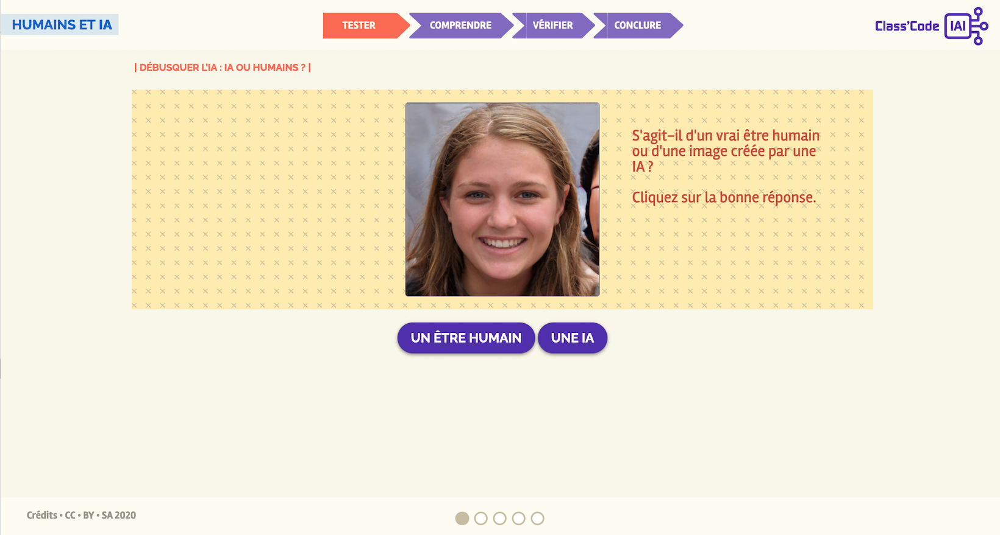

??? info "Metadáta
    - Id: EU.AI4T.O1.M3.3.1a
    - Názov: 3.3.1 Činnosť: Tvorba s umelou inteligenciou
    - Typ: činnosť
    - Opis: Určiť, či je obrázok skutočný alebo vytvorený umelou inteligenciou.
    - Predmet: Umelá inteligencia pre učiteľov a od učiteľov
    - Autori: Mgr:
        - AI4T
        - Magickí tvorcovia
        - Inria
        - S24B
        - Kód triedy
    - Licencia: CC BY 4.0
    - Dátum: 2022-11-15

# Aktivita: Tvorba s umelou inteligenciou
## Detekcia umelej inteligencie: umelá inteligencia alebo človek?

Nasledujúca aktivita spočíva v určení, či je na obrázku zobrazený skutočný objekt alebo osoba, alebo ide o produkciu umelej inteligencie. Táto experimentálna aktivita je úvodom do pochopenia GAN (generatívnych adverzných sietí). Jej cieľom je rozlíšiť skutočné portréty od portrétov vytvorených technológiou GAN.
*Zdroj obrázkov GAN: https://thispersondoesnotexist.com*
*Zdroj obrázkov skutočných ľudí: https://pixabay.com/en/*

Tento výukový program možno použiť na vyučovaní.

**Chcete si to vyskúšať?  
Kliknite na obrázok nižšie a nechajte sa viesť!

<a href="https://pixees.fr/classcodeiai/app/tuto3-ai4t/" target="_blank"><figure>
  
</figure></a>
