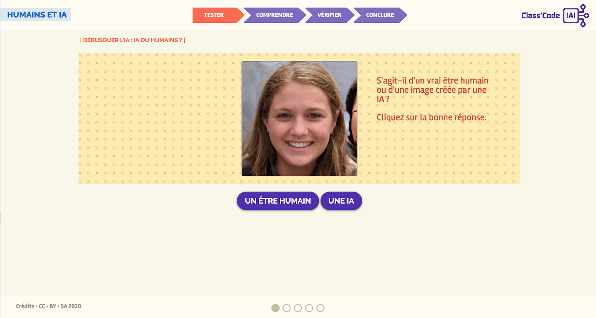

??? info "Metadáta
    - Id: EU.AI4T.O1.M3.3.1a
    - Názov: 3.3.1 Aktivita: Tvorme s umelou inteligenciou
    - Typ: činnosť
    - Opis: Určite, či je obrázok skutočný alebo vytvorený umelou inteligenciou.
    - Predmet: Umelá inteligencia pre učiteľov a od učiteľov
    - Autori:
        - AI4T
        - Magic Makers
        - Inria
        - S24B
        - Class Code
    - Licencia: CC BY 4.0
    - Dátum: 2022-11-15

# Aktivita: Tvorme s umelou inteligenciou
## Odhaľujeme AI: umelá inteligencia alebo človek?

Nasledujúca aktivita je zameraná na určovanie, či je obrázok skutočný alebo vytvorený umelou inteligenciou. Táto experimentálna aktivita slúži ako úvod do pochopenia generatívnych adversariálnych sietí (GAN). Cieľom aktivity je pokúsiť sa rozlíšiť skutočné portréty od portrétov vytvorených cez GAN.  
*Zdroj obrázkov z GAN: https://thispersondoesnotexist.com*  
*Zdroj obrázkov skutočných ľudí: https://pixabay.com/en/*

Túto aktivitu môžete využiť v triede.

**Chcete si to vyskúšať?**  
*Kliknite na nasledujúci obrázok a nechajte sa viesť!*

<a href="https://pixees.fr/classcodeiai/app/tuto3-ai4t/" target="_blank"><figure>
  
</figure></a>
