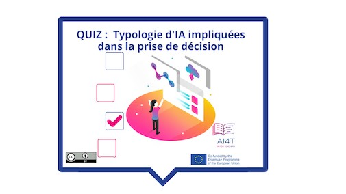

??? info "Metadáta
    - Id: EU.AI4T.O1.M4.1.3a
    - Názov: 4.1.3 Aktivita: Rozhodovanie s umelou inteligenciou
    - Typ: činnosť
    - Opis: Pochopiť, ako nástroje rozhodovania menia postupy, môžu ich zlepšiť, ale je potrebné ich spochybniť.
    - Predmet: Umelá inteligencia pre učiteľov a pre učiteľov
    - Autori: Mgr:
        - AI4T 
    - Licencia: CC BY 4.0
    - Dátum: 2022-11-15

# Aktivita: Rozhodovanie s umelou inteligenciou vo vzdelávaní

Táto krátka aktivita sa zaoberá 3 hlavnými spôsobmi, akými môže byť umelá inteligencia zapojená do rozhodovania, pričom každý typ rozhodnutia ilustruje prípadová štúdia v oblasti vzdelávania.

**Prístup k aktivite  
Pod obrázkom

<figure>
    
</figure>

<iframe width="818" height="404" src="4-1-3a-activity-making-decision-with-ai/4-1-3a-decision-making-and-education.html" frameborder="0" allowfullscreen></iframe>

