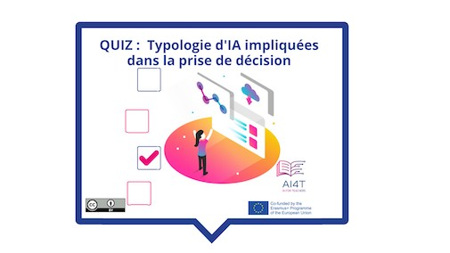

??? info "Metadáta
    - Id: EU.AI4T.O1.M4.1.3a
    - Názov: 4.1.3 Aktivita: Rozhodovanie s pomocou AI
    - Typ: aktivita
    - Opis: Ako nástroje na podporu rozhodovania menia postupy, ako ich môžu zlepšiť a prečo je potrebné kriticky ich analyzovaťť.
    - Predmet: Umelá inteligencia pre učiteľov a od učiteľov
    - Autori:
        - AI4T 
    - Licencia: CC BY 4.0
    - Dátum: 2022-11-15

# Aktivita: Rozhodovanie s pomocou AI vo vzdelávaní

Táto krátka aktivita sa vracia ku klasifikácii 3 stupňov zapojenia AI do rozhodovania, pričom každý stupeň je ilustrovaný príkladom z oblasti vzdelávania.

**Prístup k aktivite**
*Kliknite na nasledujúci obrázok*

<figure>
    
</figure>

<iframe width="818" height="404" src="4-1-3a-activity-making-decision-with-ai/4-1-3a-decision-making-and-education.html" frameborder="0" allowfullscreen></iframe>

