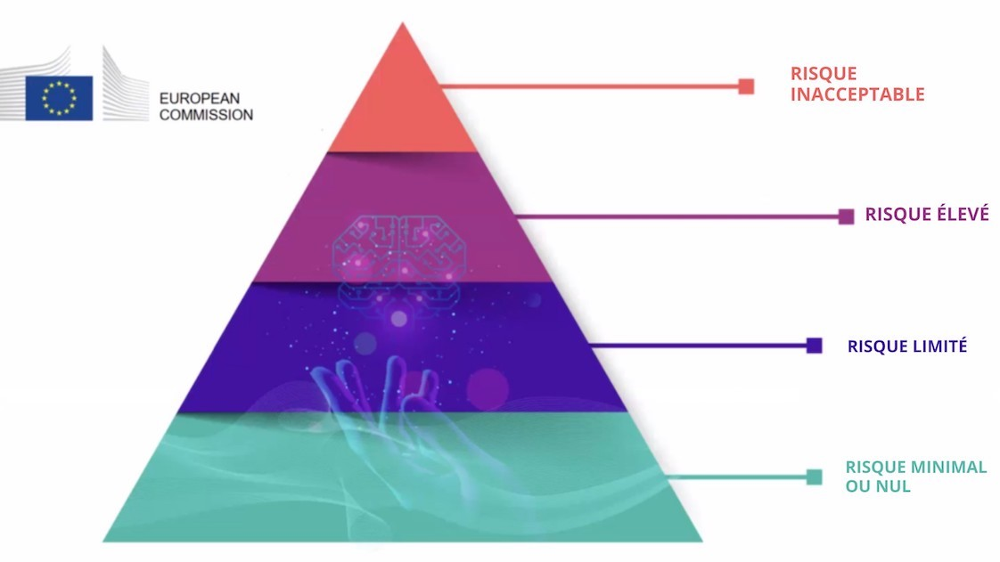

??? info "Metadáta
    - Id: EU.AI4T.O1.M4.1.4t
    - Názov: 4.1.4 Riziká a rozhodovanie založené na umelej inteligencii
    - Typ: text
    - Opis: Pochopenie klasifikácie rizík súvisiacich s používaním systémov umelej inteligencie pri rozhodovaní.
    - Predmet: Umelá inteligencia pre učiteľov a pre učiteľov
    - Autori: Mgr:
        - AI4T
    - Licencia: CC BY 4.0
    - Dátum: 2022-11-15

# Riziká spojené s používaním systémov umelej inteligencie pri rozhodovaní

## 4 úrovne rizika v oblasti umelej inteligencie

V **návrhu regulačného rámca pre umelú inteligenciu**[^1], ktorý má Európska komisia (EK) zaviesť v roku 2021, sa uvádzajú štyri úrovne rizika súvisiaceho s používaním systémov umelej inteligencie. Uvádza sa v ňom, že "*Akkoľvek väčšina systémov umelej inteligencie predstavuje obmedzené alebo žiadne riziko a môže pomôcť vyriešiť mnohé spoločenské výzvy, niektoré systémy umelej inteligencie vytvárajú riziká, ktoré musíme riešiť, aby sme sa vyhli nežiaducim výsledkom*".
Zdôrazňuje, že "*často nie je možné zistiť, prečo systém UI urobil rozhodnutie alebo predpoveď a podnikol určitú akciu. Preto môže byť ťažké určiť, či bola osoba nespravodlivo znevýhodnená, napríklad pri rozhodovaní o prijatí do zamestnania alebo pri žiadosti o verejné dávky "*.

Boli identifikované štyri úrovne rizika, od neprijateľnej po minimálnu:

1. **Prijateľné riziko**: Všetky systémy umelej inteligencie, ktoré sa považujú za jasnú hrozbu pre bezpečnosť, živobytie a práva ľudí, budú zakázané, od sociálneho označovania zo strany vlád až po hračky využívajúce hlasovú asistenciu, ktorá podporuje nebezpečné správanie.  

2. **Vysoké riziko**: Medzi systémy UI označené za vysoko rizikové patria technológie UI používané v:

    - kritickej infraštruktúre (napr. v doprave), ktoré by mohli ohroziť životy a zdravie občanov;
    - vzdelávaní alebo odbornej príprave, ktoré môžu rozhodnúť o prístupe osôb k vzdelaniu a kariérnej dráhe (napr. hodnotenie skúšok)**;
    - komponenty bezpečnosti výrobkov (napr. aplikácia umelej inteligencie v roboticky asistovanej chirurgii);
    - Zamestnanie, riadenie pracovníkov a prístup k samostatnej zárobkovej činnosti (napr. softvér na triedenie životopisov pri výberových konaniach);
    - Základné súkromné a verejné služby (napr. hodnotenie úverov, ktoré odopiera občanom možnosť získať úver);
    - presadzovanie práva, ktoré môže zasahovať do základných práv ľudí (napr. posudzovanie spoľahlivosti dôkazov);
    - riadenie migrácie, azylu a hraničných kontrol (napr. kontrola pravosti cestovných dokladov);
    - Výkon spravodlivosti a demokratické procesy (napríklad uplatňovanie práva na konkrétny súbor skutočností).

3. **Omedzené riziko**: Obmedzené riziko sa vzťahuje na systémy UI s osobitnými povinnosťami v oblasti transparentnosti. Pri používaní systémov AI, ako sú chatboti, si používatelia musia byť vedomí, že komunikujú so strojom, aby mohli prijať informované rozhodnutie o pokračovaní alebo odstúpení.  

4. **Minimálne alebo žiadne riziko**: Návrh umožňuje voľné používanie AI s minimálnym rizikom. Patria sem aplikácie, ako sú videohry alebo filtre nevyžiadanej pošty využívajúce AI. Prevažná väčšina systémov UI, ktoré sa v súčasnosti používajú v EÚ, patrí do tejto kategórie.

<figure>

<figcaption>4 úrovne rizika súvisiaceho s umelou inteligenciou stanovené v právnych predpisoch Európskej komisie o umelej inteligencii.</figcaption>
</figure>

Zaradenie vzdelávania a odbornej prípravy do kategórie vysokého rizika neznamená, že by sa v týchto oblastiach nemali používať žiadne systémy umelej inteligencie, ale že by sa mali prijať dodatočné preventívne opatrenia. V uvedenom rámci sa uvádza, že "*systémy UI s vysokým rizikom budú podliehať prísnym povinnostiam pred ich uvedením na trh "*.

## Etika pre dôveryhodnú UI

Systémy UI používané vo vzdelávaní musia byť dôveryhodné, t. j. musia spĺňať nasledujúcich 7 podmienok, aby sa mohli považovať za dôveryhodné[^2] :

- Technická robustnosť a bezpečnosť,

- ochrana súkromia a správa údajov,

- transparentnosť,

- rozmanitosť, nediskriminácia a spravodlivosť,

- Spoločenský a environmentálny blahobyt,

- Zodpovednosť podnikov,

- a **Intervencia a dohľad nad ľuďmi**: "*Systémy inteligentnej inteligencie by mali posilniť postavenie ľudí, umožniť im prijímať informované rozhodnutia a podporovať ich základné práva. Zároveň je potrebné zaviesť vhodné mechanizmy dohľadu, čo možno dosiahnuť prostredníctvom prístupov "človek v slučke", "človek na slučke" a "človek v riadení "*.

[^1]: [Ustanovenie harmonizovaných pravidiel o umelej inteligencii (Akt o umelej inteligencii) a zmena a doplnenie niektorých legislatívnych aktov Únie"] (https://digital-strategy.ec.europa.eu/en/library/proposal-regulation-laying-down-harmonised-rules-artificial-intelligence) - Návrh regulačného rámca pre umelú inteligenciu, Európska komisia - 2021

[^2]: [Etické usmernenia pre dôveryhodnú umelú inteligenciu](https://digital-strategy.ec.europa.eu/en/library/ethics-guidelines-trustworthy-ai), Európska komisia, skupina expertov na vysokej úrovni pre umelú inteligenciu - 2019.
