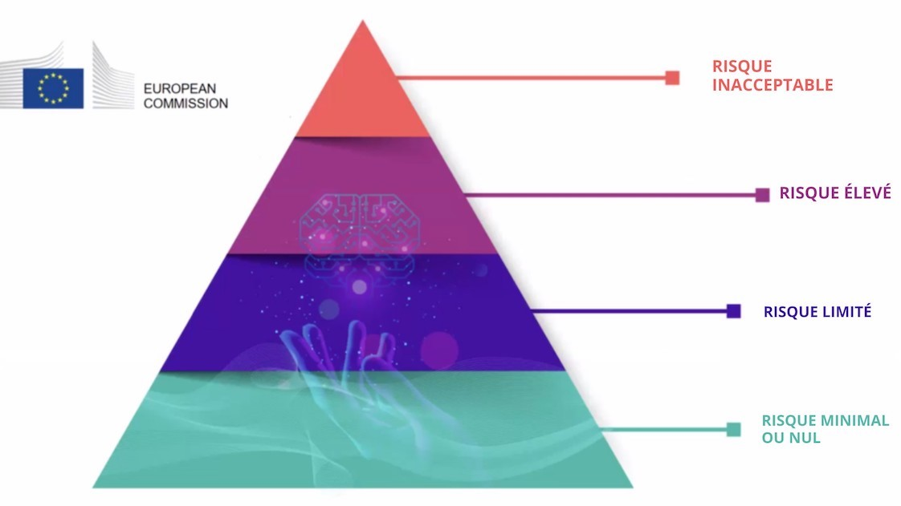

??? info "Metadáta
    - Id: EU.AI4T.O1.M4.1.4t
    - Názov: 4.1.4 Riziká rozhodovania s pomocou AI
    - Typ: text
    - Opis: Klasifikácia rizík spojených s používaním AI systémov pri rozhodovaní.
    - Predmet: Umelá inteligencia pre učiteľov a pre učiteľov
    - Autori:
        - AI4T
    - Licencia: CC BY 4.0
    - Dátum: 2022-11-15

# Riziká spojené s používaním AI systémov pri rozhodovaní

## 4 úrovne rizika pri používaní umelej inteligencie

**Návrhu regulačného rámca pre umelú inteligenciu**,[^1] ktorý Európska komisia (EK) publikovala už v roku 2021, rozlišuje štyri úrovne rizika súvisiaceho s používaním AI systémov. Uvádza sa v ňom, že *„hoci väčšina AI systémov predstavuje iba obmedzené alebo žiadne riziko a môže prispieť k riešeniu mnohých spoločenských výziev, niektoré AI systémy prinášajú riziká, ktoré musíme riešiť, aby sme sa vyhli nežiaducim dôsledkom.“*
Zdôrazňuje, že *“často nie je možné zistiť, prečo AI systém urobil konkrétne rozhodnutie, predoveď či krok. Preto môže byť ťažké posúdiť, či bol niekto nespravodlivo znevýhodnený, napríklad pri rozhodovaní o prijatí do zamestnania alebo pri žiadosti o pridelenie sociálnych dávok."*

Boli identifikované štyri úrovne rizika, od minimálneho až po neprijateľné:

1. **Neprijateľné riziko**: Všetky AI systémy, ktoré sa považujú za jasnú hrozbu pre bezpečnosť, živobytie a práva ľudí, budú zakázané. Patria sem rôzne systémy od sociálneho hodnotenia zo strany vlády až po technologické hračky s hlasovou asistenciou, ktorá podnecuje k nebezpečnému správaniu.  

2. **Vysoké riziko**: Medzi vysokorizikové AI systémy patria AI technológie v nasledujúcich oblastiach:

    - kritická infraštruktúra (napr. doprava), kde by mohli ohroziť život a zdravie občanov;
    - vzdelávanie alebo odborná príprava, kde môžu rozhodovať o prístupe osôb k vzdelaniu a kariérnej dráhe (napr. hodnotenie skúšok);
    - bezpečnostné komponenty výrobkov (napr. AI aplikácia pri robotickej chirurgii);
    - zamestnávanie, riadenie pracovníkov a prístup k samostatným zárobkovým činnostiam (napr. softvér na triedenie životopisov pri nábore);
    - základné súkromné a verejné služby (napr. úverové skóre, ktoré občanom odopiera možnosť získať úver);
    - presadzovanie práva, kde môže zasahovať do základných práv ľudí (napr. posudzovanie spoľahlivosti dôkazov);
    - riadenie migrácie, azylu a hraničných kontrol (napr. overovanie pravosti cestovných dokladov);
    - výkon spravodlivosti a demokratické procesy (napríklad uplatňovanie práva na konkrétny súbor skutočností).

3. **Omedzené riziko**: Obmedzené riziko sa vzťahuje na AI systémy s osobitnými povinnosťami v oblasti transparentnosti. Pri používaní AI systémov, ako sú četboty, si používatelia musia byť vedomí toho, že komunikujú so strojom, aby sa mohli informovane rozhodnúť, či chcú pokračovať alebo nie.  

4. **Minimálne alebo žiadne riziko**: Návrh umožňuje voľné používanie umelej inteligencie s minimálnym rizikom. Patria sem napríklad videohry alebo spamové filtre, ktoré využívajú umelú inteligenciu. Do tejto kategórie patrí prevažná väčšina AI systémov, ktoré sa v súčasnosti používajú v EÚ.

<figure>

<figcaption>Navrhované 4 úrovne rizika umelej inteligencie podľa Aktu o umelej inteligencii od Európskej komisie.</figcaption>
</figure>

Zaradenie oblasti vzdelávania a odbornej prípravy do kategórie vysokého rizika neznamená, že by sa v týchto oblastiach nemali používať žiadne AI systémy, ale že by sa mali prijať dodatočné preventívne opatrenia. V spomínanom rámci sa uvádza, že *„vysokorizikové AI systémy budú pred uvedením na trh podliehať prísnym povinnostiam.“*

## Etika pre dôveryhodnú umelú inteligenciu

AI systémy používané vo vzdelávaní musia byť dôveryhodné, t. j. musia spĺňať nasledujúcich 7 požiadaviek:[^2]

- technická robustnosť a bezpečnosť,

- ochrana súkromia a správa údajov,

- transparentnosť,

- rozmanitosť, nediskriminácia a spravodlivosť,

- Spoločenský a environmentálny blahobyt,

- Zodpovednosť,

- a **ľudská schopnosť konať a ľudský dohľad**: *„AI systémy by mali posilňovať postavenie ľudí, umožňovať im prijímať informované rozhodnutia a podporovať ich základné práva. Zároveň je potrebné zaviesť náležité mechanizmy dohľadu, čo sa dá dosiahnuť prostredníctvom prístupov „človek v slučke“ (human-in-the-loop), „človek nad slučkou“ (human-on-the-loop) a „človek vo velení“ (human-in-command).“*

[^1]: [Ustanovenie harmonizovaných pravidiel o umelej inteligencii (Akt o umelej inteligencii) a zmena a doplnenie niektorých legislatívnych aktov Únie"] (https://digital-strategy.ec.europa.eu/en/library/proposal-regulation-laying-down-harmonised-rules-artificial-intelligence) - Návrh regulačného rámca pre umelú inteligenciu, Európska komisia - 2021

[^2]: [Etické usmernenia pre dôveryhodnú umelú inteligenciu](https://digital-strategy.ec.europa.eu/en/library/ethics-guidelines-trustworthy-ai), Európska komisia, skupina expertov na vysokej úrovni pre umelú inteligenciu - 2019.
