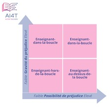

??? info "Metadáta
    - Id: EU.AI4T.O1.M4.1.6t
    - Názov: 4.1.6 Učiteľ v slučke
    - Typ: text
    - Opis: Pochopenie modelu učiteľ v slučke a jeho využitie ako nástroja na podporu kontroly používateľov systémov umelej inteligencie vo vzdelávaní.
    - Predmet: Umelá inteligencia pre učiteľov a pre učiteľov
    - Autori: Mgr:
        - AI4T 
    - Licencia: CC BY 4.0
    - Dátum: 2022-11-15

# Učiteľ v slučke

V oblasti vzdelávania a odbornej prípravy "*Všetci zainteresovaní by mali zvážiť dôsledky prenechania právomocí novým technológiám pri prijímaní pedagogických rozhodnutí, ktoré by inak robil učiteľský profesionál s primeranými znalosťami pedagogiky a obsahu konkrétneho predmetu*" [^1].  
Na to, aby boli systémy umelej inteligencie vo vzdelávaní dôveryhodné, je potrebná náležitá analýza s využitím modelu **učiteľa v slučke**.

Spoločné výskumné centrum vo svojej správe [^1] navrhuje nasledovné: "*V prípade vzdelávacích aplikácií a služieb, ktoré sa spoliehajú na autonómne rozhodovanie, možno uvažovať o troch rôznych prístupoch k riešeniu rozdelenia zodpovednosti medzi človekom a algoritmom/strojom*" [^1], a to učiteľ v slučke, učiteľ mimo slučky a učiteľ nad slučkou:

- Učiteľ v slučke***: Uvažujme o aplikácii, ktorá autonómne hodnotí skúšky s vysokou úrovňou úspešnosti alebo diagnostikuje poruchy učenia. V takýchto situáciách by nesprávne rozhodnutie mohlo spôsobiť vážnu škodu konečnému používateľovi (napr. strata príležitosti, nekalé praktiky). Rozhodnutia alebo aplikácie, ktoré by mohli spôsobiť škodu alebo mať závažné dôsledky pre koncového používateľa, by mali pedagógovi najprv odporučiť rozhodnutie s dostatočnými transparentnými informáciami, ktoré by mohol zvážiť - a až potom rozhodnúť, či konečné rozhodnutie implementovať alebo nie (obrázok 1, vpravo hore).

- ***Pedagóg nad slučkou***: Existujú aj iné typy rozhodnutí, pri ktorých stačí, aby mal pedagóg prehľad o rozhodnutiach prijatých aplikáciou. Môže to byť napríklad prípad, keď adaptívna vzdelávacia platforma odporučí učiacemu sa aktivitu na dosiahnutie požadovaného vzdelávacieho výsledku (obrázok 1, vpravo dole).

- Učiteľ mimo dosahu***: V situácii, keď je pravdepodobnosť a závažnosť škody spôsobenej napríklad vzdelávacou aplikáciou používanou mimo školy nízka, monitorovanie zo strany pedagóga nie je potrebné (obrázok 1, vľavo dole).

## Interaktívna prezentácia modelu "Učiteľ v slučke".
Kliknutím na obrázok nižšie sa dozviete viac o modeli "Učiteľ v slučke".

<a href="https://view.genial.ly/63aad9b7560d05001916bb98" target="_blank">
<figure>
  
  <figcaption>Figure 1 : Différents degrés de contrôle humain lorsqu'il s'agit de prise de décision autonome dans l'enseignement et la formation. (Adapté du rapport "Emerging technologies and the teaching profession").</figcaption>
</figure></a>  

[^1]: Dokument v angličtine ["Emerging technologies and the teaching profession: Ethical and pedagogical considerations based on near-future scenarios"](https://publications.jrc.ec.europa.eu/repository/handle/JRC120183) - Vuorikari Riina, Punie Yves, Marcelino Cabrera - Správa Spoločného výskumného centra - Európska komisia 2020.
