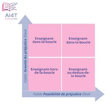

??? info "Metadáta
    - Id: EU.AI4T.O1.M4.1.6t
    - Názov: 4.1.6 Učiteľ v slučke
    - Typ: text
    - Opis: Pochopenie modelu „učiteľ v slučke“ a využiť ho ako nástroj na podporu prístupu, kde majú používatelia kontrolu nad vzdelávacími AI systémami.
    - Predmet: Umelá inteligencia pre učiteľov a od učiteľov
    - Autori:
        - AI4T 
    - Licencia: CC BY 4.0
    - Dátum: 2022-11-15

# Učiteľ v slučke

V oblasti vzdelávania a odbornej prípravy by *„všetky zainteresované strany mali zvážiť dôsledky toho, keď sa novým technológiám prenechá právomoc prijímať pedagogické rozhodnutia, ktoré by inak robili ľudskí odborníci s primeranými znalosťami pedagogiky a obsahu konkrétneho predmetu.“*[^1]  
Na to, aby boli AI systémy vo vzdelávaní dôveryhodné, je potrebná náležitá analýza s využitím modelu **učiteľ v slučke**.

Spoločné výskumné centrum (JRC) vo svojej správe[^1] navrhuje nasledovné: _„Pri vzdelávacích aplikáciách a službách, ktoré sa spoliehajú na autonómne rozhodovanie, možno uvažovať o troch rôznych prístupoch k rozdeleniu zodpovednosti medzi ľudí a algoritmus/stroj:“_[^1] učiteľ v slučke, učiteľ mimo slučky a učiteľ nad slučkou:

- **Učiteľ v slučke** (teacher-in-the-loop): Predstavte si aplikáciu, ktorá autonómne vyhodnocuje dôležité skúšky alebo diagnostikuje poruchu učenia. V takýchto situáciách by nesprávne rozhodnutie mohlo konečnému používateľovi spôsobiť vážnu ujmu (napr. stratu príležitosti, nespravodlivé zaobchádzanie). Pri rozhodnutiach alebo aplikáciách, ktoré by mohli spôsobiť škodu alebo mať pre koncového používateľa vážne dôsledky, by mal systém pedagógovi najprv odporučiť rozhodnutie s dostatkom transparentných informácií, aby ho mohol skontrolovať – a až potom sa rozhodnúť, či konečné rozhodnutie vykoná alebo nie (obrázok č. 1, vpravo hore).

- **Učiteľ nad slučkou** (teacher-over-the-loop): Existujú aj iné typy rozhodnutí, pri ktorých stačí, ak si pedagóg udržiava prehľad o rozhodnutiach prijatých aplikáciou. Môže to byť napríklad prípad, keď adaptívna vzdelávacia platforma odporučí študentovi učebnú aktivitu na dosiahnutie zamýšľaného výsledku vzdelávania (obrázok č. 1, vpravo dole).

- **Učiteľ mimo slučky** (teacher-above-the-loop): V situácii, keď je pravdepodobnosť a závažnosť škody spôsobenej (napríklad) vzdelávacou aplikáciou používanou mimo školy nízka, monitorovanie zo strany pedagóga nie je potrebné (obrázok č. 1, vľavo dole).

## Interaktívna prezentácia modelu „učiteľ v slučke“.
O modeli „učiteľ v slučke“ sa dozviete viac kliknutím na nasledujúci obrázok.

<a href="https://view.genial.ly/63aad9b7560d05001916bb98" target="_blank">
<figure>
    
  <figcaption>Obrázok 1: Rôzne stupne ľudského vplyvu pri autonómnom rozhodovaní vo vzdelávaní a odbornej príprave. (Upravené podľa správy „Emerging technologies and the teaching profession“).</figcaption>
</figure></a>  

[^1]: [Emerging technologies and the teaching profession: Ethical and pedagogical considerations based on near-future scenarios](https://publications.jrc.ec.europa.eu/repository/handle/JRC120183) - Vuorikari Riina, Punie Yves, Marcelino Cabrera - Joint Research Center report - European Commission, 2020.
