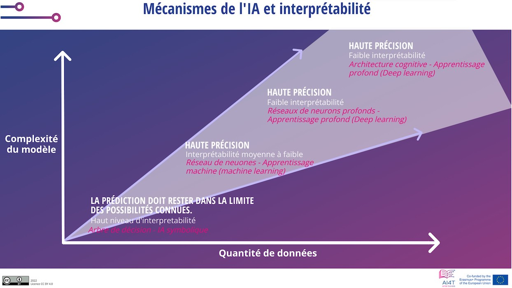
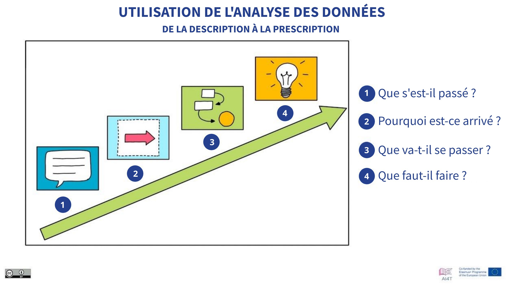

??? info "Metadáta
    - Id: EU.AI4T.O1.M4.2.1t
    - Názov:
    - Typ: text
    - Opis: Predmet: Umelá inteligencia pre učiteľov a pre učiteľov
    - Predmet: Umelá inteligencia pre učiteľov a pre učiteľov
    - Autori: Mgr:
        - AI4T
    - Licencia: CC BY 4.0
    - Dátum: 2022-11-15

# Ste pripravení dôverovať umelej inteligencii pri rozhodovaní?

Nie všetky rozhodnutia prijaté pomocou nástrojov založených na umelej inteligencii majú rovnaký vplyv.

V prípade niektorých automatizovaných rozhodnutí, ako sú napríklad "kroky riešenia", ktoré študentovi navrhne aplikácia na riešenie matematických úloh, možno dlhodobé riziko a škodu *považovať* za pomerne nízke.

Na druhej strane iné rozhodnutia predstavujú potenciálnu škodu a/alebo riziko.

V týchto prípadoch je potrebné prijať maximálne množstvo preventívnych opatrení. V prvom rade musí byť rozhodnutie vysvetliteľné: prečo sa toto rozhodnutie navrhuje pre túto konkrétnu situáciu, pre tohto konkrétneho žiaka alebo skupinu žiakov?

Pozrime sa na niektoré kritériá používané na "hodnotenie" rozhodovacieho procesu systémov založených na umelej inteligencii.

## Vysvetliteľnosť

Vysvetliteľnosť - jedna zo 7 požiadaviek na dôveryhodnú UI: "_Vysvetliteľnosť sa týka schopnosti vysvetliť technické procesy systému UI aj zodpovedajúce ľudské rozhodnutia (napr. oblasti použitia systému). Technická vysvetliteľnosť vyžaduje, aby rozhodnutia, ktoré robí systém UI, mohli ľudia pochopiť a vysledovať_". [^1]

V oblasti vzdelávania to znamená, že v každom nástroji na prijímanie rozhodnutí s umelou inteligenciou sú spôsob, akým sa rozhodnutie navrhuje, a miera zapojenia človeka prvkami, ktoré musia byť prístupné.

Túto podmienku je viac-menej ľahké splniť, ale v prípade niektorých technológií umelej inteligencie sa zrozumiteľnosť nedá tak ľahko dosiahnuť. Napríklad v prípade neurónových sietí s mnohými vrstvami môže byť ťažké poskytnúť vysvetlenie. Preto sa v súčasnosti rozvíja nová oblasť umelej inteligencie: eXplicable AI alebo XAI, ktorá je definovaná ako "_umelá inteligencia, v ktorej ľudia môžu pochopiť rozhodnutia alebo predpovede vykonané umelou inteligenciou. Je v kontraste s koncepciou 'čiernej skrinky' strojového učenia, kde ani konštruktéri nedokážu vysvetliť, prečo AI dospela k určitému rozhodnutiu_" [^2].

## Interpretovateľnosť

Predpovede vykonané niektorými technikami umelej inteligencie sa interpretujú ľahšie ako iné. Napríklad predikcia urobená na základe rozhodovacieho stromu sa dá vysvetliť. Nie vždy však ide o najzaujímavejšie predpovede.

Na extrémnom konci spektra vysvetliteľnosti je hlboké učenie, ktoré sa dá ťažko vysvetliť, ale ktorého výsledky môžu byť oveľa významnejšie ako tie, ktoré sa dosiahli s vysoko vysvetliteľnou AI.

<figure>
  
  <figcaption>Obrázok1: Mechanizmy UI a interpretovateľnosť.
 Prevzaté z Mooc IAI / Ikram Chraibi Kaadoud - CC.BY.SA 2.0.</figcaption>
</figure>

Takto môže byť podpora rozhodovania poskytovaná nástrojmi s nízkou interpretovateľnosťou väčšia ako podpora poskytovaná nástrojmi s vysokou interpretovateľnosťou.

### Od opisu k predpisu

Tu je znázornenie, ktoré spája použitú technológiu, jej zložitosť a strategické výsledky.

<figure>
  
</figure>
Obrázok 2: Klasifikácia použitia analýzy údajov od opisu po predpis [^3] (Prevzaté z videa "Learning Analytics" v tomto kurze).

V nasledujúcich 4 kategóriách môžeme vidieť súvislosť medzi zložitosťou použitých metód a strategickými výsledkami.

### Deskriptívna analýza

Deskriptívna analýza skúma údaje s cieľom odpovedať na otázku "Čo sa stalo?
Výsledky možno poskytnúť vo forme "*jednoduchých zhrnutí vzorky a zistení, ktoré boli vykonané. Tieto zhrnutia môžu byť kvantitatívne alebo vizuálne, t. j. ľahko zrozumiteľné grafy*" [DeepL] [^4]. Je založený na tradičných nástrojoch bez umelej inteligencie.

### Diagnostická analýza

Diagnostická analýza odpovedá na otázku "Prečo sa to stalo?
Vedie k identifikácii povahy a príčiny javu s cieľom určiť zmierňujúce opatrenia a riešenia. Niektoré z techník používaných pri diagnostickej analýze: štatistické metódy, ako napríklad zisťovanie údajov, dolovanie údajov a korelácie. Pri týchto metódach sa môže využívať umelá inteligencia.

### Prediktívna analýza

Prediktívna analýza skúma údaje alebo udalosti s cieľom odpovedať na otázku "Čo sa stane?" alebo presnejšie "Čo sa pravdepodobne stane?".
"Prediktívna analýza je zameraná na budúcnosť a využíva minulé udalosti na predvídanie budúcnosti. Štatistické techniky prediktívnej analýzy zahŕňajú modelovanie údajov, strojové učenie, umelú inteligenciu, algoritmy hlbokého učenia a dolovanie údajov." *[Preklad DeepL][^5]

### Preskriptívna analytika

Preskriptívna analytika odpovedá na otázku "Čo by sa malo urobiť?" alebo "Ako to uskutočniť?".

"*Preskriptívna analytika predvída nielen to, čo sa stane a kedy sa to stane, ale aj prečo sa to stane. Okrem toho preskriptívna analytika navrhuje možnosti rozhodnutia, ako využiť budúcu príležitosť alebo zmierniť budúce riziko, a ukazuje dôsledky každej možnosti rozhodnutia*." [Preklad DeepL] [^6]

Súhrnne možno povedať, že čím relevantnejšie môžu byť nástroje ako pomoc pri rozhodovaní, tým zložitejšie sú informačné technológie a tým ťažšie sa môžu vysvetľovať.
Z hľadiska poskytovanej pomoci je však potrebné zachovať pozornosť na vysvetľovanosť a ostražitosť, ktorá sa môže vyžadovať pri používaní nástroja umelej inteligencie v oblasti, kde sú dôsledky rozhodnutí dôležité a dlhodobé.

[^1]: "* Okrem toho môže byť potrebné urobiť kompromis medzi zlepšením vysvetliteľnosti systému (čo môže znížiť jeho presnosť) alebo zvýšením jeho presnosti (na úkor vysvetliteľnosti). Vždy, keď má systém UI významný vplyv na život ľudí, malo by byť možné požadovať primerané vysvetlenie rozhodovacieho procesu systému UI. Toto vysvetlenie by sa malo poskytnúť včas a malo by byť prispôsobené odborným znalostiam dotknutej zainteresovanej strany (napr. laik, regulačný orgán alebo výskumný pracovník). Okrem toho by malo byť k dispozícii vysvetlenie, do akej miery systém UI ovplyvňuje a formuje rozhodovací proces organizácie, výber návrhu systému a dôvody jeho nasadenia (zabezpečenie transparentnosti obchodného modelu)*." [Preklad DeepL] - Výňatok z "[Etické usmernenia pre dôveryhodnú UI (dokument v angličtine) na tému "Vysvetliteľnosť"](https://ec.europa.eu/futurium/en/ai-alliance-consultation/guidelines/1.html#Transparency)" (konzultované 16. 10. 2022).

[^2]: Výňatok z článku wikipédie ["Vysvetliteľná umelá inteligencia"](https://en.wikipedia.org/wiki/Explainable_artificial_intelligence) (prezerané 16. 10. 2022).

[^3]: Pozri v tomto kurze časť 1.1.3. o analýze učenia (video).

[^4]: Výňatok z článku na Wikipédii ["Deskriptívna štatistika"] (https://en.wikipedia.org/wiki/Descriptive_statistics)" (prístup 16. 10. 2022).

[^5]: Výňatok z článku wikipédie ["Prediktívna analýza"](https://en.wikipedia.org/wiki/Predictive_analytics)" (prístup 16/10/2022).

[^6]: Výber z článku wikipédie ["Prescriptive Analytics"](https://en.wikipedia.org/wiki/Prescriptive_analytics)" (prístup 16/10/2022).
