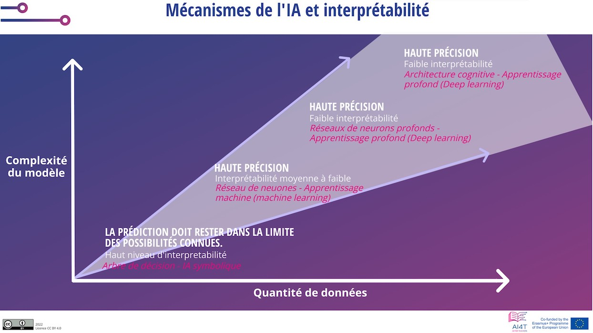
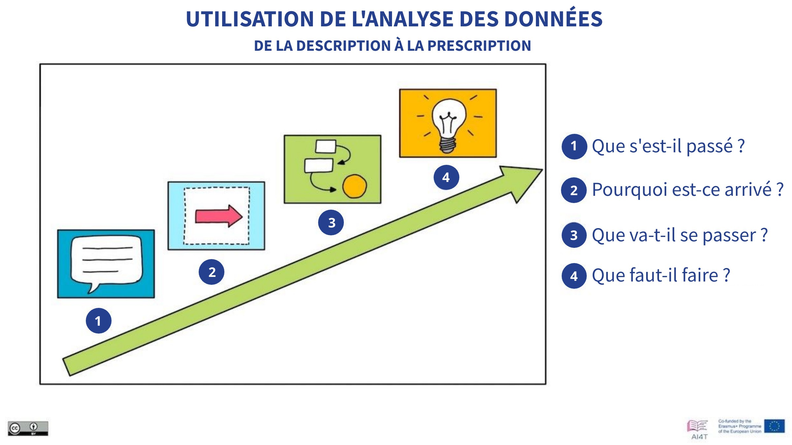

??? info "Metadáta
    - Id: EU.AI4T.O1.M4.2.1t
    - Názov:
    - Typ: text
    - Opis: Predmet: Umelá inteligencia pre učiteľov a od učiteľov
    - Predmet: Umelá inteligencia pre učiteľov a od učiteľov
    - Autori:
        - AI4T
    - Licencia: CC BY 4.0
    - Dátum: 2022-11-15

# Ste pripravení dôverovať umelej inteligencii pri rozhodovaní?

Nie všetky rozhodnutia prijaté pomocou AI nástrojov majú rovnaký vplyv.

Pri niektorých automatizovaných rozhodnutiach, ako napríklad pri „krokoch riešenia“, ktoré študentovi navrhne aplikácia na riešenie matematických úloh, možno dlhodobé riziko a škodu *považovať* za pomerne nízke.

Iné rozhodnutia, naopak, predstavujú potenciálnu škodu alebo riziko.

V takýchto prípadoch je potrebné prijať maximálne možné preventívnE opatrenia. V prvom rade musí byť rozhodnutie vysvetliteľné: prečo sa toto rozhodnutie navrhuje pre túto konkrétnu situáciu, pre tohto konkrétneho študenta alebo skupinu študentov?

Pozrime sa na niektoré kritériá používané na „hodnotenie“ rozhodovacieho procesu AI systémov.

## Vysvetliteľnosť

Vysvetliteľnosť - jedna zo 7 požiadaviek dôveryhodnej umelej inteligencie: _„Vysvetliteľnosť sa týka schopnosti vysvetliť technické procesy AI systému aj príslušné ľudské rozhodnutia (napr. oblasti použitia systému). Technická vysvetliteľnosť si vyžaduje, aby rozhodnutia prijaté AI systémom boli pre ľudí pochopiteľné a vysledovateľné.“_[^1]

V oblasti vzdelávania to znamená, že pri akomkoľvek AI nástroji na rozhodovanie musí byť prístup k informáciám o tom, ako sa rozhodnutie navrhuje a akú mieru ľudskej interakcie zahŕňa.

Túto požiadavku je pomerne ľahké splniť, ale pri niektorých AI technológiách sa vysvetliteľnosť nedá dosiahnuť tak ľahko. Napríklad v prípade mnohovrstvových neurónových sietí môže byť ťažké zabezpečiť vysvetliteľnosť. Preto sa v súčasnosti rozvíja nová oblasť umelej inteligencie: vysvetliteľná umelá inteligencia (XAI), teda _„umelá inteligencia, pri ktorej majú ľudia možnosť pochopiť rozhodnutia alebo predpovede robené umelou inteligenciou. Stojí v protiklade ku konceptu ,čiernej skrinky‘ v strojovom učení, kde ani samotní dizajnéri nedokážu vysvetliť, prečo umelá inteligencia dospela k určitému rozhodnutiu.“_[^2]

## Interpretovateľnosť

Niektoré techniky umelej inteligencie vedú k predpovediam, ktoré sa sa interpretujú ľahšie ako iné. Napríklad predpoveď vytvorená na základe rozhodovacieho stromu je vysvetliteľná. Takéto predpovede však nutne nemusia byť zaujímavé.

Na opačnom konci spektra vysvetliteľnosti sa nachádza hlboké učenie, ktoré môže byť oveľa náročnejšie na vysvetlenie, ale jeho výstupy môžu byť oveľa významnejšie ako tie, ktoré vytvorila umelá inteligencia s dobrou vysvetliteľnosťou.

<figure>
  
  <figcaption>Obrázok č. 1: Mechanizmy umelej inteligencie a interpretovateľnosť.
 Prevzaté z MOOC IAI / Ikram Chraibi Kaadoud - CC.BY.SA 2.0.</figcaption>
</figure>

Nástroe so slabou interpretovateľnosťou tak môžu pri rozhodovaní poskytovať väčšiu podporu než nástroje s dobrou interpretovateľnosťou.

### Od deskriptívneho k preskriptívnemu prístupu

Nasledujúci graf spája použitú technológiu, jej komplexnosť a strategický výsledok.

<figure>
  
</figure>
Obrázok č. 2: Klasifikácia využití dátovej analýzy: od deskriptívnych k preskriptívnym[^3] (Prevzaté z videa "Learning Analytics" v tomto kurze).

V nasledujúcich štyroch kategóriách si môžeme všimnúť koreláciu medzi komplexnosťou použitých metód a strategickými výsledkami.

### Deskriptívna analýza

Deskriptívna analýza skúma dáta s cieľom odpovedať na otázku „Čo sa stalo?“.  
Môže byť poskytnutá vo forme *„jednoduchých súhrnov o vzorke a vykonaných pozorovaniach. Tieto súhrny môžu byť kvantitatívne alebo vizuálne, teda mať podobu ľahko pochopiteľných grafov“*[^4]. Je založená na tradičných nástrojoch bez umelej inteligencie.

### Diagnostická analýza

Diagnostická analýza odpovedá na otázku „Prečo sa to stalo?“  
Vedie k identifikácii povahy a príčiny javu s cieľom určiť zmierňujúce opatrenia a riešenia. Využíva štatistické metódy ako objavovanie dát, dolovanie dát a korelácie. Tieto metódy môžu zahŕňať využitie umelej inteligencie.

### Prediktívna analýza

Prediktívna analýza skúma dáta alebo udalosti s cieľom odpovedať na otázku „Čo sa stane?“ alebo presnejšie „Čo sa pravdepodobne stane?“  
„Prediktívna analýza sa orientuje na budúcnosť a využíva minulé udalosti na predvídanie budúcich. Využíva štatistické metódy akomodelovanie dát, strojové učenie, umelú inteligenciu, algoritmy hlbokého učenia či dolovanie dát.“[^5]

### Preskriptívna analýza

Preskriptívna analýza odpovedá na otázku "Čo by sa malo urobiť?" alebo "Ako to uskutočniť?".

"*Preskriptívna analytika predvída nielen to, čo sa stane a kedy sa to stane, ale aj prečo sa to stane. Okrem toho preskriptívna analytika navrhuje možnosti rozhodnutia, ako využiť budúcu príležitosť alebo zmierniť budúce riziko, a ukazuje dôsledky každej možnosti rozhodnutia*." [Preklad DeepL] [^6]

Súhrnne možno povedať, že čím relevantnejšie môžu byť nástroje ako pomoc pri rozhodovaní, tým zložitejšie sú informačné technológie a tým ťažšie sa môžu vysvetľovať.
Z hľadiska poskytovanej pomoci je však potrebné zachovať pozornosť na vysvetľovanosť a ostražitosť, ktorá sa môže vyžadovať pri používaní nástroja umelej inteligencie v oblasti, kde sú dôsledky rozhodnutí dôležité a dlhodobé.

[^1]: "* Okrem toho môže byť potrebné urobiť kompromis medzi zlepšením vysvetliteľnosti systému (čo môže znížiť jeho presnosť) alebo zvýšením jeho presnosti (na úkor vysvetliteľnosti). Vždy, keď má systém UI významný vplyv na život ľudí, malo by byť možné požadovať primerané vysvetlenie rozhodovacieho procesu systému UI. Toto vysvetlenie by sa malo poskytnúť včas a malo by byť prispôsobené odborným znalostiam dotknutej zainteresovanej strany (napr. laik, regulačný orgán alebo výskumný pracovník). Okrem toho by malo byť k dispozícii vysvetlenie, do akej miery systém UI ovplyvňuje a formuje rozhodovací proces organizácie, výber návrhu systému a dôvody jeho nasadenia (zabezpečenie transparentnosti obchodného modelu)*." [Preklad DeepL] - Výňatok z "[Etické usmernenia pre dôveryhodnú UI (dokument v angličtine) na tému "Vysvetliteľnosť"](https://ec.europa.eu/futurium/en/ai-alliance-consultation/guidelines/1.html#Transparency)" (konzultované 16. 10. 2022).

[^2]: Výňatok z článku wikipédie ["Vysvetliteľná umelá inteligencia"](https://en.wikipedia.org/wiki/Explainable_artificial_intelligence) (prezerané 16. 10. 2022).

[^3]: Pozri v tomto kurze časť 1.1.3. o analýze učenia (video).

[^4]: Výňatok z článku na Wikipédii ["Deskriptívna štatistika"] (https://en.wikipedia.org/wiki/Descriptive_statistics)" (prístup 16. 10. 2022).

[^5]: Výňatok z článku wikipédie ["Prediktívna analýza"](https://en.wikipedia.org/wiki/Predictive_analytics)" (prístup 16/10/2022).

[^6]: Výber z článku wikipédie ["Prescriptive Analytics"](https://en.wikipedia.org/wiki/Prescriptive_analytics)" (prístup 16/10/2022).
