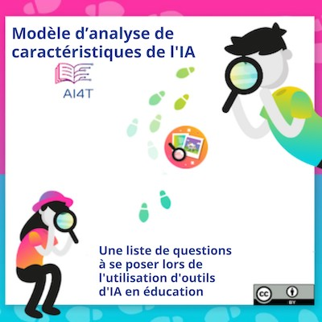
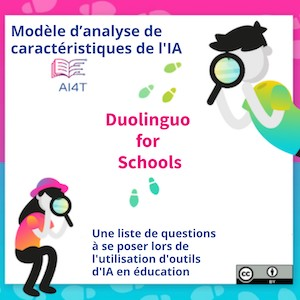

??? info "Metadáta
    - Id: EU.AI4T.O1.M4.3.2a
    - Názov: 4.3.2 Aktivita: Prípadová štúdia s Duolingo
    - Typ: aktivita
    - Opis: Použitie modelu na charakterizovanie Duolinga pre školy
    - Predmet: Umelá inteligencia pre učiteľov a pre učiteľov
    - Autori: Mgr:
        - AI4T
        - Jiajun, Pan - Loria
        - Azim, Roussanaly - Loria
        - Anne, Boyer - Loria
        - AI4T
    - Licencia: CC BY 4.0
    - Dátum: 2022-11-15


# Aktivita: Prípadová štúdia s použitím modelu AI na analýzu Duolingo pre školy

Aplikácia "*Duolingo for Schools*" je relevantný nástroj umelej inteligencie, s ktorým môžu učitelia experimentovať.

Je to aplikácia na učenie sa jazykov a otázky, ktoré vyvoláva jej AI, sú relevantné pre všetky odbory.

V priebehu tejto aktivity sa aplikácia Duolingo for Schools navrhuje ako prípadová štúdia na experimentovanie s modelom charakterizujúcim UI, ktorý bol predstavený v module 3 "Ako funguje UI?". Duolingo for Schools má dve vlastnosti, ktoré ho robia vhodnou prípadovou štúdiou:

1. Duolingo zdieľa množstvo informácií o tom, ako funguje,
2. Keďže ho používa veľa žiakov, je predmetom mnohých otázok od nezúčastnených osôb, ktoré sa obávajú napríklad o súkromie. Vďaka tomu je ľahšie získať prehľad o určitých otázkach, ktoré zvyčajne nie je také jednoduché mať na AIER, napríklad o ochrane údajov.

## Duolingo pre školy vlastnými slovami

Tu je prezentácia Duolingo for Schools na jej anglickom blogu[^1]: "*Duolingo for Schools má ovládací panel priamo v účte Duolingo učiteľa, ktorý mu umožňuje vytvárať triedy a úlohy a sledovať aktivity študentov. Sme radi, že môžeme spolupracovať s pedagógmi a priniesť do tried aplikáciu číslo jeden v oblasti jazykového vzdelávania, ktorej funkcie sú navrhnuté tak, aby maximalizovali efektivitu učiteľov a učenie sa študentov*". [Deepl preklad]

## Niektoré zdroje, ktoré môžete použiť na analýzu funkcií umelej inteligencie aplikácie Duolingo pre školy:

1. Duolingo pre školy (v angličtine): [https://schools.duolingo.com/](https://schools.duolingo.com/)
2. Duolingo pre školy - centrum pomoci v angličtine: [https://duolingoschools.zendesk.com/hc/en-us](https://duolingoschools.zendesk.com/hc/en-us)
3. Oficiálna webová stránka Duolingo: [https://www.duolingo.com/](https://www.duolingo.com/)
4. Blog Duolingo (v angličtine): [https://blog.duolingo.com](https://blog.duolingo.com)
5. Výskumná webová stránka Duolingo (vedecké články, nástroje a údaje): [https://research.duolingo.com/](https://research.duolingo.com/)

Toto sú "oficiálne" stránky spoločnosti Duolingo. Niektoré zaujímavé informácie možno nájsť aj na iných stránkach, preto neváhajte a spestrite si vyhľadávanie.

**Chceli by ste analyzovať funkcie umelej inteligencie Duolingo pre školy?  
Kliknutím na obrázok nižšie si stiahnite pripravenú šablónu charakteristiky UI a vyplňte ju podľa svojich možností.
<a href="Documents/AI4T-Template-Ready-to-use-fr.pdf" target="_blank">
<figure>
  
</figure></a>

## Príklad vyplnenej šablóny charakteristiky UI pre "Duolingo for Schools".

Tu je príklad vzoru vyplneného pomocou informácií získaných z vyššie uvedených odkazov a ďalších informácií ľahko dostupných prostredníctvom vyhľadávania na internete.
Zatiaľ čo väčšina informácií je dostupná, niektoré ďalšie charakteristiky je ťažké vyplniť alebo niekedy nemožné ich nájsť.

<a href="Documents/AI4T-Template-Case-study-Duolingo-fr.pdf" target="_blank">
<figure>
  
</figure></a>

```
**Poznámka**: Tu uvedená verzia modelu je z januára 2023, teda z dátumu začiatku experimentálnej fázy projektu.
```

[^1]: [Prezentácia Duolingo pre školy](https://blog.duolingo.com/duolingo-for-schools/)
 (konzultované 10. 11. 2022)
