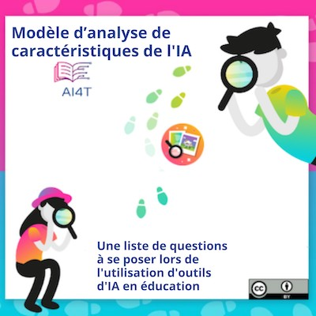
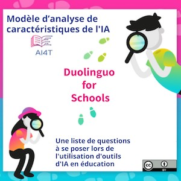

??? info "Metadáta
    - Id: EU.AI4T.O1.M4.3.2a
    - Názov: 4.3.2 Aktivita: Prípadová štúdia služby Duolingo
    - Typ: aktivita
    - Opis: Použitie AI šablóny na analýzu nástroja Duolingo for Schools
    - Predmet: Umelá inteligencia pre učiteľov a od učiteľov
    - Autori:
        - AI4T
        - Jiajun, Pan - Loria
        - Azim, Roussanaly - Loria
        - Anne, Boyer - Loria
        - AI4T
    - Licencia: CC BY 4.0
    - Dátum: 2022-11-15


# Aktivita: Prípadová štúdia s využitím AI šablóny na analýzu nástroja Duolingo for Schools

Konzorcium AI4T identifikovalo službu *Duolingo for Schools* je relevantný AI nástroj, s ktorým môžu učitelia v rámci projektu experimentovať.

Ide o aplikáciu na učenie sa jazykov, no otázky, ktoré jej využitie umelej inteligencie vo vzdelávaní je relevantné pre všetky odbory.

V priebehu tejto aktivity aplikácia Duolingo for Schools slúži ako prípadová štúdia na otestovanie šablóny na charakteristiku umelej inteligencie, ktorý sme predstavili v 3. module: _Ako funguje umelá inteligencia?_. Služba Duolingo for Schools má dve vlastnosti, vďaka ktorým je vhodná na prípadovú štúdiu:

1. Duolingo zverejňuje množstvo informácií o tom, ako funguje,
2. Keďže ho používa obrovské množstvo študentov, čelí mnohým otázkam verejnosti, napríklad kvôli obavám o súkromie. Vďaka tomu je ľahšie získať vhľad do apektov, ktoré sa pri iných AI vzdelávacích nástrojoch skúmajú ťažšie (napríklad ochrana údajov).

## Duolingo for Schools vlastnými slovami

Aplikácia Duolingo for Schools sa na jej anglickom blogu prezentuje nasledovne: *„Duolingo for Schools je ovládací panel priamo v účte, ktorý má učiteľ vytvorený v službe Duolingo. Tento panel mu umožňuje vytvárať triedy, pridávať zadania a sledovať aktivitu študentov. Sme radi, že môžeme spolupracovať s pedagógmi a priniesť do tried svetovú jednotku medzi aplikáciami na vyučovanie jazykov, ktorej funkcie sú navrhnuté tak, aby maximalizovali efektivitu učiteľa a učenie sa študentov.“*[^1]

## Niektoré zdroje, ktoré môžete použiť na analýzu AI funkcií aplikácie Duolingo for Schools:

1. Duolingo for Schools: [https://schools.duolingo.com/](https://schools.duolingo.com/)
2. Duolingo for Schools – centrum pomoci: [https://duolingoschools.zendesk.com/hc/en-us](https://duolingoschools.zendesk.com/hc/en-us)
3. Oficiálny web Duolingo: [https://www.duolingo.com/](https://www.duolingo.com/)
4. Duolingo blog: [https://blog.duolingo.com](https://blog.duolingo.com)
5. Výskumná stránka Duolingo (vedecké články, zdieľanie dát): [https://research.duolingo.com/](https://research.duolingo.com/)

Poznámka: Toto sú „oficiálne“ stránky spoločnosti. Niektoré zaujímavé informácie sa však dajú nájsť aj na iných stránkach, preto si pokojne vyhľadajte aj ďalšie zdroje.

**Chceli by ste analyzovať AI funkcie služby Duolingo for Schools?**
*Kliknutím na nasledujúci obrázok si stiahnite si pripravenú šablónu na charakteristiku umelej inteligencie a vyplňte do nej čo najviac údajov.*
<a href="Documents/AI4T-Template-Ready-to-use-fr.pdf" target="_blank">
<figure>
  
</figure></a>

## Príklad vyplnenej šablóny pre Duolingo for Schools.

Tu je príklad vyplnenej šablóny s použitím informácií získaných z vyššie uvedených odkazov a ďalších verejne dostupných online zdrojov.
Hoci väčšina informácií je ľahko dostupná, niektoré ďalšie charakteristiky sa vypĺňajú ťažko a niekedy ani nie je nemožné ich nájsť.

<a href="Documents/AI4T-Template-Case-study-Duolingo-fr.pdf" target="_blank">
<figure>
  
</figure></a>

```
**Poznámka**: Verzia šablóny, ktorú tu prezentujeme, je z januára 2023, teda z dátumu začiatku experimentálnej fázy projektu.
```

[^1]: [Prezentácia Duolingo pre školy](https://blog.duolingo.com/duolingo-for-schools/)
 (prístup 10. 11. 2022)
