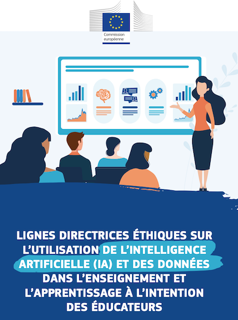

??? info "Metadáta
    - Id: EU.AI4T.O1.M7.0.2t
    - Názov: Etické usmernenia o používaní umelej inteligencie a údajov vo vyučovaní a učení.
    - Typ: text
    - Opis: Vydanie tohto dokumentu je v súlade so zásadou proporcionality: 
    - Predmet: Umelá inteligencia pre učiteľov a pre učiteľov.
    - Autori: Mgr:
        - AI4T 
    - Licencia: CC BY 4.0
    - Dátum: 2022-11-15

# Etické usmernenia o používaní umelej inteligencie a údajov vo vyučovaní a učení.
V októbri 2022 Európska komisia v rámci akčného plánu digitálneho vzdelávania (opatrenie 6)[^1] zverejnila etické usmernenia o používaní umelej inteligencie a údajov, aby pomohla učiteľom a pedagógom pochopiť potenciál, ktorý môžu mať aplikácie umelej inteligencie a využívanie údajov vo vzdelávaní, a aby si uvedomili možné riziká.
Kliknutím na obrázok nižšie si môžete stiahnuť "Etické usmernenia o používaní umelej inteligencie (UI) a údajov vo vyučovaní a učení pre pedagógov".
<a href="Documents/Lignes-directrices-ethiques-sur-lutilisation-de-lintelligence-NC0722649FRN.pdf" target="_blank">
<figure>
  
  <figcaption>  Lignes directrices éthiques sur l’utilisation de l’intelligence artificielle (ia) et des données dans l’enseignement et l’apprentissage à l’intention des éducateurs. European Union, 2022 - CC BY 4.0 International </figcaption>
</figure></a>
[^1]: [Európska komisia v rámci akčného plánu digitálneho vzdelávania (opatrenie 6)] (https://education.ec.europa.eu/focus-topics/digital-education/action-plan/action-6)
