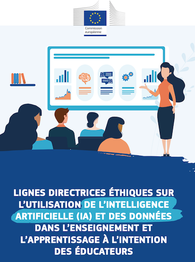

??? info "Metadáta
    - Id: EU.AI4T.O1.M7.0.2t
    - Názov: Etické usmernenia týkajúce sa používania umelej inteligencie a údajov pri výučbe a vzdelávaní.
    - Typ: text
    - Opis: Prezentácia etických usmernení Európskej komisie
    - Predmet: Umelá inteligencia pre učiteľov a od učiteľov.
    - Autori:
        - AI4T 
    - Licencia: CC BY 4.0
    - Dátum: 2022-11-15

# Etické usmernenia týkajúce sa používania umelej inteligencie a údajov pri výučbe a vzdelávaní
V októbri 2022 Európska komisia v rámci akčného plánu digitálneho vzdelávania (opatrenie č. 6)[^1] zverejnila *Etické usmernenia pre pedagógov týkajúce sa používania umelej inteligencie a údajov pri výučbe a vzdelávaní*, ktoré majú pedagógom pomôcť pochopiť potenciál AI aplikácií a využívania údajov vo vzdelávaní a zároveň zvýšiť povedomie o možných rizikách.

*Etické usmernenia pre pedagógov týkajúce sa používania umelej inteligencie a údajov pri výučbe a vzdelávaní* si môžete stiahnuť kliknutím na nasledujúci obrázok.

<a href="Documents/Lignes-directrices-ethiques-sur-lutilisation-de-lintelligence-NC0722649FRN.pdf" target="_blank">
<figure>
  
  <figcaption>  Etické usmernenia pre pedagógov týkajúce sa používania umelej inteligencie a údajov pri výučbe a vzdelávaní. Európska únia, 2022 – CC BY 4.0 International </figcaption>
</figure></a>

[^1]: [Európska komisia v rámci akčného plánu digitálneho vzdelávania (opatrenie č. 6)](https://education.ec.europa.eu/sk/focus-topics/digital-education/actions/plan/ethical-guidelines-for-educators-on-using-artificial-intelligence)
