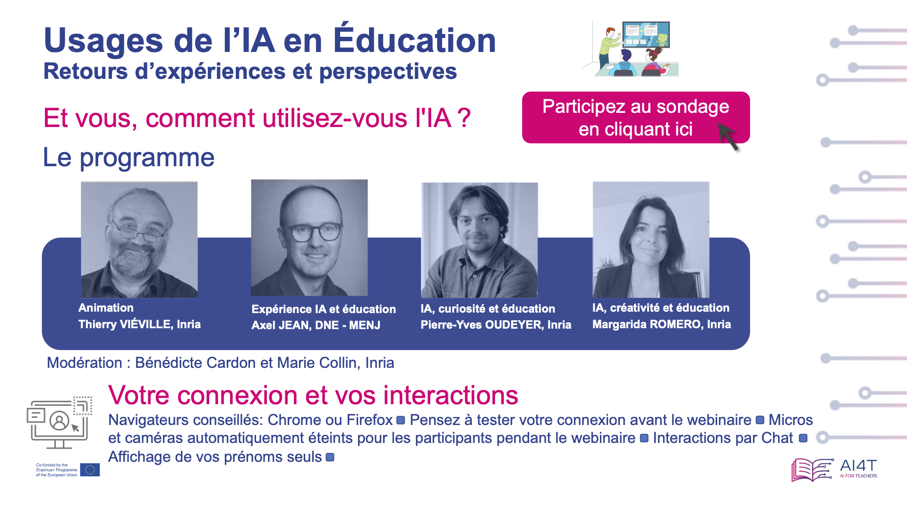

# Využitie umelej inteligencie vo vzdelávaní: spätná väzba a perspektívy

Dňa 31. januára 2024 zorganizoval pedagogický tím Mooc svoj prvý webinár na tému 
"Využitie umelej inteligencie vo vzdelávaní: spätná väzba a perspektívy".

<td style="center; border: none; vertical-align: middle;"></td>

## Webinár moderuje Thierry VIÉVILLE
Thierry je výskumný pracovník v oblasti počítačovej neurovedy - Inria, tím Mnemosyne - *Člen výučbového tímu AI4T* Mooc

### AI, využitie a vzdelávanie Axel JEAN
Axel je vedúci kancelárie na podporu digitálnych inovácií a aplikovaného výskumu - TN2 DNE - MENJ - *člen výučbového tímu AI4T* Mooc

### AI pre personalizované vzdelávanie by Pierre-Yves OUDEYER
Pierre-Yves je výskumník v oblasti umelej inteligencie, strojového učenia a kognitívnej vedy v spoločnosti Inria a vedecký poradca spoločnosti EvidenceB.
Zvedavosť zohráva kľúčovú úlohu pri učení detí v škole aj mimo nej. Je to jedna z hnacích síl, ktorá ich môže viesť k rozkvetu tým, že ich baví učiť sa a stimuluje ich vytrvalosť a tvorivosť. Tím Flowers v spoločnosti Inria, ktorý vychádza zo svojej základnej práce v oblasti kognitívnych vied a umelej inteligencie pri modelovaní zvedavosti u detí, už niekoľko rokov pracuje na ich aplikácii v oblasti vzdelávania. Pierre-Yves Oudeyer predstaví dva projekty realizované v spolupráci tímu Flowers a edTech spoločnosti evidenceB. Jeden z nich využíva metódy personalizácie učenia, ktoré stimulujú zvedavosť v kontexte výučby matematiky, v súčasnosti široko rozšírené v softvéri Adaptiv'Maths podporovanom francúzskym ministerstvom školstva a prístupnom vo všetkých školách vo Francúzsku (68 000 tried). V druhom prípade experimentujeme s veľmi sľubnými možnosťami jazykových modelov na vytvorenie konverzačných agentov, ktorí učia deti klásť zvedavé otázky. Bude tiež diskutovať o výzvach gramotnosti v oblasti umelej inteligencie na stredných školách a o viacerých výučbových nástrojoch, ktoré k nej majú prispieť. 

### AI, kreativita a vzdelávanie Margarida ROMERO
Margarida je profesorkou na Laboratoire d'Innovation et Numérique pour l'Education - Université Côte d'Azur.
V nadväznosti na bielu knihu "Vyučovanie a učenie sa vo veku umelej inteligencie. Akulturácia, integrácia a kreatívne využitie umelej inteligencie vo vzdelávaní" bude Margarida Romero diskutovať o kreatívnom využití generatívnej umelej inteligencie.

## Organizácia a moderovanie webinára: Bénédicte CARDON a Marie COLLIN
Marie a Bénédicte sú inžinierky vzdelávania vo vzdelávacom laboratóriu Inria a *členky výučbového tímu Mooc*.