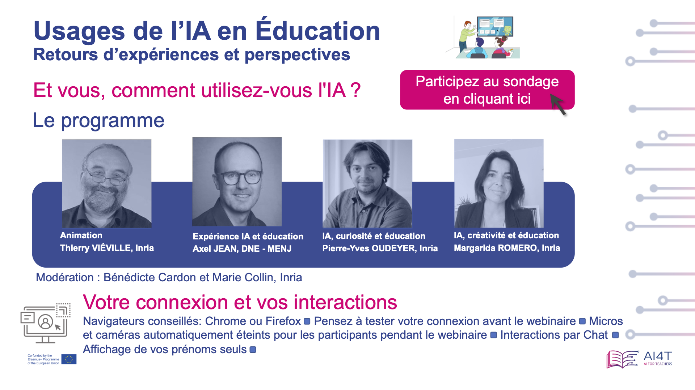

# Využívanie AI vo vzdelávaní: spätná väzba a vyhliadky

Dňa 31. januára 2024 zorganizoval pedagogický tím MOOC kurzu svoj prvý webinár na tému *Využívanie AI vo vzdelávaní: spätná väzba a vyhliadky*.

<td style="center; border: none; vertical-align: middle;"></td>

## Moderátor: Thierry VIÉVILLE
Thierry je výskumný pracovník v oblasti počítačovej neurovedy, ktorý v rámci organizácie Inria pracuje v tíme Mnemosyne. Okrem toho je aj *člen výučbového tímu MOOC kurzu AI4T*.

### AI, využitie a vzdelávanie: Axel JEAN
Axel je vedúci kancelárie na podporu digitálnych inovácií a aplikovaného výskumu (TN2 DN a MENJ). Okrem toho je aj *člen výučbového tímu MOOC kurzu AI4T*.

### AI pre personalizované vzdelávanie: Pierre-Yves OUDEYER
Pierre-Yves pracuje výskumník v oblasti umelej inteligencie, strojového učenia a kognitívnej vedy v organizácii Inria a vedecký poradca v spoločnosti EvidenceB.
Zvedavosť zohráva kľúčovú úlohu pri učení detí v škole aj mimo nej. Je hnacou silou, ktorá môže viesť k ich rozvoju, keďže vďaka zvedavosti robí z učenia zábavu a stimuluje ich vytrvalosť a tvorivosť. Tím Flowers v spoločnosti Inria vychádza zo svojej základnej práce v oblasti kognitívnych vied a umelej inteligencie pri modelovaní zvedavosti u detí. Už niekoľko rokov pritom pracuje na aplikácii týchto zistení v oblasti vzdelávania. Pierre-Yves Oudeyer vo webniári predstavuje dva projekty realizované v spolupráci tímu Flowers a edtechovej spoločnosti evidenceB. Jeden z nich využíva metódy personalizácie učenia na stimulovanie zvedavosti pri výučbe matematiky, v súčasnosti široko rozšírené pomocou softvéru Adaptiv'Maths, ktorý má podporu francúzskeho ministerstva školstva a je prístupný vo všetkých školách vo Francúzsku (68 000 tried). V druhom prípade experimentujeme s veľmi sľubnými možnosťami jazykových modelov na vytvorenie konverzačných agentov, ktorí učia deti klásť zvedavé otázky. Pierre-Yves na webinári diskutuje aj o výzvach AI gramotnosti na stredných školách a o viacerých učebných nástrojoch, ktoré k nej majú prispieť. 

### AI, kreativita a vzdelávanie: Margarida ROMERO
Margarida je profesorkou na francúzskej univerzite Université Côte d'Azur, kde pracuje v rámci Laboratória inovácií a digitálnych technológií vo vzdelávaní.
V nadväznosti na bielu knihu s názvom _Vyučovanie a učenie sa vo veku umelej inteligencie. Akulturácia, integrácia a kreatívne využitie umelej inteligencie vo vzdelávaní_ bude Margarida Romero diskutovať o kreatívnom využití generatívnej umelej inteligencie.

## Organizácia a moderovanie webinára: Bénédicte CARDON a Marie COLLIN
Marie a Bénédicte sú inžinierky vzdelávania vo vzdelávacom laboratóriu Inria a *členky výučbového tímu MOOC kurzu AI4T*.
