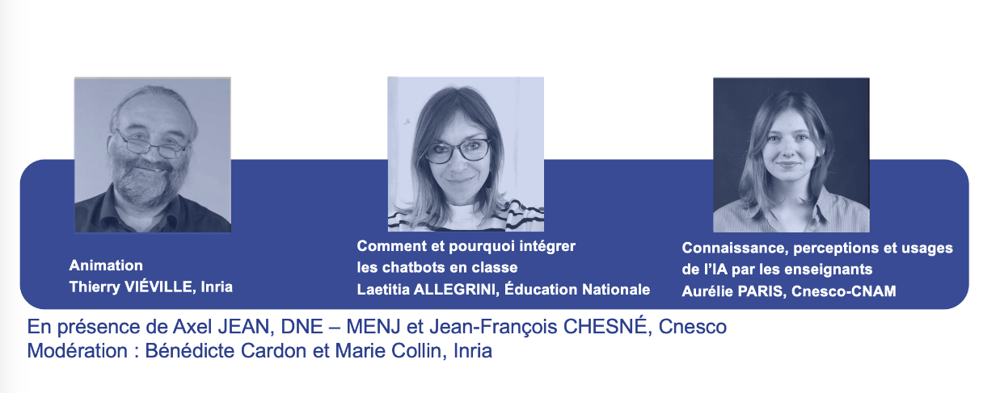

# Využitie umelej inteligencie vo vzdelávaní: Integrácia nástrojov umelej inteligencie do výučby.

Dňa 3. apríla 2024 zorganizoval výučbový tím Mooc druhý webinár na tieto témy 
"Využitie umelej inteligencie vo vzdelávaní: integrácia nástrojov umelej inteligencie v triede".

<td style="border: none; vertical-align: middle;"></td>

## Webinár moderuje Thierry VIÉVILLE.
Thierry je výskumník v oblasti počítačovej neurovedy - Inria, tím Mnemosyne - *Člen výučbového tímu AI4T* Mooc.

### Ako a prečo by sa mali chatboti používať v triede? by Laetitia ALLEGRINI
Laetitia je učiteľka špecializujúca sa na variant F a členka pracovnej skupiny pre umelú inteligenciu na DRANE Akadémie d'Aix-Marseille.
V dnešnej dobe umelej inteligencie (UI) budú mať učitelia k dispozícii nové nástroje. Používanie a vytváranie konverzačných agentov alebo "chatbotov" môže okrem iného pomáhať učiteľovi, podporovať a sprevádzať žiaka pri učení... Tieto pomôcky by sa mohli stať výkonnými a inovatívnymi nástrojmi výučby. Počas tejto prezentácie odpovieme na otázku: "Ako a prečo by sa mali chatboti integrovať do vyučovania? Pre každú z troch kategórií konverzačných jednotiek objavíte konkrétne príklady z vyučovania. Budeme zdôrazňovať kľúčovú úlohu učiteľa pri implementácii chatbotov v rámci vyučovacieho scenára, aby sme sa vyhli určitým predsudkom. Mohla by podľa vás integrácia chatbotov do vzdelávania symbolizovať budúcnosť, v ktorej sa umelá inteligencia stane inkluzívnym vzdelávacím nástrojom, ktorý pomáha podporovať vzdelávanie?

### Hodnotenie projektu AI4T: znalosti, vnímanie a využívanie umelej inteligencie učiteľmi Aurélie PARIS 
Aurélie je projektová pracovníčka v Cnesco - CNAM, zodpovedná za koordináciu pracovnej skupiny pre hodnotenie projektu AI4T.
Táto prezentácia poukazuje na výsledky prieskumov, ktoré sa uskutočnili v rámci hodnotenia európskeho projektu na vzdelávanie učiteľov v oblasti umelej inteligencie koordinovaného organizáciou Cnesco. Ponúkajú porovnávací pohľad na znalosti, vnímanie a využívanie umelej inteligencie medzi učiteľmi v rôznych krajinách. Predstavené sú aj spôsoby podpory využívania umelej inteligencie vo vzdelávaní, ktoré vychádzajú zo spätnej väzby z tejto oblasti.

## Organizácia a moderovanie webinára: Bénédicte CARDON a Marie COLLIN
Marie a Bénédicte sú inžinierky vzdelávania vo vzdelávacom laboratóriu Inria a *členky tímu učiteľov Mooc*.