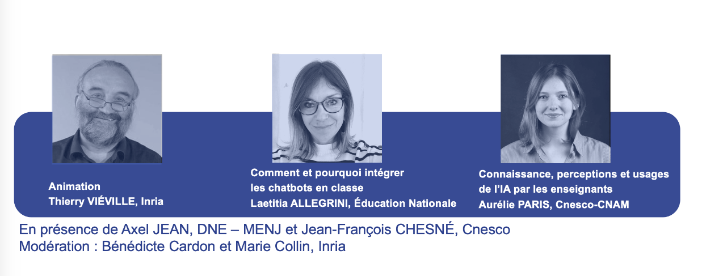

# Využívanie AI vo vzdelávaní: integrovanie AI nástrojov do výučby

Dňa 3. apríla 2024 zorganizoval pedagogický tím MOOC kurzu svoj druhý webinár, na tému _Využívanie AI vo vzdelávaní: integrovanie AI nástrojov do výučby_.

<td style="border: none; vertical-align: middle;"></td>

## Moderátor: Thierry VIÉVILLE.
Thierry je výskumný pracovník v oblasti počítačovej neurovedy, ktorý v rámci organizácie Inria pracuje v tíme Mnemosyne. Okrem toho je aj *člen výučbového tímu MOOC kurzu AI4T*.

### Ako a prečo v triede využívať četboty: Laetitia ALLEGRINI
Laetitia je učiteľka a členka pracovnej skupiny pre umelú inteligenciu v organizácii DRANE Académie d'Aix-Marseille.
V ére umelej inteligencie majú učitelia k dispozícii nové nástroje. Používanie a vytváranie konverzačných agentov alebo četbotov môže okrem iného učiteľovi pomáhať podporovať a sprevádzať žiaka pri učení. Tieto pomôcky môžu byť výkonnou a inovatívnou súčasťou výučby. Počas tejto prezentácie zodpovedáme otázku: _Ako a prečo by sa mali četboty integrovať do vyučovania?_ Pre každú z troch kategórií konverzačných jednotiek objavíte konkrétne príklady z vyučovania. Budeme zdôrazňovať kľúčovú úlohu učiteľa pri implementácii četbotov v rámci vyučovacieho scenára, aby sme sa vyhli zaujatosti. Mohla by podľa vás integrácia četbotov do vzdelávania viesť k budúcnosti, kde bude umelá inteligencia inkluzívnym vzdelávacím nástrojom na podporu vzdelávania?

### Vyhodnotenie projektu AI4T: znalosti, vnímanie a využívanie AI medzi učiteľmi: Aurélie PARIS 
Aurélie je projektová pracovníčka v organizácii Cnesco – CNAM. Okrem toho je zodpovedná aj za koordináciu pracovnej skupiny na hodnotenie projektu AI4T.
Táto prezentácia poukazuje na výsledky prieskumov uskutočnených pri hodnotení európskeho projektu na vzdelávanie učiteľov v oblasti umelej inteligencie, ktorý koordinovala organizácia Cnesco. Výsledky umožňujú porovnanie znalostí, vnímania a využívania umelej inteligencie medzi učiteľmi v rôznych krajinách. Prezentácia predstavuje aj spôsoby, ako podporovať využívanie umelej inteligencie vo vzdelávaní, ktoré vychádzajú zo spätnej väzby z tejto oblasti.

## Organizácia a moderovanie webinára: Bénédicte CARDON a Marie COLLIN
Marie a Bénédicte sú inžinierky vzdelávania vo vzdelávacom laboratóriu Inria a *členky výučbového tímu MOOC kurzu AI4T*.
