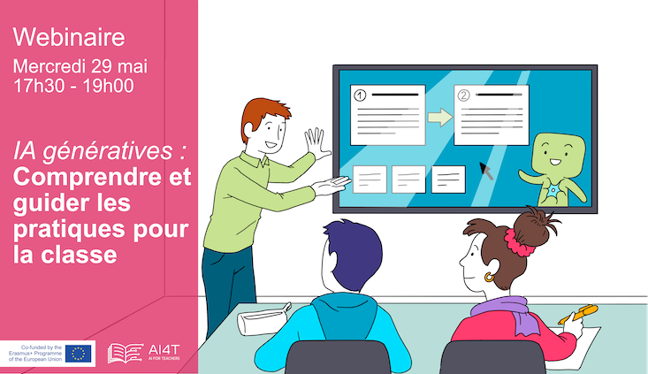

# Generatívna umelá inteligencia, pochopenie a usmernenie jej používania v triede.

Dňa 29. mája 2024 zorganizoval tím učiteľov Mooc tretí webinár na tému
"Generatívna umelá inteligencia, pochopenie a usmernenie jej použitia v triede".

<td style="border: none; vertical-align: middle;"></td>

### AI: Sľuby a obmedzenia Nicolas ROUGIER
Nicolas ROUGIER je riaditeľom výskumu v oblasti počítačovej kognitívnej neurovedy v spoločnosti Inria (tím Mnemosyne) - člen tímu učiteľov AI4T Mooc.
Hovoril na tému generatívnej umelej inteligencie: prísľuby a limity: "Generatívne umelé inteligencie, ktoré sme v posledných rokoch videli v praxi, sa z generácie na generáciu stále zlepšujú a sú prísľubom, že čoskoro budeme svedkami skutočných revolúcií na pracovisku, a dokonca aj inteligentných umelých inteligencií vo všeobecnom zmysle. A predsa, podobne ako v prípade autonómnych vozidiel, existuje mnoho dôvodov, prečo stále čakáme na ich rozšírenú výrobu a zdá sa, že všeobecná UI je v nedohľadne. V tejto prednáške preskúmam niektoré pravdepodobné príčiny a tvrdé limity generatívnej AI".

### Generatívna AI - niektoré pedagogické skúsenosti Guillaume VINIACOURT a Franck BODIN
Guillaume VINIACOURT a Frank BODIN sú národnými koordinátormi tematickej skupiny "Digital Humanities &amp; Education" siete Canopé.
Vystúpili na tému: IAs génératives, quelques expériences pédagogiques.
Osvojenie si generatívnych UI žiakmi a ich učiteľmi umožnilo žiakom a učiteľom zapojiť sa do tvorivého a vzdelávacieho experimentovania. Medzi pokusmi, omylmi a objavmi tieto nové interakcie v triede naznačujú vývoj zručností, ktoré sa majú rozvíjať. Tri pedagogické systémy budú základom prezentácie týchto nových prístupov k pedagogickému využívaniu generatívnych UI a budú sa zaoberať otázkou podpory žiakov v náročných postupoch.

### Novinky o AI4T Axel JEAN
Axel JEAN je vedúcim Úradu na podporu digitálnych inovácií a aplikovaného výskumu (DNE-TN2) na Ministerstve národného vzdelávania a výskumu - Podelil sa s nami o najnovšie informácie o projekte AI4T a vo všeobecnosti o iniciatívach na podporu racionálneho využívania UI vo vzdelávaní.

## Organizácia a moderovanie webinára: Bénédicte CARDON a Marie COLLIN
Marie a Bénédicte sú inžinierky v oblasti vzdelávania v spoločnosti Inria a *členky výučbového tímu Mooc*.
