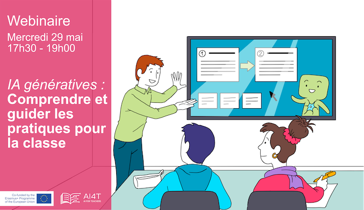

# Generatívna umelá inteligencia, pochopenie a usmernenie jej používania v triede.

Dňa 29. mája 2024 zorganizoval pedagogický tím MOOC kurzu svoj prvý webinár na tému _Generatívna umelá inteligencia, pochopenie a usmernenie jej použitia v triede_.

<td style="border: none; vertical-align: middle;"></td>

### Prísľuby a obmedzenia AI: Nicolas ROUGIER
Nicolas ROUGIER je riaditeľom výskumu v oblasti počítačovej neurovedy, ktorý v rámci organizácie Inria pracuje v tíme Mnemosyne. Okrem toho je aj člen výučbového tímu MOOC kurzu AI4T.
Rozprával o prísľuboch aj obmedzeniach generatívnej umelej inteligencie: „Generatívne umelé inteligencie, ktoré sme v posledných rokoch videli v praxi, sa z generácie na generáciu stále zlepšujú. Prinášajú tak so sebou prísľub, že čoskoro budeme svedkami skutočných revolúcií na pracovisku, a dokonca aj inteligentnej AI vo všeobecnom zmysle. A predsa, podobne ako v prípade autonómnych vozidiel, existuje mnoho dôvodov, prečo stále čakáme na ich rozšírenie, a zatiaľ sa zdá, že všeobecná umelá inteligencia je v nedohľadne. V tejto prednáške preskúmam niektoré pravdepodobné príčiny a tvrdé limity generatívnej umelej inteligencie“.

### Pedagogické skúsenosti s generatívnou AI: Guillaume VINIACOURT a Franck BODIN
Guillaume VINIACOURT a Frank BODIN sú národnými koordinátormi tematickej skupiny Digital Humanities &amp; Education, ktorá je súčasťou siete Canopé.
Ich príspevok sa venoval téme pedagogických skúseností s generatívnou AI.
Vďaka tomu, že si žiaci a ich učitelia osvojili používanie generatívnej umelej inteligencie, teraz sa môžu zapojiť do tvorivého experimentovania so vzdelávacím procesom. Objavovanie týchto nových interakcií metódou pokus-omyl v triede naznačuje, aké zručnosti je potrebné rozvíjať. Prezentácia spomína tri pedagogické systémy, ktoré sú základom pre nové prístupy k pedagogickému využívaniu generatívnej umelej inteligencie, a zaoberá sa aj podporou žiakov pri náročnejších postupoch.

### Novinky o AI4T: Axel JEAN
Axel JEAN je vedúcim Úradu na podporu digitálnych inovácií a aplikovaného výskumu (DNE-TN2) na francúzskom ministerstve školstva. Podelil sa s nami o najnovšie informácie o projekte AI4T a ďalších iniciatívach na podporu racionálneho využívania AI vo vzdelávaní.

## Organizácia a moderovanie webinára: Bénédicte CARDON a Marie COLLIN
Marie a Bénédicte sú inžinierky vzdelávania vo vzdelávacom laboratóriu Inria a *členky výučbového tímu MOOC kurzu AI4T*.
