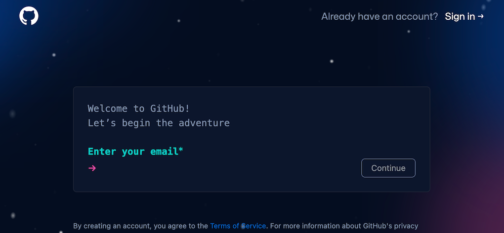
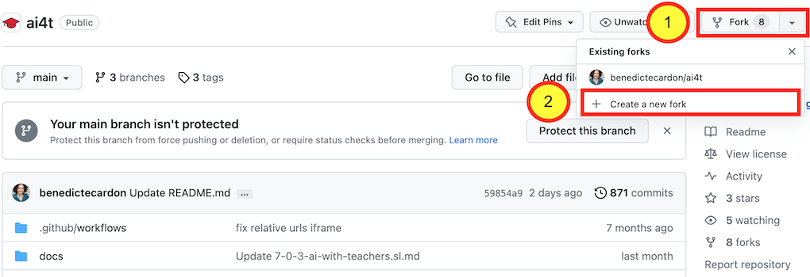
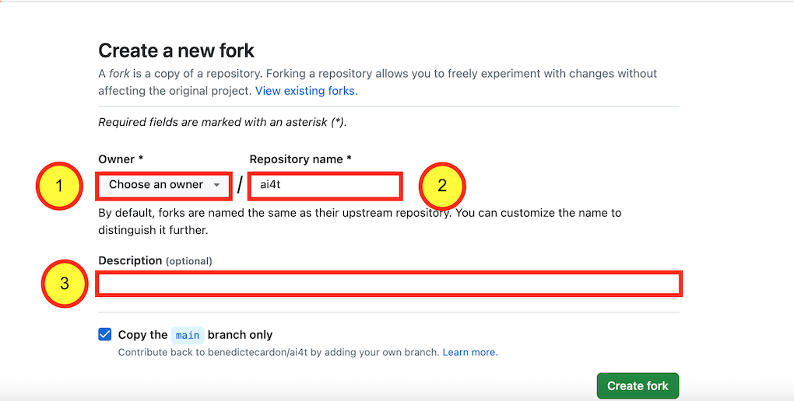
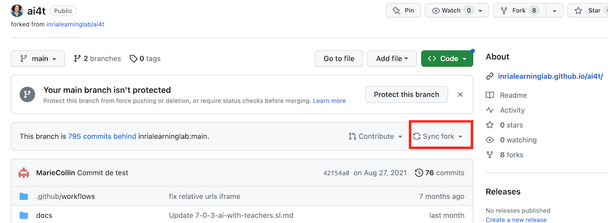

## 1- Vytvorenie účtu na GitHub

Prvým krokom je vytvorenie účtu na GitHub (je bezplatný), ak ho ešte nemáte.

<figure class="image-frame">
    
</figure>
<figcaption>Vytvorte si účet na githube.</figcaption>

Prístup na [registračnú stránku GitHub](https://github.com/signup){:target="_blank"}

## 2- Prístup k úložisku GitHub pre projekt AI4T

Adresa úložiska GitHub projektu AI4T: [https://GitHub.com/inrialearninglab/ai4t](https://GitHub.com/inrialearninglab/ai4t){:target="_blank"}

## 3- Vytvorte **fork** úložiska

Fork je rozsiahla kópia prvkov (od obsahu až po príkazy) úložiska GitHub, ale je oddelená od hlavného úložiska alebo **main**.

Môžete preto robiť, čo chcete, bez toho, aby ste ovplyvnili AI4T Mooc.

Ak však chcete sledovať vývoj **main**, môžete **synchronizovať** svoj fork, kedykoľvek budete chcieť.

<figure class="image-frame">
    
</figure>
<figcaption>Vytvorte si fork na githube.</figcaption>

Po vytvorení musí byť fork pomenovaný.

<figure class="image-frame">
    
</figure>
<figcaption>Názov forku na githube.</figcaption>

**Podporujeme vás, aby ste:**

1: Vyberte si správny názov pre svoj účet

2: V názve vkladu ponechajte **AI4T**

3 : A ako **opis** pridajte nový cieľový jazyk, ktorý vyvíjate
vyvinúť

**Nezabudnite**: Vždy je možné sledovať vývoj pôvodného úložiska GitHub "synchronizáciou" vlastného úložiska s úložiskom AI4T.
<figure class="image-frame">
    
</figure>
<figcaption>Synchronizujte fork na githube.</figcaption>

## 4- Váš fork je teraz pripravený na vašej vlastnej adrese URL:

*Príklad vlastnej adresy URL*: https://GitHub.com/ **YOURNAME** /ai4t

<figure class="image-frame">
    
</figure>
<figcaption>Identifikátor vidlice uvedený v adrese URL jej statických webových stránok.</figcaption>
