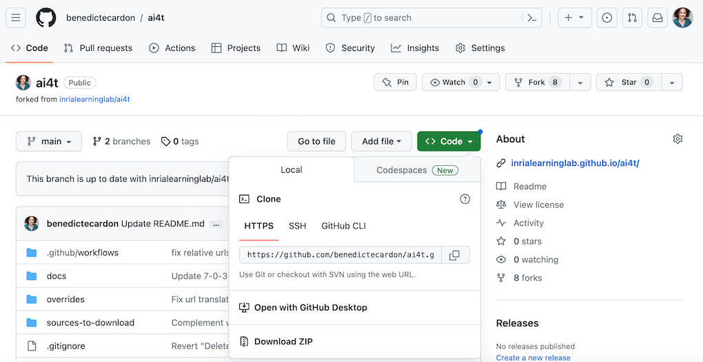
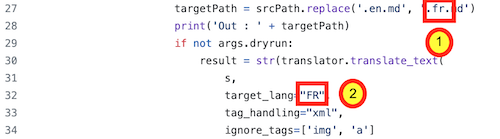
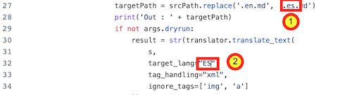
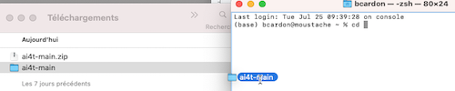
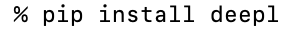
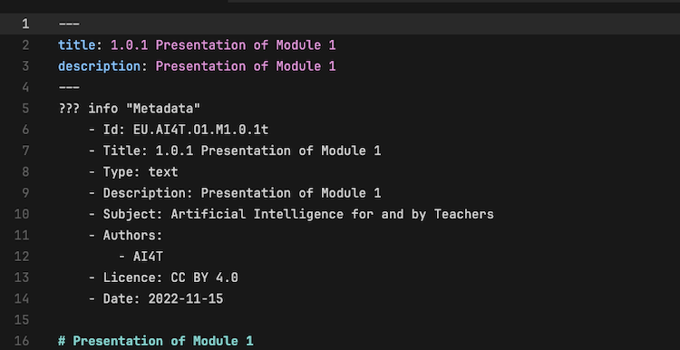
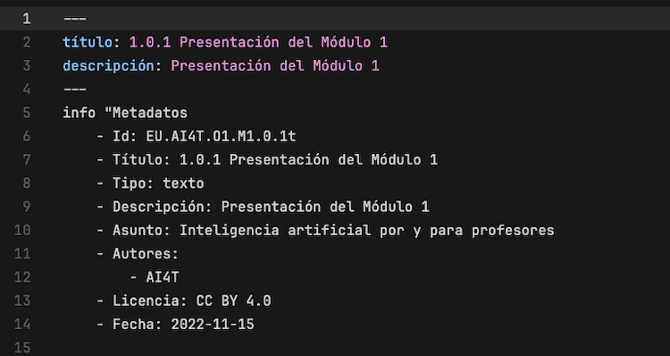
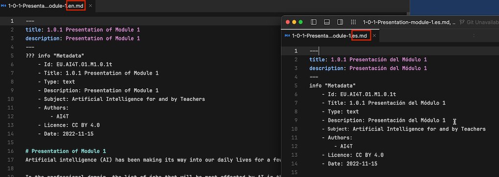
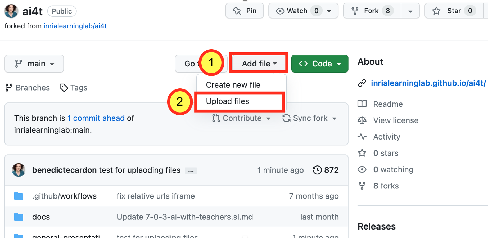
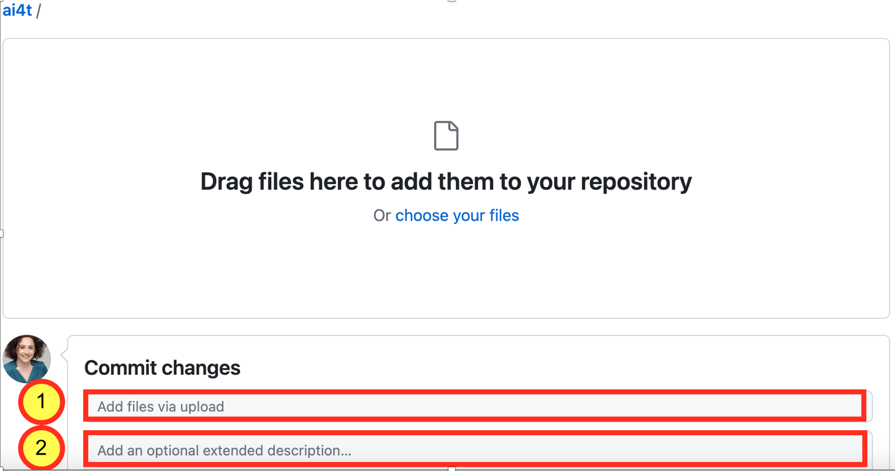

Tento dokument je postupnou prezentáciou toho, ako generovať **celý textový obsah** Mooc v akomkoľvek cieľovom jazyku.
Táto metodika si vyžaduje API DeepL [https://www.deepl.com/pro-api?cta=header-pro-api/](https://www.deepl.com/pro-api?cta=header-pro-api/){:target="_blank"}.
Vychádza z práce, ktorú vykonalo učebné laboratórium Inria (Laurence Farhi / Benoit Rospars + členovia tímu, ktorí sa konkrétnejšie podieľajú na projekte AI4T: Marie Collin a Bénédicte Cardon) na **produkcii a distribúcii obsahu Mooc** a súvisiacich učebných zdrojov v 5 jazykoch.

Na ilustráciu rôznych fáz prekladateľského procesu uvádzame opakujúci sa príklad prekladu obsahu Mooc **do španielčiny**.

&gt; Poznámka: Tento dokument je doplnený o osobitný návod na korektúru súborov vytvorených po ukončení fázy automatického prekladu.

## 1- Prístup k vášmu forku repozitára github projektu

*Ukážka adresy URL forku vytvoreného z AI4T* : **https://github.com/ **YOURNAME** /ai4t**

## 2- Stiahnite si svoj fork z repozitára github vo formáte ZIP

<figure class="image-frame">
    
</figure>
<figcaption>Stiahnite si repozitár github vo formáte ZIP.</figcaption>

## 3- Rozbaľte priečinok
Teraz máte priečinok "ai4t-main".

## 4- Vytvorte skript v cieľovom jazyku

- Skopírujte súbor **"trad.py "** a vložte ho pod príslušným názvom, napríklad pomocou **"tradXX.py "** (🏗️ tradES.py pre španielčinu)

- Otvorte nový súbor **"tradXX.py "** - kód zobrazený pred akýmikoľvek zmenami sa použije na preklad anglických súborov do francúzštiny.

Potom musíte zmeniť cieľový jazyk podľa svojich potrieb: **"fr "** sa musí nahradiť na dvoch miestach:

<figure class="image-frame">

</figure>
<figcaption>Príklad výpisu zo skriptu trad.py s cieľovým jazykom (t. j. FR).</figcaption>

<figure class="inline-image">
    
    <figcaption>**riadok 27**: targetPath = srcPath.replace('.en.md','fr.md')</figcaption>
</figure>

<figure class="inline-image">
    
<figcaption>**a riadok 32**: target_lang="[FR]",</figcaption>
</figure>

🏗️ **pre preklad do španielčiny**

<figure class="image-frame">
    
</figure>
<figcaption>Príklad úryvku zo skriptu trad.py upraveného na preklad do španielčiny.</figcaption>

## 5- Otvorte terminál a vstúpte do priečinka "ai4t-main".

Spustite príkaz: `cd+space` a potom potiahnite a pustite priečinok "ai4t-main":

<figure class="image-frame">
    
</figure>
<figcaption>Súbor sa presunie z prieskumníka súborov do terminálu.</figcaption>

## 6- Nastavenie DeepL

⌨️ Spustite príkaz: pip install deepl
<figure class="image-frame">
    
</figure>
<figcaption>Kód príkazu-pip-install-deepl.</figcaption>

## 7- Vygenerujte nové súbory v cieľových jazykoch

⌨️ Spustite príkaz: `python tradXX.py --key=xxxxxxxx --path=<folder to translate>`

- Pomocou **"xxxxxxxx "** : **kľúč** vášho API DeepL 

- **"Priečinok na preklad "**: zadajte jeden priečinok - použite funkciu "drag and drop".

Mooc sa skladá zo 4 modulov, z ktorých každý obsahuje 3 jednotky (od N-1 po N-3) a úvod (N-0).

K dispozícii je aj úvodná časť a záver.

🏗️ pre preklad z EN do ES súboru, ktorý obsahuje všetky stránky modulu 4 Unit 3 "artificial-intelligence-at-our-service".

<figure class="image-frame">
    
</figure>
<figcaption>Príklad priečinka jednotky, ktorý sa dá pretiahnuť a pustiť na vygenerovanie prekladu.</figcaption>

⌨️ Spustite príkaz: `python tradES.py --key=xxxxxxxx --path=`

Vygenerujú sa dva nové španielske súbory

- 4-3-1v-artificial-intelligence-at-our-service.es.md

- 4-3-2a-case-study-with-ai-templates.es.md

## 8- Preskúmajte vytvorené súbory (formálna kontrola)

Pri tejto metóde sa všetky anglické prvky v referenčnom súbore preložia do cieľového jazyka.

Úpravy, ktoré sa majú vykonať v každom súbore, sú nasledovné:

- Prvky záhlavia: názov, opis (a prípadne autor a typ zdroja)

- Prvky metadát sa musia skontrolovať, aby sa zabezpečilo správne fungovanie webových stránok a kompatibilita metadát v každom jazyku.

🏗️ **Preklad súboru z angličtiny (EN) do španielčiny (ES)**

<figure class="image-frame">
    
</figure>
<figcaption>Hlavička a metadáta v referenčnom EN súbore.</figcaption>

<figure class="image-frame">
  
</figure>
<figcaption>Záhlavie a metadáta v ES súbore pred revíziou súboru s označením v španielčine.</figcaption>

**Zmeny, ktoré sa majú vykonať:**

### V záhlaví

- title** namiesto **titulo**.

- description** namiesto **descripción**

A prípadne :

- contributors** namiesto **colaborador**.

- typ** namiesto **tipo**

- text** namiesto **texto**

- activity** namiesto **actividad**

- video** namiesto **vídeo**

### V metadátach

- Názov** namiesto **Titul**.

- Tím** namiesto **Tipo**.

- Text** namiesto **Text**

- Aktivita** namiesto **Actividad**

- Video** namiesto **Vídeo**

- Popis** namiesto **Descripción**

- Predmet: Umelá inteligencia pre učiteľov a pre učiteľov** namiesto **Asunto: Inteligencia artificial por y para profesores** (Umelá inteligencia pre učiteľov a pre učiteľov)

- **Autori** namiesto **Autores** (Učitelia)

- Licencia** namiesto **Licencia**

- Dátum** namiesto **Fecha**

**Poznámka:** Dávajte pozor na písanie veľkých a malých písmen: niektoré prvky vyžadujú veľké písmeno na začiatku slova, iné nie.

<figure class="image-frame">
    
</figure>
<figcaption>Záhlavie a metadáta v súboroch EN a ES po revízii súborov markdown v angličtine a španielčine.</figcaption>

## 9- Nahrajte svoj súbor do svojho forku na Githube

Súbory v nových cieľových jazykoch boli vytvorené lokálne na vašom počítači. Teraz musíte aktualizovať svoj fork Github.

**Poznamenajte**, že vzhľadom na veľký počet súborov to nie je možné urobiť naraz.

<figure class="image-frame">
    
</figure>
<figcaption>Kde stiahnuť súbory vo forku - snímka obrazovky z githubu.</figcaption>

<figure class="image-frame">
    
</figure>
<figcaption> Ako sťahovať súbory vo forku - snímka obrazovky z githubu.</figcaption>

Neváhajte pridať popis vášho nahrávania, aby ste mohli ľahšie sledovať priebeh forku a najmä ho synchronizovať s inými repozitármi, keď si to budete priať.

## 10- Preskúmajte vytvorené súbory (preskúmajte obsah + jazyk)
Priamo na githube, aby ste :

- Zaručiť jazykovú kvalitu navrhovaného prekladu,

- v prípade potreby vylepšiť alebo doplniť text podľa miestneho kontextu,

- navrhnúť nahradenie alebo doplnenie zdrojov citovaných v jazyku originálu (články, knihy, webové stránky, aktivity atď.) v cieľovom jazyku.

**Pozrite si špecializovaný návod:** [Krok 2.2 - Korektúra textov](https://inrialearninglab.github.io/ai4t//fr/3-Build-your-own-training/3-2-Step-2-Translating-the-mooc-resources/3-2-2-Step-2-2.html){:target="_blank"}
