## Kde nájdem texty Mooc na korektúry a opravy?

Všetky texty, obrázky a aktivity pre 4 moduly s modulmi Prezentácia a Záver sú k dispozícii v úložisku GitHub, ktoré ste vytvorili v kroku 2-1: ["Vytvoriť a preložiť texty"](https://inrialearninglab.github.io/ai4t//fr/3-Build-your-own-training/3-2-Step-2-Translating-the-mooc-resources/3-2-1-Step-2-1.html).

Sú prístupné na nasledujúcej url adrese
https://github.com/**[YOUR-GITHUB-NAME]**/ai4t/tree/main/docs/1-Mooc

Kliknutím na text "module-1-using-AI-and-Education" sa dostanete k obsahu modulu, ktorý je usporiadaný do kapitol:

<figure class="image-frame">
    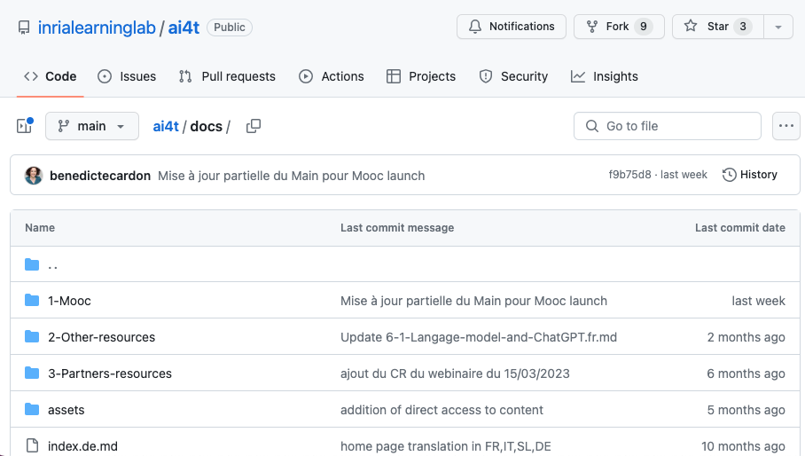
</figure>
<figcaption>Obsah priečinka 1-Mooc, ako je uvedený na GitHub.</figcaption>

Kliknutím na kapitolu sa dostanete na všetky stránky kapitoly v 5 jazykoch:
<figure class="image-frame">
    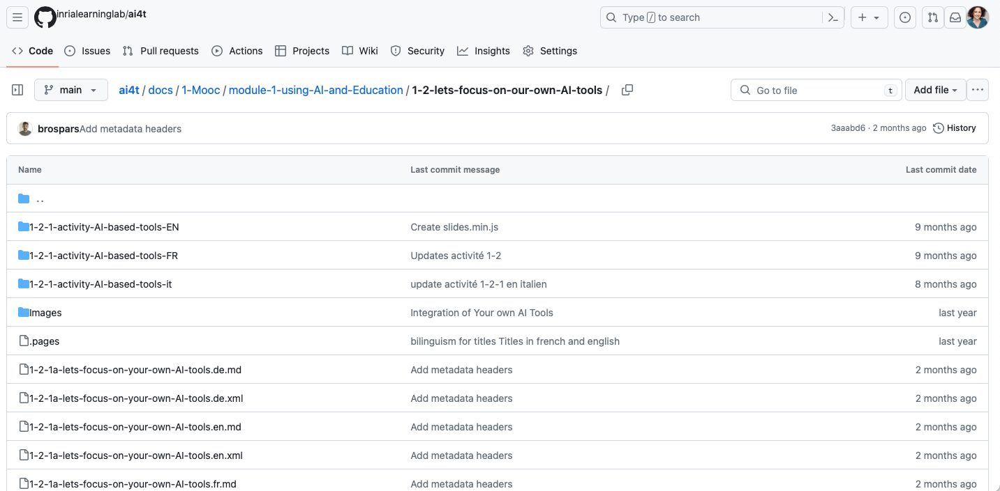
</figure>
<figcaption>Obsah priečinka 1-2 Mooc, ako je uvedený na GitHub.</figcaption>

Nomenklatúra názvov súborov pre stránky kapitoly** **Príkladová stránka: 1-2-1a-lets-focus-on
**Ukážková stránka: 1-2-1a-lets-focus-on-your-own-AI-tools.en.md**

- 1** modul 1

- x-2 kapitola 2

- x-x-1 strana 1

- x-x-xa = strana obsahujúca činnosť

- x-x-xv = stránka obsahujúca video

- lets-focus-on-your-own-AI-tools** : názov referenčného súboru

- **.fr** : jazyk

- **.md** text vo formáte markdown (ľahký značkovací jazyk)

- xml** metadáta spojené s rovnomennou stránkou

V uvedenom príklade (1-2-1a-lets-focus-on-your-own-AI-tools.sk.md) je to prvá stránka kapitoly 2 modulu 1; obsahuje aktivitu.

## Texty

Každá kapitola (napríklad kapitola "1-1-sa-učitelia-skutočne-zaoberajú-umelou-inteligenciou") obsahuje :

- texty všetkých stránok tejto kapitoly vo všetkých jazykoch (súbory .md vo formáte markdown).

- metadáta pre každú stránku tejto kapitoly vo všetkých jazykoch (.xml súbory).

## Obrázky

Sú zoskupené pre každú kapitolu Mooc v priečinku "**Obrázky**". Je dôležité, aby ste obsah priečinkov "Obrázky" nevymazali. Ak chcete pridať alebo upraviť obrázky, nezabudnite použiť rovnaký postup pomenovania, aký je použitý v priečinku.

<figure class="image-frame">
    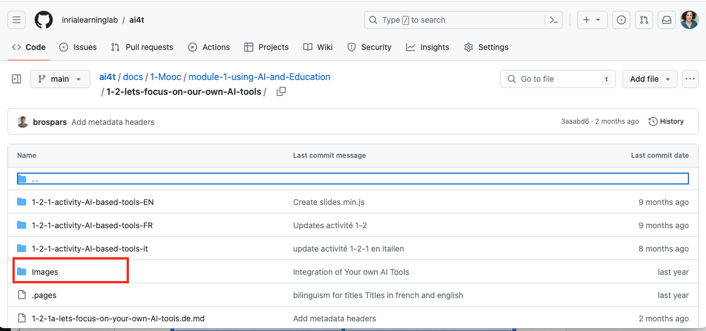
</figure>
<figcaption>Identifikácia priečinka s obrázkami.</figcaption>

## 🔎 Funkcia vyhľadávania

Funkcia **vyhľadávania** v službe GitHub vám pomôže nájsť súbor, ktorý chcete upraviť. Nachádza sa v ľavej hornej časti rozhrania, ako je znázornené nižšie:

<figure class="image-frame">
    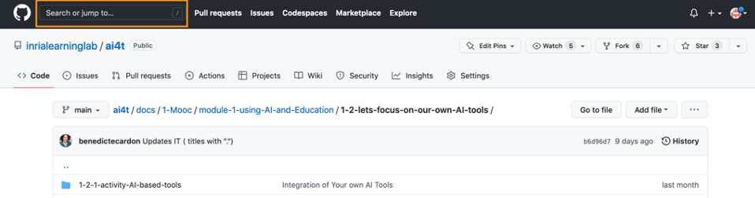
</figure>
<figcaption>Prístup k vyhľadávaciemu nástroju na portáli github.</figcaption>

*Príklad použitia vyhľadávacieho nástroja*: Učiteľ v slučke.

<figure class="image-frame">
    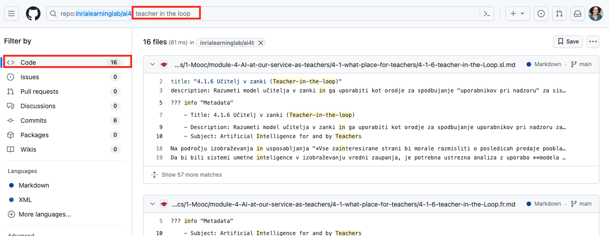
</figure>
<figcaption>Príklad výsledku vyhľadávania na portáli github.</figcaption>

## Ako opravovať a korigovať preložené texty

Umožnite prispievateľom/korektorom upravovať texty v úložisku Github:

1.  Vytvorte si účet GitHub:
[https://GitHub.com/join](https://GitHub.com/join){:target="_blank"} a zadajte :

a. svoje **prijímacie meno**

b. ich **emailovú adresu**

2.  Pošlite tieto informácie správcovi vášho úložiska, aby mohol aktualizovať zoznam účtov GitHub, ktoré by mali mať práva prispievateľa na opravu textov, s uvedením "mena používateľa" a/alebo e-mailovej adresy použitej na vytvorenie účtov.

Ďalej sa musíte pripojiť k svojmu účtu GitHub! [Karta prihlásenia](images/3.2-Sign-in-tab-on-Github.png)

### Ako upraviť textový súbor (formát .md) zverejnený na GitHub?

*Príklad nižšie: Prístup k súboru 1-2-1, prvej strane kapitoly "1-2-na-na-naše-vlastné-nástroje-AI" modulu 1, vo francúzštine.

- Vyhľadajte a kliknite na textový súbor (začínajúci 1-2-1 a končiaci .fr.md), ktorý sa nachádza nižšie pri oranžovom rámčeku.

<figure class="image-frame">
    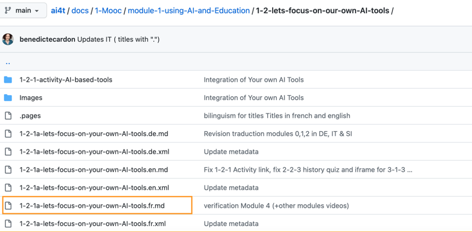
</figure>
<figcaption>Vyhľadajte textový súbor a kliknite naň.</figcaption>

- Po kliknutí na hľadanú stránku kliknite na tlačidlo "Upraviť" (symbolizované ceruzkou) v oranžovom poli nižšie.
<figure class="image-frame">
    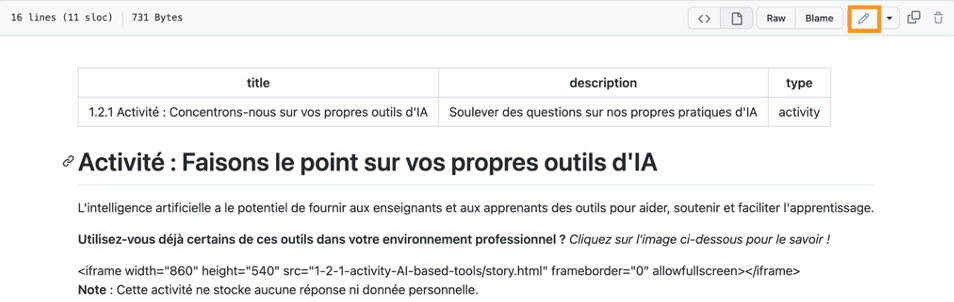
</figure>
<figcaption>Kliknite na tlačidlo "Upraviť".</figcaption>

- V ponuke tohto tlačidla vyberte možnosť "Upraviť tento súbor".

<figure class="image-frame">
    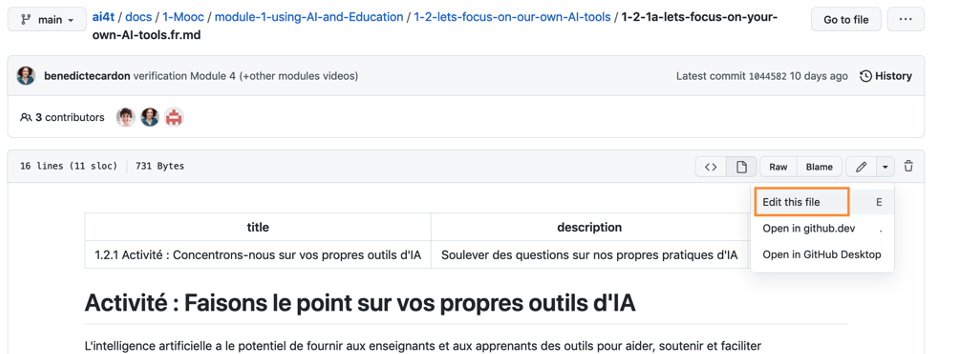
</figure>
<figcaption>V ponuke vyberte položku "Upraviť súbor".</figcaption>

- Keď ste v režime úprav, aktivuje sa karta "Upraviť súbor" (biele pozadie).

Režim "Náhľad", ktorý môžete aktivovať prostredníctvom rovnomennej karty, vám umožní skontrolovať formátovanie vašich zmien.

<figure class="image-frame">
    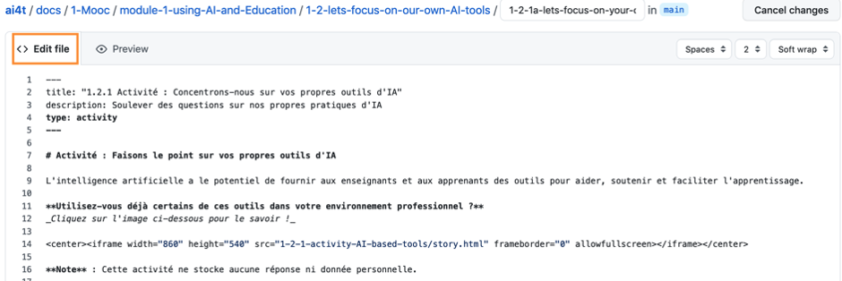
</figure>
<figcaption>Aktivácia režimu náhľadu.</figcaption>

- Úprava textu

- Ak chcete upraviť súbor .md, vyberte režim "Upraviť súbor".

- Základné pokyny na úpravu textu vo formáte .md
    - # /#/ : názov 1. úrovne
    - ## /###/ : názov 2. úrovne
    - tučný text** /**/ : tučný text
    - kurzívny text* /*/ : kurzívny text

- Prehľad hlavných funkcií jazyka markdown :
[https://squidfunk.github.io/mkdocs-material/reference/](https://squidfunk.github.io/mkdocs-material/reference/){:target="_blank"}

- Po dokončení opráv a ich kontrole v režime *Preview* stručne popíšte povahu svojich zmien v poli **"Commit message "**.

<figure class="image-frame">
    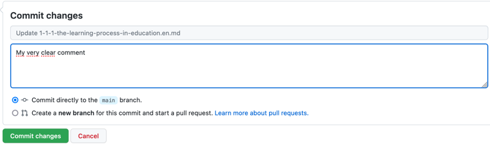
</figure>
<figcaption>Opis obsahu revízie v poli správy.</figcaption>

- Nakoniec kliknite na zelené tlačidlo **Odoslať zmeny**, čím zverejníte svoje zmeny.

<figure class="image-frame">
    
</figure>
<figcaption>Tlačidlo "Overiť".</figcaption>

**UPOZORNENIE:**

- Neexistuje žiadne automatické ukladanie zmien: odporúčame preto, aby ste svoje zmeny (t. j. po kliknutí na tlačidlo "Odovzdať zmeny") publikovali podľa fázy opravy (napr. pridanie odkazov, vylepšenie prekladu, pridanie odseku atď.)

- Zmeny sú pre ostatných prispievateľov viditeľné až po ich zverejnení.

- Názov stránky (t. j. názov súboru) **nezmeníte**.

Nižšie: 1-2-1a-lets-focus-on-your-own-AI-tools.en.md

<figure class="image-frame">
    
</figure>

- Nemodifikujte **záhlavie** v hornej časti každej stránky, ktoré je ohraničené 2 riadkami s 3 pomlčkami (---).

<figure class="image-frame">
    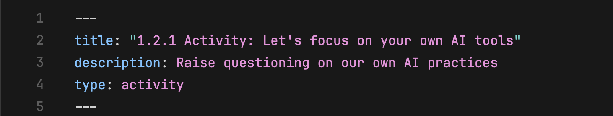
</figure>
<figcaption>Správna definícia názvu stránky vo formáte markdown</figcaption>

&gt;Akákoľvek akcia vykonaná na obsahu tejto časti má zásadné dôsledky pre zobrazenie. Ak chcete vykonať zmeny, odporúčame skopírovať nadpis a navrhnúť nové znenie podľa pôvodnej verzie.
&gt;Ak si želáte vykonať zmeny, odporúčame vám, aby ste nadpis skopírovali a navrhli nové znenie nasledujúce po pôvodnej verzii (prečiarknuté časti sú tie, ktoré možno upraviť), ako je uvedené nižšie.

#### Pôvodný parameter

/---/

názov : \1.2.1 Aktivita: Zameranie na vlastné nástroje umelej inteligencie

opis: Vyvolanie otázok o našich vlastných postupoch v oblasti umelej inteligencie

typ: aktivita

/---/

#### Možné zmeny

/---/

názov : \1.2.1 Aktivita: ~~Zamerajte sa na svoje vlastné nástroje xxxxxxxx~~~

popis : ~~Vyvolať otázky o našej vlastnej praxi xxxx~~~.

typ : aktivita

/---/

## Čo treba skontrolovať

- Grafika a obrázky**
Obrázky a grafiky obsahujúce anglický text možno nahradiť :

  - Ak nie sú zrozumiteľné v angličtine

  - Ak môžete nájsť alternatívu na nahradenie obrázka v cieľovom jazyku.

- **Zdroje a bibliografické odkazy**

&gt; Na doplnenie alebo nahradenie anglických zdrojov uvedených v Mooc je potrebné vykonať veľa práce. Tu sú dve riešenia, ktoré sme prijali v rámci projektu.

- Ak nie je možná náhrada: zachovať pôvodný zdroj v angličtine (napríklad dokumenty ako AI Watch, publikácie JRC atď.).

- Ak existuje alternatívny zdroj, môže byť uvedený spolu s pôvodným zdrojom.

V záujme čo najväčšieho priblíženia sa miestnemu kontextu sa odporúča pridať odkazy v cieľových jazykoch.

- Pripomienka kvality/presnosti prekladu**.

&gt; Preložené texty sú generované na stránke DeepL z verzie Mooc (odporúčame použiť anglickú verziu ako základ pre ďalšie preklady). Na zlepšenie kvality prekladu môžu byť potrebné úpravy **a** je potrebné vykonať úvodnú korektúru; niekedy DeepL interpretuje znaky (napr. "*") nesprávne a v preklade sa môžu vyskytnúť nezrovnalosti (jeden alebo viac prvkov textu zostalo vo východiskovom jazyku). Predtým, ako sa prejde k vecnej korektúre, je preto užitočné vykonať úvodnú "formálnu očistu" prekladu.
