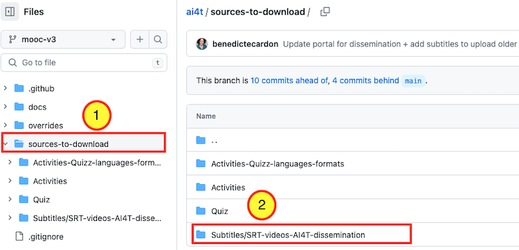
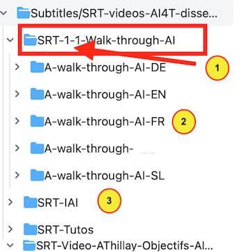

Všetky videá Mooc sú umiestnené na kanáli projektu YouTube [https://www.youtube.com/channel/UCBd_PgP_BdhmgdSzz5d83vQ](https://www.youtube.com/channel/UCBd_PgP_BdhmgdSzz5d83vQ){:target="_blank"}.

## Videá sú k dispozícii v niekoľkých jazykoch

Počas projektu AI4T bola väčšina videí Mooc vytvorená v 5 jazykoch partnerstva (t. j. v angličtine, nemčine, francúzštine, taliančine a slovinčine) s rôznymi riešeniami v závislosti od povahy/pôvodu videa.

*Šesť "humorných" videí IAI je:*

- 🔈 pôvodne vo francúzštine

- 🎧 s **voice-over** v angličtine, taliančine a slovinčine

- 🎬 s **titulkami** vo francúzštine, angličtine, taliančine a slovinčine

*Video [úvod](https://inrialearninglab.GitHub.io/ai4t//1-Mooc/general-presentation/0-1-what-does-this-training-offer-us/0-1-1v-why-this-training.html) &amp; [záver](https://inrialearninglab.GitHub.io/ai4t//1-Mooc/to-conclude/7-0-1v-ethical-use-of-artificial-intelligence-in-education.html){:target="_blank"}* Alaina Thillaya, jedného z iniciátorov projektu, je :

  - 🔈 pôvodne vo francúzštine

  - 🎧 s **voice-over** v angličtine, nemčine, taliančine a slovinčine

  - 🎬 s **titulkami** dostupnými v angličtine, francúzštine, nemčine, taliančine a slovinčine

  *Tri videá v časti [Prechádzka po AI](https://inrialearninglab.GitHub.io/ai4t//1-Mooc/module-1-using-AI-and-Education/1-1-are-teachers-really-concerned-by-Artificial-Intelligence/1-1-1-the-learning-process-in-education.html){:target="_blank"}* boli navrhnuté s ohľadom na viacjazyčnosť (vo videách nie je žiadny textový obsah, aby sa dali ľahšie prispôsobiť všetkým jazykom).

Sú to :

  - 🔈 pôvodne v angličtine

  - 🎧 s **dubbingom** vo francúzštine, nemčine, taliančine a slovinčine

  - 🎬 s **titulkami** v angličtine, francúzštine, nemčine, taliančine a slovinčine

Poznámka: všetky hlasy a dabingy boli nahovorené rodenými hovorcami.

## Kde nájdete titulky k videám Mooc

Všetky titulky (.srt formát) sú zhromaždené v priečinku na úložisku GitHub. Môžete si ich stiahnuť z priečinka [**Subtitles/SRT-videos-AI4T-dissemination**](https://GitHub.com/inrialearninglab/ai4t/tree/mooc-v3/sources-to-download/Subtitles/SRT-videos-AI4T-dissemination)

<figure class="image-frame">
    
</figure>
<figcaption>Vyhľadajte priečinok s titulkami na serveri GitHub.</figcaption>

<figure class="image-frame">
  
</figure>
<figcaption>Obsah priečinka Subtitles na GitHub.</figcaption>

<figure class="inline-image">
    
    
Všetok vzdelávací obsah mooc možno identifikovať podľa <b>modulu</b>,<b>jednotky</b> a <b>časti,</b> ku ktorej patrí.

</figure>

<figure class="inline-image">
    
    
Pre každý zdroj sú súbory usporiadané podľa jazyka. Poznámka: ako je uvedené vyššie, väčšina zdrojov Mooc je k dispozícii v piatich jazykoch, ale niektoré sú k dispozícii v troch alebo štyroch jazykoch z dôvodu rôznych potrieb partnerov počas experimentálnej fázy projektu).

</figure>

<figure class="inline-image">
    
    
K dispozícii sú 4 zložky obsahujúce titulky k videám:

</figure>

- 1 - SRT-1-1-Walk-through-AI: týkajú sa 3 videí "A walk through AI" použitých v module 1,

- 2 - SRT-IAI: týkajú sa 6 videí IAI použitých v moduloch 2, 3 a 4,

- 3 - SRT-Tutos: týka sa 3 výukových materiálov použitých v moduloch 2 a 3,

- 4 - SRT-Video-AThillay: týka sa 3 rozhovorov s Alainom Thillayom použitých v úvodnom a záverečnom module.
